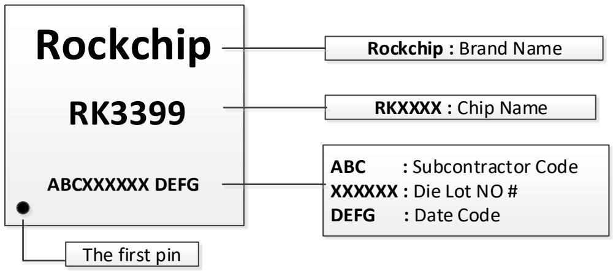
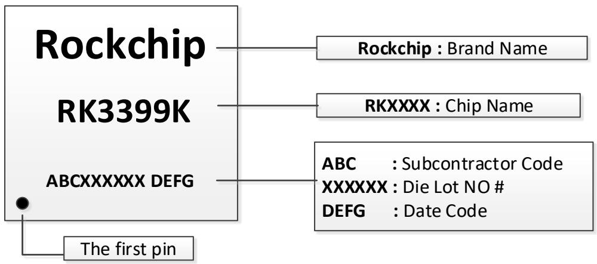
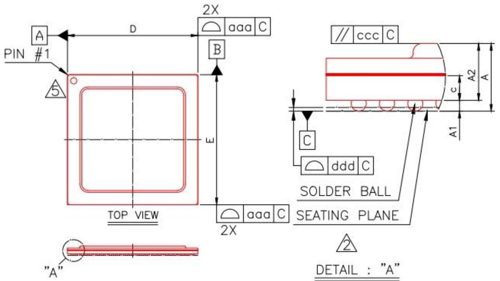
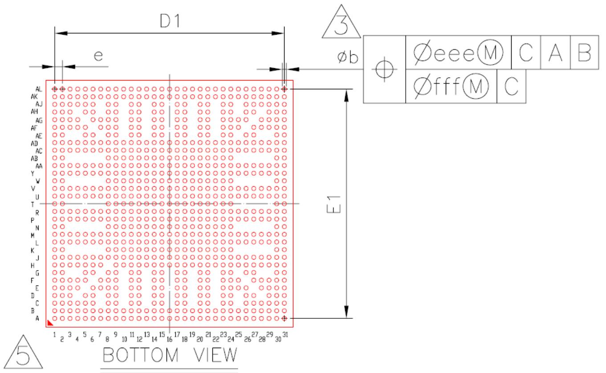

# Rockchip

# RK3399

# Datasheet

Revision 1.8

May. 2018

Revision History   

<table><tr><td>Date</td><td>Revision</td><td>Description</td></tr><tr><td>2018-5-29</td><td>1.8</td><td>• Add RK3399K information</td></tr><tr><td>2017-6-1</td><td>1.7</td><td>• Updated the description about &quot;power supply for IO&quot;</td></tr><tr><td>2017-3-1</td><td>1.6</td><td>• Update</td></tr><tr><td>2016-12-20</td><td>1.5</td><td>• Update &quot;Recommended Operating Conditions&quot; for CPU A72</td></tr><tr><td>2016-12-06</td><td>1.4</td><td>• Removed repeated &quot;EMMC_COREDLL_0V9&quot; in section 3.2
• Add ball description for &quot;EMMC_COREDLL_0V9&quot; in section 2.6</td></tr><tr><td>2016-10-30</td><td>1.3</td><td>• Updated ball description for DDR1 in section 2.6</td></tr><tr><td>2016-9-30</td><td>1.2</td><td>• Update the description about video codec</td></tr><tr><td>2016-8-15</td><td>1.1</td><td>• Updated I2C information about Fast-mode plus feature
• Updated video codec about H264/H265/VP9
• Updated voltage information for power supply
• Updated PCIe specification
• Updated &quot;Features&quot; section</td></tr><tr><td>2016-5-04</td><td>1.0</td><td>• Initial Release</td></tr></table>

# Table of Content

Table of Content .. 3

Figure Index ... 5

Table Index 6

Chapter 1 Introduction . 8

1.1 Overview... 8   
1.2 Features.... 8   
1.3 Block Diagram .... 26

Chapter 2 Package information . .27

2.1 Ordering information . 27   
2.2 Top Marking.... 27   
2.3 Dimension ... 28   
2.4 Ball Map ...... 30   
2.5 Ball Pin Number Order ... 38   
2.6 Power/ground IO descriptions ... 47   
2.7 Power supply for IO . 49   
2.8 Function IO description ... 52   
2.9 IO pin name descriptions.. 57

Chapter 3 Electrical Specification ... .65

3.1 Absolute Maximum Ratings..... 65   
3.2 Recommended Operating Conditions... 65   
3.3 DC Characteristics .. 67   
3.4 Electrical Characteristics for General IO. 68   
3.5 Electrical Characteristics for PLL . 69   
3.6 Electrical Characteristics for SAR-ADC .. 69   
3.7 Electrical Characteristics for TSADC .. 70   
3.8 Electrical Characteristics for Type-C PHY.. 70   
3.9 Electrical Characteristics for USB2.0 PHY .. 70   
3.10 Electrical Characteristics for DDR IO .. 71   
3.11 Electrical Characteristics for eFuse .... 71   
3.12 Electrical Characteristics for HDMI . 71   
3.13 Electrical Characteristics for MIPI PHY . 72   
3.14 Electrical Characteristics for eMMC PHY ... 72   
3.15 Electrical Characteristics for PCIe PHY .. 73

Chapter 4 Thermal Management . .75

4.1 Overview... 75   
4.2 Package Thermal Characteristics . 75

# Figure Index

Fig. 1-1 Block Diagram .... . 26   
Fig. 2-1 Top Marking ..... 27   
Fig. 2-2 Package Top and SideView ... 2 8   
Fig. 2-3 Package Bottom View .. 28   
Fig. 2-4 Package Dimension .. 29   
Fig. 2-5 Ball Mapping Diagram.... . 30

# Table Index

Table 2-1 Ball Pin Number Order Information.... . 38   
Table 2-2 Power/Ground IO information . 47   
Table 2-3 Function IO description... 5 2   
Table 2-4 eMMC pin description . 57   
Table 2-5 PCIe pin description .. 57   
Table 2-6 USB2 pin description .. 57   
Table 2-7 eDP pin description .. 58   
Table 2-8 HDMI pin description .. 5 8   
Table 2-9 MIPI pin description ... 59   
Table 2-10 ISP pin description .. 59   
Table 2-11 EFUSE pin description ... . 60   
Table 2-12 SAR-ADC pin description . 60   
Table 2-13 TSADC pin description ... 60   
Table 2-14 GMAC pin description... 60   
Table 2-15 UART pin description.... . 60   
Table 2-16 I2C pin description ... . 60   
Table 2-17 PWM pin description .... 61   
Table 2-18 CIF pin description .. 61   
Table 2-19 SPI pin description .. 61   
Table 2-20 SPDIF pin description... 61   
Table 2-21 I2S pin description .... 62   
Table 2-22 DDRC pin description... 62   
Table 2-23 SDIO pin description.... 63   
Table 2-24 SDMMC pin description .. 63   
Table 2-25 JTAG pin description . 63   
Table 2-26 MISC pin description.... 64   
Table 3-1 Absolute maximum ratings... 65   
Table 3-2 Recommended operating conditions... . 65   
Table 3-3 DC Characteristics... 67   
Table 3-4 Electrical Characteristics for Digital General IO .. 68   
Table 3-5 Electrical Characteristics for PLL.. 69   
Table 3-6 Electrical Characteristics for SAR-ADC . 69   
Table 3-7 Electrical Characteristics for TSADC . 70   
Table 3-8 Electrical Characteristics for Type-C PHY.. 70   
Table 3-9 Electrical Characteristics for USB2.0 PHY . 70   
Table 3-10 Electrical Characteristics for DDR IO . 71   
Table 3-11 Electrical Characteristics for eFuse.. 71   
Table 3-12 Electrical Characteristics for HDMI . 71   
Table 3-13 Electrical Characteristics for MIPI PHY . 72   
Table 3-14 Electrical Characteristics for eMMC PHY . 72   
Table 3-15 Electrical Characteristics for PCIe PHY .. . 73   
Table 4-1 Thermal Resistance Characteristics.. 75

# NOTICE

# Copyright $\circledcirc$ 2017, Fuzhou Rockchip Electronics Co., Ltd. All rights reserved.

1. By using this document, you hereby unequivocally acknowledge that you have read and agreed to be bound by the contents of this notice.   
2. Fuzhou Rockchip Electronics Co., Ltd. (“Rockchip”) may make changes to any information in this document at any time without any prior notice. The information herein is subject to change without notice. Do not finalize a design with this information.   
3. Information in this document is provided in connection with Rockchip products.   
4. THIS DOCUMENT IS PROVIDED “AS IS” WITHOUT ANY WARRANTY OR CONDITION OF ANY KIND, EITHER EXPRESS, IMPLIED OR STATUTORY, INCLUDING, WITHOUT LIMITATION, ANY WARRANTY OR CONDITION WITH RESPECT TO MERCHANTABILITY, FITNESS FOR ANY PARTICULAR PURPOSE, OR NON-INFRINGEMENT.ROCKCHIP DOES NOT ASSUME ANY RESPONSIBILITY AND LIABILITY FOR ITS USE NOR FOR ANY INFRINGEMENT OF PATENTS OR OTHER RIGHTS OF THE THIRD PARTIES WHICH MAY RESULT FROM ITS USE.   
5. Rockchip products described in this document are not designed, intended for use in medical, lifesaving, life sustaining, critical control or safety systems, or in nuclear facility application.   
6. Rockchip and Rockchip logo are trademarks or registered trademarks of Rockchip in China and other countries. All referenced brands, product names, service names and trademarks in this document are the property by their respective owners.

# Chapter 1 Introduction

# 1.1 Overview

RK3399 is a low power, high performance processor for computing, personal mobile internet devices and other smart device applications. Based on Big.Little architecture, it integrates dual-core Cortex-A72 and quad-core Cortex-A53 with separate NEON coprocessor.

Many embedded powerful hardware engines provide optimized performance for high-end application. RK3399 supports multi-format video decoders including H.264/H.265/VP9up to4Kx2K@60fps, especially, H.264/H.265 decoders support 10bits coding, and also supports H.264/MVC/VP8 encoders by 1080p@30fps, high-quality JPEG encoder/decoder, and special image preprocessor and postprocessor.

Embedded 3D GPU makes RK3399 completely compatible with OpenGL ES1.1/2.0/3.0/3.1, OpenCL and DirectX 11.1. Special 2D hardware engine with MMU will maximize display performance and provide very smooth operation.

RK3399 has high-performance dual channel external memory interface (DDR3/DDR3L/LPDDR3/LPDDR4) capable of sustaining demanding memory bandwidths, also provides a complete set of peripheral interface to support very flexible applications.

# 1.2 Features

The features listed below which may or may not be present in actual product, may be subject to the third party licensing requirements. Please contact Rockchip for actual product feature configurations and licensing requirements.

# 1.2.1 Microprocessor

Dual-core ARM Cortex-A72 MPCore processor and Quad-core ARM Cortex-A53MPCore processor, both are high-performance, low-power and cached application processor   
Two CPU clusters.Big cluster with dual-coreCortex-A72 is optimized for highperformance and little cluster with quad-core Cortex-A53 is optimized for low power.   
Full implementation of the ARM architecture v8-A instruction set, ARM Neon Advanced SIMD (single instruction, multiple data) support for accelerating media and signal processing   
ARMv8 Cryptography Extensions   
 SCU ensures memory coherency between the MPCore for each cluster   
 CCI500 ensures the memory coherency between the two clusters   
Each Cortex-A72 integrates48KB L1 instruction cache and 32KB L1 data cache with 4- way set associative. Each Cortex A53 integrates 32KB L1 instruction cache and 32kB L1 data cache separately with 4-way set associative   
1MB unified L2 Cache for Big cluster, 512KB unified L2 Cache for Little cluster   
Trustzone technology support   
 Full Coresight debug solution

 Debug and trace visibility of whole systems   
 ETM trace support   
 Invasive and non-invasive debug

Eight separate power domains for CPU core system to support internal power switch and externally turn on/off based on different application scenario

 PD_A72_B0: 1st Cortex-A72 + Neon + FPU + L1 I/D cache of big cluster   
 PD_A72_B1: $2 ^ { \mathsf { n d } }$ Cortex-A72+ Neon $^ +$ FPU + L1 I/D cache of big cluster   
PD_SCU_B: SCU + L2 Cache controller, and including PD_A72_B0, PD_A72_B1, debug logic of big cluster   
 PD_A53_L0: 1st Cortex-A53 + Neon + FPU + L1 I/D Cache of little cluster   
 PD_A53_L1: 2nd Cortex-A53 $^ +$ Neon + FPU + L1 I/D Cache of little cluster

 PD_A53_L2: $3 ^ { \mathsf { r d } }$ Cortex-A53 + Neon + FPU + L1 I/D Cache of little cluster   
 PD_A53_L3: 4th Cortex- $\mathsf { - A S 3 } + \mathsf { N e o n } + \mathsf { F P U } + \mathsf { L 1 } \mathrm { I } / \mathsf { D }$ Cache of little cluster   
PD_SCU_L: SCU + L2 Cache controller, and including PD_A53_L0, PD_A53_L1, PD_A53_L2, PD_A53_L3, debug logic of little cluster

Two isolated voltage domain to support DVFS for big cluster and little cluster separately.

# 1.2.2 Memory Organization

Internal on-chip memory

 BootROM   
 Internal SRAM

External off-chip memory①

 DDR3/DDR3L/LPDDR3/LPDDR4   
SPI NOR/NAND Flash   
 eMMC 5.1   
 SD 3.0/MMC 4.51

# 1.2.3 Internal Memory

Internal BootROM

 Size : 32KB   
Support system boot from the following device :

$\spadesuit$ SPI interface   
$\spadesuit$ eMMC interface   
$\spadesuit$ SD/MMC interface

Support system code download by the following interface:   
$\spadesuit$ USB OTG interface

Internal SRAM

 Size : 200KB   
 Support security and non-security access   
 Security or non-security space is software programmable   
Security space can be 0KB,4KB,8KB,12KB,16KB,… up to 64KB by 4KB step

# 1.2.4 External Memory or Storage device

 Dynamic Memory Interface (DDR3/DDR3L/LPDDR3/LPDDR4)

Compatible with JEDEC standard DDR3-1866 /DDR3L-1866 /LPDDR3-1866 / LPDDR4 SDRAM   
一 Support 2 channels, each channel is 16 or 32bits data width   
Support up to 2 ranks (chip selects) for each channel; totally 4GB(max) address space. Maximum address space of one rank in a channel is also 4GB, which is software-configurable   
32bits/64bits data width is software programmable   
Programmable timing parameters to support DDR3/DDR3L/LPDDR3/LPDDR4 SDRAM from various vendor   
Advanced command reordering and scheduling to maximize bus utilization   
Embedded dynamic drift detection in the PHY to get dynamic drift compensation with the controller   
 Programmable output and ODT impedance with dynamic PVT compensation   
Low power modes, such as power-down and self-refresh for DDR3/DDR3L/LPDDR3/LPDDR4 SDRAM   
Support standby mode to auto-gating DDR controller clock for power save   
Support power down DDR controller and DDR PHY   
一 Support hardware-based DDR frequency scaling

eMMC Interface

 Fully compliant with JEDEC eMMC 5.1and eMMC 5.0 specification   
 There is only one eMMC interface

 It is backward compliant with eMMC 4.51 and earlier versions specification.   
 Supports HS400, HS200, DDR50 and legacy operating modes.   
 Provide eMMC boot sequence to receive boot data from external eMMC device   
Configurable (Minimum 1 Block Size) FIFO used to aid data transfer between the CPU and the controller   
 Handle the FIFO overrun and underrun condition by stopping interface clock   
 Up to 3200Mbits per second data rate using 8 parallel data lines (eMMC HS400)   
 Up to 1600Mbits per second data rate using 8 parallel data lines (eMMC HS200)   
Up to 832Mbits per second data rate using 8 parallel data lines (eMMC DDR52 mode)   
 Transfers the data in 1 bit, 4 bit and 8 bit modes   
 Cyclic Redundancy Check CRC7 for command and CRC16 for data integrity

# SD/MMC Interface

 Compatible with SD3.0, MMC ver4.51   
 There are 2 MMC interfaces which can be configured as SD/MMC or SDIO   
Support FIFO over-run and under-run prevention by stopping card clock automatically   
Support CRC generation and error detection   
 Embedded clock frequency division control to provide programmable baud rate   
 Support block size from 1 to 65535Bytes   
 Data bus width is 4bits

# 1.2.5 System Component

# Cortex-M0

 Two Cortex-M0 inside RK3399 to cooperate with Cortex-A72/Cortex-A53   
Thumb instruction set combines high code density with 32-bit performance   
Integrated sleep modes for low power consumption   
 Fast code execution permits slower processor clock or increases sleep mode time   
 Deterministic, high-performance interrupt handling for time-critical applications   
 Serial Wire Debug reduces the number of pins required for debugging

# CRU (clock & reset unit)

 Support clock gating control for individual components inside RK3399   
 One oscillator with 24MHz clock input and 8 embedded PLLs   
Support global soft-reset control for whole SOC, also individual soft-reset for every components

# PMU (power management unit)

Multiple configurable work modes to save power by different frequency or automatic clock gating control or power domain on/off control   
 Lots of wakeup sources in different mode   
6 separate voltage domains   
30 separate power domains, which can be power up/down by software based on different application scenes

# Timer

14 on-chip 64bits Timers in SoC with interrupt-based operation for non-secure application   
12 on-chip 64bits Timers in SoC with interrupt-based operation for secure application   
 Provide two operation modes: free-running and user-defined count   
Support timer work state checkable   
Fixed 24MHz clock input

# PWM

 Four on-chip PWMs with interrupt-based operation

Programmable pre-scaled operation to bus clock and then further scaled   
 Embedded 32-bit timer/counter facility   
Support capture mode   
Support continuous mode or one-shot mode   
 Provides reference mode and output various duty-cycle waveform

# Watchdog

 Three Watchdogs in SoC with 32 bits counter width   
Counter clock is from APB bus clock   
Counter counts down from a preset value to 0 to indicate the occurrence of a timeout   
 WDT can perform two types of operations when timeout occurs:

$\spadesuit$ Generate a system reset   
$\spadesuit$ First generate an interrupt and if this is not cleared by the service routine by the time a second timeout occurs then generate a system reset

Programmable reset pulse length   
Totally 16 defined-ranges of main timeout period

# Mailbox

 Two Mailboxes in SoC to service multi-core communication   
Support four mailbox elements per mailbox, each element includes one data word, one command word register and one flag bit that can represent one interrupt   
Provide 32 lock registers for software to use to indicate whether mailbox is occupied

# Bus Architecture

128bit/64-bit/32-bit multi-layer AXI/AHB/APB composite bus architecture   
一 CCI500 embedded to support two clusters cache coherency   
 5 embedded AXI interconnect

$\spadesuit$ PERI low performance interconnect with one 128-bits AXI master, seven 64-bits AXI masters, one 32-bits AXI master, two 64-bits AXI slaves, five 32-bits AHB masters and lots of 32-bits AHB/APB slaves   
$\spadesuit$ PERI high performance interconnect with one 128-bits AXI master, one 128-bits AXI slave, four 32-bits AHB masters and lots of 32-bits AHB/APB slaves   
$\spadesuit$ DISPLAY interconnect with two 128-bits AXI masters, two 64-bits AXI masters, one 32-bits AXI master and lots of 32-bits AHB/APB slaves   
$\spadesuit$ GPU interconnect with one 128-bits AXI master and 32-bits APB slave   
$\spadesuit$ VIDEO interconnect with two 128-bits AXI masters, two 64-bits AXI masters and four 32-bits AHB slaves

 Flexible different QoS solution to improve the utility of bus bandwidth

# Interrupt Controller

Support 8 PPI interrupt source and 148 SPI interrupt sources input from different components inside RK3399   
Support 16 software-triggered interrupts   
Input interrupt level is fixed, high-level sensitive for SPI and low-level sensitive for PPI   
Support Locality-specific Peripheral Interrupts (LPIs). These interrupts are generated by a peripheral writing to a memory-mapped register in the controller   
 Two AXI stream interrupt interfaces separately for each cluster   
Support different interrupt priority for each interrupt source, and they are always software-programmable

# DMAC

Micro-code programming based DMA   
 The specific instruction set provides flexibility for programming DMA transfers   
Linked list DMA function is supported to complete scatter-gather transfer   
Support internal instruction cache

Embedded DMA manager thread   
Support data transfer types with memory-to-memory, memory-to-peripheral, peripheral-to-memory   
Signals the occurrence of various DMA events using the interrupt output signals   
Mapping relationship between each channel and different interrupt outputs is software-programmable   
Two embedded DMA controller, BUS_DMAC is for bus system, PERI_DMAC is for peripheral system   
 DMAC0 features:

$\spadesuit$ 6 channels totally   
$\spadesuit$  10 hardware request from peripherals   
$\spadesuit$ 2 interrupt output   
$\spadesuit$ Dual APB slave interface for register configuration, designated as secure and non-secure   
$\spadesuit$  Support Trustzone technology and programmable secure state for each DMA channel

 DMAC1 features:

$\spadesuit$ 8 channels totally   
$\spadesuit$ 20 hardware request from peripherals   
$\spadesuit$ 2 interrupt output   
$\spadesuit$ Dual APB slave interface for register configuration, designated as secure and non-secure   
$\spadesuit$ Support Trustzone technology and programmable secure state for each DMA channel

Security system

 Support Trustzone technology for the following components inside RK3399

$\spadesuit$ Cortex-A72, support security and non-security mode, switch by software   
$\spadesuit$ Cortex-A53, support security and non-security mode, switch by software   
$\spadesuit$  Except Cortex-A72 and Cortex-A53, the other masters in the SoC can also support security and non-security mode by software-programmable   
$\spadesuit$ Some slave components in SoC can only be addressed by security master and the other slave components can be addressed by security master or nonsecurity master by software-programmable   
$\spadesuit$ Internal memory, part of space is addressed only in security mode, detailed size is software-programmable together with TZMA (Trustzone memory adapter)   
$\spadesuit$ External DDR space can be divided into eight parts; each part can be softwareprogrammable to be addressed in security mode or non-security mode

 Embedded dual-channel encryption and decryption engine

$\spadesuit$ Support AES 128/192/256 bits key mode, ECB/CBC/CTR/XTS chain mode, Slave/FIFO mode   
$\spadesuit$ Support DES/3DES (ECB and CBC chain mode), 3DES (EDE/EEE key mode), Slave/FIFO mode   
$\spadesuit$ Support SHA1/SHA256/MD5(with hardware padding) HASH function, FIFO mode only   
$\spadesuit$ Support 160-bit Pseudo Random Number Generator (PRNG)   
$\spadesuit$ Support 256-bit True Random Number Generator (TRNG)   
$\spadesuit$ Support PKA 512/1024/2048 bit Exp Modulator

 Support security boot   
 Support security debug

# 1.2.6 Video CODEC

Video Decoder

 MMU embedded

Real-time video decoder of MPEG-1, MPEG-2, MPEG-4, H.263, H.264, H.265, VC-1, VP9, VP8, MVC   
 H.264/AVC, Base/Main/High/High10 profile @ level 5.1; up to 4Kx2K @ 30fps   
 H.265/HEVC, Main/Main10 profile $@$ level 5.1 High-tier; up to 4Kx2K @ 60fps   
VP9, profile 0, up to 4Kx2K $@$ 60fps   
一 MPEG-1, ISO/IEC 11172-2, up to 1080P $@$ 60fps  
 MPEG-2, ISO/IEC 13818-2, SP@ML, MP@HL, up to 1080P @ 60fps   
 MPEG-4, ISO/IEC 14496-2, SP@L0-3, ASP@L0-5, up to 1080P @ 60fps   
 VC-1, SP@ML, MP@HL, AP@L0-3, up to 1080P @ 60fps   
 MVC is supported based on H.264 or H.265, up to 1080P @ 60fps   
  
Supports frame timeout interrupt, frame finish interrupt and bit stream error interrupt   
■ Error detection and concealment support for all video formats   
Output data format YUV420 semi-planar, YUV400(monochrome), YUV422 is supported by H.264   
 For MPEG-4, GMC (global motion compensation) not supported   
 For VC-1, up-scaling and range mapping are supported in image post-processor   
For MPEG-4 SP/H.263, using a modified H.264 in-loop filter to implement deblocking filter in post-processor unit

Video Encoder

 Support video encoder for H.264 UP to HP@level4.1, MVC and VP8   
 MMU Embedded   
Only support I and P slices, not B slices   
Support error resilience based on constrained intra prediction and slices   
 Input data format:

$\spadesuit$ YCbCr 4:2:0 planar   
$\spadesuit$ YCbCr 4:2:0 semi-planar   
$\spadesuit$ YCbYCr 4:2:2   
$\spadesuit$ CbYCrY 4:2:2 interleaved   
$\spadesuit$ RGB444 and BGR444   
$\spadesuit$ RGB555 and BGR555   
$\spadesuit$ RGB565 and BGR565   
$\spadesuit$ RGB888 and BRG888   
$\spadesuit$ RGB101010 and BRG101010

Image size is from 96x96 to 1920x1080(Full HD)   
 Maximum frame rate is up to 1920x1080@30FPS②

# 1.2.7 JPEG CODEC

JPEG decoder

Input JPEG file: YCbCr 4:0:0, 4:2:0, 4:2:2, 4:4:0, 4:1:1 and 4:4:4 sampling formats   
 Output raw image: YCbCr 4:0:0, 4:2:0, 4:2:2, 4:4:0, 4:1:1 and 4:4:4 semi-planar   
 Decoder size is from $4 8 \times 4 8$ to 8176x8176(66.8Mpixels)   
Support JPEG ROI (region of image) decode   
Maximum data rate④ is up to 76million pixels per second   
 Embedded memory management unit(MMU)

JPEG encoder

Input raw image:

$\spadesuit$ YCbCr 4:2:0 planar   
$\spadesuit$ YCbCr 4:2:0 semi-planar   
$\spadesuit$ YCbYCr 4:2:2   
$\spadesuit$ CbYCrY 4:2:2 interleaved   
$\spadesuit$ RGB444 and BGR444   
$\spadesuit$ RGB555 and BGR555

$\spadesuit$ RGB565 and BGR565   
$\spadesuit$ RGB888 and BRG888   
$\spadesuit$ RGB101010 and BRG101010

 Output JPEG file: JFIF file format 1.02 or Non-progressive JPEG   
 Encoder image size up to 8192x8192(64million pixels) from 96x32   
Maximum data rate④ up to 90million pixels per second   
 Embedded memory management unit(MMU)

# 1.2.8 Image Enhancement

Image pre-processor

Only used together with HD video encoder inside RK3399, not support stand-alone mode   
Provides RGB to YCbCr 4:2:0 color space conversion, compatible with BT601, BT709 or user defined coefficients   
 Provides YCbCr4:2:2 to YCbCr4:2:0 color space conversion   
 Support cropping operation from 8192x8192 to any supported encoding size   
Support rotation with 90 or 270 degrees

Video stabilization

Work in combined mode with HD video encoder inside RK3399 and stand-alone mode   
Adaptive motion compensation filter   
Support scene detection from video sequence, encodes key frame when scene change noticed

Image Post-Processor (embedded inside video decoder)

Combined with HD video decoder and JPEG decoder, post-processor can read input data directly from decoder output to reduce bus bandwidth   
Also work as a stand-alone mode, its input data is from image data stored in external memory   
Input data format:

$\spadesuit$ Any format generated by video decoder in combined mode   
$\spadesuit$ YCbCr 4:2:0 semi-planar   
$\spadesuit$ YCbCr 4:2:0 planar   
$\spadesuit$ YCbYCr 4:2:2   
$\spadesuit$ YCrYCb 4:2:2   
$\spadesuit$ CbYCrY 4:2:2   
$\spadesuit$ CrYCbY 4:2:2

Output data format:

$\spadesuit$ YCbCr 4:2:0 semi-planar   
$\spadesuit$ YCbYCr 4:2:2   
$\spadesuit$ YCrYCb 4:2:2   
$\spadesuit$ CbYCrY 4:2:2   
$\spadesuit$ CrYCbY 4:2:2   
$\spadesuit$ Fully configurable ARGB channel lengths and locations inside 32bits, such as ARGB8888, RGB565, ARGB4444 etc.

Input image size:

$\spadesuit$ Combined mode: from $4 8 \times 4 8$ to 8176x8176 (66.8Mpixels)   
$\spadesuit$ Stand-alone mode: width from 48 to 8176, height from 48 to 8176, and maximum size limited to 16.7Mpixels   
$\spadesuit$ Step size is 16 pixels

Output image size: from 16x16 to 1920x1088 (horizontal step size 8, vertical step size 2)   
Support image up-scaling:

$\spadesuit$ Bicubic polynomial interpolation with a four-tap horizontal kernel and a two-tap vertical kernel   
$\spadesuit$ Arbitrary non-integer scaling ratio separately for both dimensions   
$\spadesuit$ Maximum output width is $3 \times$ input width   
$\spadesuit$ Maximum output height is $3 \times$ input height

 Support image down-scaling:

$\spadesuit$ Arbitrary non-integer scaling ratio separately for both dimensions   
$\spadesuit$ Unlimited down-scaling ratio

Support YUV to RGB color conversion, compatible with BT.601-5, BT.709 and user definable conversion coefficient

Support dithering ( $2 \times 2$ ordered spatial dithering) for 4/5/6bit RGB channel precision   
Support programmable alpha channel and alpha blending operation with the following overlay input formats:

$\spadesuit$ 8bit alpha +YUV444, big endian channel order with AYUV8888   
$\spadesuit$ 8bit alpha $+ 2 4$ bit RGB, big endian channel order with ARGB8888

Support de-interlacing with conditional spatial de-interlace filtering, only compatible with YUV420 input format   
Support RGB image contrast/brightness/color saturation adjustment   
 Support image cropping & digital zoom only for JPEG or stand-alone mode   
Support picture in picture   
Support image rotation (horizontal flip, vertical flip, rotation 90,180 or 270 degrees)

Image Enhancement-Processor (IEP)

 Image format

$\spadesuit$ Input data: XRGB/RGB565/YUV420/YUV422   
$\spadesuit$ Output data: ARGB/RGB565/YUV420/YUV422   
$\spadesuit$ The format ARGB/XRGB/RGB565/YUV support swap   
$\spadesuit$ Support YUV semi-planar/planar   
$\spadesuit$ Support BT601_l/BT601_f/BT709_l/BT709_f color space conversion   
$\spadesuit$  Support RGB dither up/down conversion   
$\spadesuit$ Support YUV up/down sampling conversion   
$\spadesuit$  Max resolution for static image up to 8192x8192   
$\spadesuit$ Max resolution for dynamic image

 De-interlace: 1920x1080   
 Sampling noise reduction: 1920x1080   
 Compression noise reduction: 4096x2304   
 Enhancement: 4096x2304

 Enhancement

$\spadesuit$ Gamma adjustment with programmable mapping table   
$\spadesuit$ Hue/Saturation/Brightness/Contrast enhancement   
$\spadesuit$ Color enhancement with programmable coefficient   
 $\spadesuit$ Detail enhancement with filter matrix up to $7 { \times } 7$   
$\spadesuit$ Edge enhancement with filter matrix up to $7 { \times } 7$   
$\spadesuit$ Programmable difference table for detail enhancement   
$\spadesuit$ Programmable distance table for detail and edge enhancement

Noise reduction

$\spadesuit$ Compression noise reduction with filter matrix up to $7 { \times } 7$   
$\spadesuit$ Programmable difference table for compression noise reduction   
$\spadesuit$ Programmable distance table for compression noise reduction   
$\spadesuit$ Spatial sampling noise reduction   
$\spadesuit$ Temporal sampling noise reduction   
$\spadesuit$ Optional coefficient for sampling noise reduction

De-interlace

$\spadesuit$ Input 4 fields, output 2 frames mode   
$\spadesuit$ Input 4 fields, output 1 frames mode   
$\spadesuit$ Input 2 fields, output 1 frames mode   
 $\spadesuit$ Programmable motion detection coefficient   
$\spadesuit$ Programmable high frequency factor   
$\spadesuit$ Programmable edge interpolation parameter   
$\spadesuit$ Source width up to 1920

 Embedded memory management unit(MMU)

# 1.2.9 Graphics Engine

3D Graphics Engine:

ARM Mali-T860MP4 GPU, support OpenGL ES1.1/2.0/3.0, OpenCL1.2, DirectX11.1 etc.   
 Embedded 4 shader cores with shared hierarchical tiler   
 Provide MMU and L2 Cache with 256KB size   
 Image quality using double-precision FP64, and anti-aliasing capabilities   
10-bit and 16-bit YUV input and output formats

2D Graphics Engine:

Source format:   
$\spadesuit$ ARGB/RGB888/RGB565/RGB4444/RGB5551/YUV420/YUV422(SupportYUV422S P10bit/YUV420SP10bit)   
 Destination formats:   
$\spadesuit$ ARGB/RGB888/RGB565/RGB4444/RGB5551/YUV420/YUV422(Support YVYU422/420 output)   
■ Max resolution: 8192x8192 source, 4096x4096 destination   
Block transfer and Transparency mode   
Color fill with gradient fill, and pattern fill   
Alpha blending modes including global alpha, per pixel alpha (color/alpha channel separately) and fading   
 Arbitrary non-integer scaling ratio, from 1/16 to 16   
 0, 90, 180, 270-degree rotation, x-mirror, y-mirror & rotation operation   
ROP2, ROP3, ROP4   
Support 4k/64k page size MMU

# 1.2.10 Video IN/OUT

Camera Interface

 One or two MIPI-CSI input interface

Image Signal Processer

 There are two ISP (Image Sensor Processor) built-in   
Maximum input resolution of one ISP is 14M pixels   
Main scaler with pixel-accurate up-scaling and down-scaling to any resolution between 4416x3312 and 32x16 pixel in processing mode   
Self scaler with pixel-accurate up-scaling and down-scaling to any resolution between $1 9 2 0 { \times } 1 0 8 0$ and $3 2 \times 1 6$ pixel in processing mode   
support of semi planar NV21 color storage format   
support of independent image cropping on main and self-path   
 ITU-R BT 601/656 compliant video interface supporting YCbCr or RGB Bayer data   
 12-bit camera interface   
一 12-bit resolution per color component internally   
 YCbCr 4:2:2 processing   
quantization and Huffman tables   
Windowing and frame synchronization   
Macro block line, frame end, capture error, data loss interrupts and sync. (h_start, v_start) interrupts   
Luminance/chrominance and chrominance blue/red swapping for YUV input signals   
Continuous resize support   
 Color processing (contrast, saturation, brightness, hue, offset, range)   
Display-ready RGB output in self-picture path (RGB888, RGB666 and RGB565)   
Rotation unit in self-picture path $9 0 ^ { \circ }$ , $1 8 0 ^ { \circ }$ , $2 7 0 ^ { \circ }$ and $\mathsf { h } / \mathsf { v }$ flipping) for RGB output   
一 Read port provided to read back a picture from system memory   
Simultaneous picture read back, resizing and storing through self path while main   
path captures the camera picture   
Black level compensation

 Four channel Lens shade correction (Vignetting)   
 Auto focus measurement   
 White balancing and black level measurement   
Auto exposure support by brightness measurement in $5 { \times } 5$ sub windows   
Defect pixel cluster correction unit (DPCC) supports on the fly and table based pixel correction   
 De-noising pre filter (DPF)   
Enhanced color interpolation (RGB Bayer demosaicing)   
Chromatic aberration correction   
 Combined edge sensitive Sharpening / Blurring filter (Noise filter)   
 Color correction matrix (cross talk matrix)   
 Global Tone Mapping with wide dynamic range unit (WDR)   
 Image Stabilization support and Video Stabilization Measurement   
 Flexible Histogram calculation   
Digital image effects (Emboss, Sketch, Sepia, B/W (Grayscale), Color Selection, Negative image, sharpening)   
 Solarize effect through gamma correction

# Display Interface

 Embedded two VOP, output from the following display interface.

$\spadesuit$ One or Two MIPI-DSI port   
$\spadesuit$ One eDP port   
$\spadesuit$ One DP port   
$\spadesuit$ One HDMI port

一 Support AFBC function co-operation with GPU

$\spadesuit$ decompress FB generated by GPU FBC   
$\spadesuit$ support 2560x1600 UI   
$\spadesuit$ support ARGB888, RGB888, RGB565   
$\spadesuit$ output for one layer among WIN0/1/2/3   
$\spadesuit$ only support one IFDBC block which can be used for WIN0/1/2/3 by configuration

#  Video Output Processor(VOP_BIG)

Display interface

$\spadesuit$ HDMI interface

 Support 480p/480i/576p/576i/720p/1080p/1080i/4k

 Support RGB/YUV420(up to 10bit) format

 DP interface

 Support progressive/interlace

 Support RGB/YUV420/YUV422/YUV444(up to 10bit) format

 MIPI interface

 MIPI DCS command mode

 Dual-MIPI

$\spadesuit$ EDP interface

$\spadesuit$ Max resolution

 Max input resolution：4096x2304  
 Max output resolution：4096x2160

$\spadesuit$ Scanning timing 8192x4096   
$\spadesuit$ Support configurable polarity of DCLK/HSYNC/VSYNC/DEN

Display process

$\spadesuit$   
$\spadesuit$ BCSH,10bit   
$\spadesuit$ Support display data swap   
$\spadesuit$ Support YUV2RGB transition and RGB2YUV transition   
$\spadesuit$ Support YUV2YUV   
$\spadesuit$ GAMMA   
$\spadesuit$ Support blank display and black display

$\spadesuit$ Support standby mode   
$\spadesuit$ X-MIRROR, Y-MIRROR for win0/win1/win2/win3/hwc   
$\spadesuit$ scale down for TV over scan

 Layer process

$\spadesuit$ Background layer

 programmable 30-bit color

 Afbcd

 format: ARGB8888/RGB888/RGB565   
 Support block split   
 win_sel(win0/win1/win2/win3)

 Win0/Win1 layer

 Support data format

 RGB888, ARGB888, RGB565,   
 YCbCr420SP, YCbCr422SP, CbCr444SP, YUYV420, YUYV422, YVYU420, YVYU422   
 RGB(8bit), YUV(8bit/10bit), YVYU/YUYV(8bit)

 YUV clip

 Y-8bit: 16~235; UV-8bit: $1 6 \sim 2 4 0$   
 Y-10bit: 64~940; UV-10bit: 64~960

 RGB2YUV, YUV2RGB, RGB2RGB, YUV2YUV

 Support max input resolution 4096x8192   
 Support max output resolution 4096x2160   
 Support virtual display

 Support 1/8 to 8 scaling-down and scaling-up engine

 scale up using Bicubic and bilinear   
 scale down using bilinear and average   
 per-pix alpha $^ +$ scale

 Support data swap

 RGB/BPP: rb_swap  
 YUV: mid_swap, uv_swap

 transparency color key, prior to alpha blending and fading   
 Support fading/alpha blending   
 Support interlace output

 Win2/Win3 layer

 Support data format

 RGB888, ARGB888, RGB565   
 8BPP   
 little endian and big endian for BPP   
 BYPASS and LUT mode(32bit LUT，8bit AA+8bit-RGB) for BPP

 CSC

 RGB2YUV, RGB2RGB

 4 display regions   
 only one region at one scanning line   
 Support data swap   
 RGB/BPP: rb_swap  
 Support transparency color key, prior to alpha blending and fading   
 Support fading/alpha blending   
 Support interlace output

 Hardware Cursor layer

 Support data format

 RGB888, ARGB888, RGB565   
 8BPP   
 little endian and big endian for BPP   
 BYPASS and LUT mode(32bit LUT，8bit AA+8bit-RGB)for BPP

 RGB2YUV

 Support four hwc size: 32x32,64x64,96x96,128x128   
 Support 2 color modes: normal and reversed color   
 Support fading/alpha blending   
 Support displaying out of panel, right or bottom   
 Support interlace output

 Support p2i

 Overlay

 support RGB and YUV domain overlay   
 Support 6 layers, background/win0/win1/win2/win3/hwc   
 Win0/Win1/Win2/Win3 overlay position exchangeable   
 Alpha blending

 Support multi alpha blending modes   
 Support pre-multiplied alpha   
 Support global alpha and per_pix alpha   
 Support 256 level alpha   
 Layer0/layer1/layer2/layer3/hwc support alpha

Write back

$\spadesuit$ Support format

 RGB565(8bit), RGB888P(8bit)   
 YUV420(8bit)

Support scale

 horizontal scale down using bilinear, $0 . 2 5 \sim 1 . 0$   
 vertical throw odd/even line

 Embedded memory management unit(MMU)

 Video Output Processor(VOP_LIT)

Display interface

$\spadesuit$ HDMI interface

 Support 480p/480i/576p/576i/720p/1080p/1080i   
 Support RGB format

 DP interface

 Support progressive/interlace   
 Support RGB/YUV420/YUV422/YUV444format

 MIPI interface

 MIPI DCS command mode   
 Dual-MIPI

$\spadesuit$ EDP interface

$\spadesuit$ Max resolution

 Max input resolution：4096x2304  
 Max output resolution：2560x1600

$\spadesuit$ Scanning timing 8192x4096   
$\spadesuit$ Support configurable polarity of DCLK/HSYNC/VSYNC/DEN

Display process

$\spadesuit$ CABC   
$\spadesuit$ BCSH,10bit   
$\spadesuit$ Support display data swap   
$\spadesuit$ Support YUV2RGB transition and RGB2YUV transition   
$\spadesuit$ Support YUV2YUV   
$\spadesuit$ GAMMA   
$\spadesuit$ Support blank display and black display   
$\spadesuit$ Support standby mode   
$\spadesuit$ X-MIRROR, Y-MIRROR for win0/win2/hwc   
$\spadesuit$ scale down for TV overscan

 Layer process

$\spadesuit$ Background layer   
 programmable30 bit color   
$\spadesuit$ Win0 layer

 Support data format  RGB888, ARGB888, RGB565,  YCbCr420SP, YCbCr422SP, CbCr444SP, YUYV420, YUYV422, YVYU420, YVYU422  RGB(8bit), YUV(8bit), YVYU/YUYV(8bit)   
 YUV clip  Y-8bit: $1 6 \sim 2 3 5$ ; UV-8bit: 16~240   
 CSC  RGB2YUV, YUV2RGB, RGB2RGB, YUV2YUV   
 Support max input resolution 4096x8192   
 Support max output resolution 2560x1600   
 Support virtual display   
 Support 1/8 to 8 scaling-down and scaling-up engine

 scale up using Bicubic and bilinear   
 scale down using bilinear and average   
 per-pix alpha $^ +$ scale

 Support data swap

 RGB/BPP: rb_swap  
 YUV: mid_swap, uv_swap

 transparency color key, prior to alpha blending and fading   
 Support fading/alpha blending   
 Support interlace output

 Win2 layer

 Support data format

 RGB888, ARGB888, RGB565   
 8BPP   
 little endian and big endian for BPP   
 BYPASS and LUT mode(32bit LUT，8bit AA+8bit-RGB) for BPP

 RGB2YUV, RGB2RGB

 4 display regions   
 only one region at one scanning line   
 Support data swap   
 RGB/BPP: rb_swap  
 Support transparency color key, prior to alpha blending and fading   
 Support fading/alpha blending   
 Support interlace output

 Hardware Cursor layer

 Support data format

 RGB888, ARGB888, RGB565   
 8BPP   
 little endian and big endian for BPP   
 BYPASS and LUT mode(32bit LUT，8bit AA+8bit-RGB)for BPP

 RGB2YUV

 Support four hwc size: 32x32,64x64,96x96,128x128   
 Support 2 color modes: normal and reversed color   
 Support fading/alpha blending   
 Support displaying out of panel, right or bottom   
 Support interlace output

 Support p2i   
 Overlay

 support RGB and YUV domain overlay   
 Support 4 layers, background/win0/win2/hwc   
 Win0/Win2 overlay position exchangeable   
 Alpha blending

 Support multi alpha blending modes

 Support pre-multiplied alpha   
 Support global alpha and per_pix alpha   
 Support 256 level alpha   
 Layer0/layer2/hwc support alpha

 Embedded memory management unit(MMU)

# 1.2.11 HDMI

 Single Physical Layer PHY with support for HDMI 1.4 and 2.0 operation   
For HDMI operation, support for the following:

HPD input analog comparator   
13.5–600MHz input reference clock   
Up to 10-bit Deep Color modes   
Up to 18Gbps aggregate bandwidth   
Up to 1080p at 120Hz and 4kx2k at 60Hz HDTV display resolutions and up to QXGA graphic display resolutions   
 3-D video formats

Link controller flexible interface with 30-, 60- or 120-bit SDR data access   
Support HDCP 1.4/2.2

# 1.2.12 MIPI PHY

Embedded 3 MIPI PHY, MIPI0 only for DSI, MIPI1 for DSI or CSI, MIPI2 only for CSI   
Lane operation ranging from 80 Mbps to 1.5 Gbps in forward direction   
Each port has 4 data lane, providing up to 6.0 Gbps data rate   
Support 1080p@60fps output with single channel   
 Support 2560x1600@60fps output with MIPI0 and MIPI1 dual channel

# 1.2.13 eDP PHY

Compliant with eDPTM Specification, version 1.3   
Support RGB 6/8/10bitvideo format   
Up to 4 physical lanes of 2.7/1.62 Gbps/lane   
Support VESA DMT and CVT timing standards   
 Fully support EIA/CEA-861Dvideo timing and Info Frame structure   
 Hot plug and unplug detection and link status monitor   
Supports Panel Self Refresh(PSR)

# 1.2.14 DisplayPort

Compliant with DisplayPort Specification, version 1.2   
Compliant with HDCP2.2 (and back compatible with HDCP1.3)   
There is only one DisplayPort controller built-in RK3399 which is shared by 2 Type-C interface   
25-600Mhz pixel clock   
Supports 8/10 bpp RGB, YCbCr422, YCbCr420formats   
Supports up to 4kx2k at 60Hz resolution   
Variety of audio formats–PCM and compressed, over I2S or SPDIF interfaces   
1Mbps AUX channel

# 1.2.15 TYPE-C Interface

Embedded 2 Type-C PHY   
Compliant with USB Type-C Specification, revision 1.1   
Compliant with USB Power Delivery Specification, revision 2.0   
Attach/detach detection and signaling as DFP, UFP and DRP   
Plug orientation/cable twist detection   
Enable/disable VBUS as DFP and DRP (when operating as DFP)   
VBUS detection as UFP and DRP (when operating as UFP)   
USB Power Delivery communication across the CC wire

Support USB3.0 Type-C and DisplayPort 1.2 Alt Mode on USB Type-C. Two PMA TX-only lanes and two PMA half-duplex TX/RX lanes (can be configured as TX-only or RX-only)   
Up to 5Gbps data rate for USB3.0   
 Up to 5.4Gbps(HBR2) data rate for DP1.2, can support 1/2/4 lane mode   
Support DisplayPort AUX channel

# 1.2.16 Audio Interface

I2S/PCM

 Three I2S/PCM in SoC   
I2S0/I2S2 support up to 8 channels TX and 8 channels RX. I2S1 supports up to 2 channels TX and 2 channels RX   
I2S2 is connected to HDMI and DisplayPort internally. I2S0 and I2S1 are exposed for peripherals.   
 Audio resolution from 16bits to 32bits   
 Sample rate up to 192KHz   
■ Provides master and slave work mode, software configurable   
 Support 3 I2S formats (normal, left-justified, right-justified)   
Support 4 PCM formats (early, late1, late2, late3)   
 I2S and PCM mode cannot be used at the same time

SPDIF

Support two 16-bit audio data store together in one 32-bit wide location   
Support biphase format stereo audio data output   
Support 16 to 31-bit audio data left or right justified in 32-bit wide sample data buffer   
 Support 16, 20, 24 bits audio data transfer in linear PCM mode   
Support non-linear PCM transfer

# 1.2.17 Connectivity

SDIO interface

Compatible with SDIO 3.0 protocol   
 4bits data bus width   
 There are 2 total MMC interfaces which may be configured as SD/MMC or SDIO

 GMAC 10/100/1000M Ethernet Controller

 There is one Giga Ethernet interface   
Supports 10/100/1000-Mbps data transfer rates with the RGMII interfaces   
 Supports 10/100-Mbps data transfer rates with the RMII interfaces   
Supports both full-duplex and half-duplex operation   
Preamble and start-of-frame data (SFD) insertion in Transmit, and deletion in Receive paths   
 Automatic CRC and pad generation controllable on a per-frame basis   
 Options for Automatic Pad/CRC Stripping on receive frames   
Programmable InterFrameGap (40-96 bit times in steps of 8)   
 Supports a variety of flexible address filtering modes   
 Separate 32-bit status returned for transmission and reception packets   
 Supports IEEE 802.1Q VLAN tag detection for reception frames   
Support detection of LAN wake-up frames and AMD Magic Packet frames   
Support checksum off-load for received IPv4 and TCP packets encapsulated by the Ethernet frame   
Support checking IPv4 header checksum and TCP, UDP, or ICMP checksum encapsulated in IPv4 or IPv6 datagrams   
Comprehensive status reporting for normal operation and transfers with errors   
Automatic generation of PAUSE frame control or backpressure signal to the GMAC core based on Receive FIFO-fill (threshold configurable) level   
 Handles automatic retransmission of Collision frames for transmission

Discards frames on late collision, excessive collisions, excessive deferral and underrun conditions

# SPI Controller

 6 on-chip SPI controllers are inside   
 Support serial-master and serial-slave mode, software-configurable   
DMA-based or interrupt-based operation   
 Embedded two 32x16bits FIFO for TX and RX operation respectively

# UART Controller

 5 on-chip UART controllers inside RK3399   
 DMA-based or interrupt-based operation   
 Embedded two 64Bytes FIFO for TX and RX operation respectively   
 Support 5bit,6bit,7bit,8bit serial data transmit or receive   
Standard asynchronous communication bits such as start,stop and parity   
Support different input clock for UART operation to get up to 4Mbps or other special baud rate   
 Support non-integer clock divides for baud clock generation   
 Support auto flow control mode for UART0 and UART3

# I2C controller

 9 on-chip I2C controllers   
Multi-master I2C operation   
 Support 7bits and 10bits address mode   
 Serial 8bits oriented and bidirectional data transfers can be made   
Software programmable clock frequency   
Data on the I2C-bus can be transferred at rates of up to 100 kbit/s in the Standardmode, up to 400 kbit/s in the Fast-mode or up to 1 Mbit/s in Fast-mode Plus.

# GPIO

 5 groups of GPIO (GPIO0~GPIO4), totally have 122 GPIOs   
 All of GPIOs can be used to generate interrupt to CPU   
GPIO0 and GPIO1 can be used to wakeup system from low-power mode   
The pull direction (pull-up or pull-down) for all of GPIOs are softwareprogrammable   
 All of GPIOs are always in input direction in default after power-on-reset   
 The drive strength for all of GPIOs is software-programmable

#  USB OTG3.0

 Embedded 2 USB OTG3.0 interfaces   
Compatible Specification

$\spadesuit$  Universal Serial Bus 3.0 Specification, Revision 1.0   
$\spadesuit$ Universal Serial Bus Specification, Revision 2.0   
$\spadesuit$ eXtensible Host Controller Interface for Universal Serial Bus (xHCI), Revision 1.1

Support Control/Bulk (including stream)/Interrupt/Isochronous Transfer   
Simultaneous IN and OUT transfer for USB3.0, up to 8Gbps bandwidth   
 Descriptor Caching and Data Pre-fetching   
 USB3.0 Device Features

$\spadesuit$ Up to 7 IN endpoints, including control endpoint 0   
$\spadesuit$ Up to 6 OUT endpoints, including control endpoint 0   
$\spadesuit$ Up to 13 endpoint transfer resources, each one for each endpoint   
$\spadesuit$ Flexible endpoint configuration for multiple applications/USB set-configuration modes   
$\spadesuit$ Hardware handles ERDY and burst   
$\spadesuit$ Stream-based bulk endpoints with controller automatically initiating data movement

$\spadesuit$ Isochronous endpoints with isochronous data in data buffers   
$\spadesuit$ Flexible Descriptor with rich set of features to support buffer interrupt moderation, multiple transfers, isochronous, control, and scattered buffering support

 USB 3.0 xHCI Host Features

$\spadesuit$ Support up to 64 devices   
$\spadesuit$ Support 1 interrupter   
$\spadesuit$ Support 1 USB2.0 port and 1 Super-Speed port   
$\spadesuit$ Concurrent USB3.0/USB2.0 traffic, up to 8.48Gbps bandwidth   
 $\spadesuit$ Support standard or open-source xHCI and class driver   
$\spadesuit$ Support xHCI Debug Capability

 USB 3.0 Dual-Role Device (DRD) Features

$\spadesuit$  Static Device operation   
$\spadesuit$ Static Host operation   
$\spadesuit$ USB3.0/USB2.0 OTG A device and B device basing on ID   
$\spadesuit$ UFP/DFP and Data Role Swap Defined in USB TypeC Specification   
$\spadesuit$ Not support USB3.0/USB2.0 OTG session request protocol(SRP), host negotiation protocol(HNP) and Role Swap Protocol(RSP)

USB 2.0 Host

 Embedded 2 USB 2.0 Host interfaces   
 Compatible with USB 2.0Host specification   
Supports high-speed(480Mbps), full-speed(12Mbps) and low-speed(1.5Mbps) mode   
Provides 16 host mode channels   
Support periodic out channel in host mode

PCIe

 One PCIe port in RK3399   
 Compatible with PCI Express Base Specification Revision 2.1   
Dual operation mode: Root Complex(RC)and End Point(EP)   
Maximum link width is 4, single bi-directional Link interface   
 Support 2.5GT/s serial data transmission rate per lane per direction   
Support DMA within the module, 2 channels, 2 RAM partitions, 2K bytes depth   
Support Resizable BAR Capability   
Support Single Physical PCI Functions in Endpoint Mode   
一  Support Legacy Interrupt and MSI and MSI-X interrupt   
 Support Outbound and Inbound Address Translation   
 Support 8 Virtual Functions attached to Physical Function   
 Support PCI Express Active State Power Management (ASPM) state L0s and L1   
Support L1 Power Management Substate   
Support PCI Function power states D0, D1 and D3, and the corresponding link power states L0, L1 and L2

# 1.2.18 Others

Temperature Sensor(TS-ADC)

 Embedded 2 channel TS-ADC in RK3399   
 TS-ADC clock must be less than 800KHZ   
10-bits TS-ADC up to 50KS/s sampling rate   
 ${ \bf - 4 0 } \sim { \bf 1 } 2 5 0$ temperature range and $5 \%$ temperature resolution

SAR-ADC (Successive Approximation Register)

6-channel single-ended 10-bit SAR analog-to-digital converter   
SAR-ADC clock must be less than 13MHZ   
 Conversion speed range is up to 1MS/s sampling rate

eFuse

Two 1024bits(32x32) high-density electrical Fuse are integrated in RK3399

Support standby mode and power down mode   
Embedded power-switch   
Embedded four redundancy bits

Package Type

FCBGA828(body: 21mmx21mm; ball size: 0.35mm; ball pitch: 0.65mm)

Notes :① : DDR3/DDR3L/LPDDR3/LPDDR4could not be used simultaneously   
②:Actual maximum frame rate will depend on the clock frequency and system bus performance   
③:Actual maximum data rate will depend on the clock frequency and JPEG compression rate

# 1.3 Block Diagram

The following diagram shows the basic block diagram.

# System Peripheral

Clock & Reset

PMU

PLL x 8

System register

Timer x 26

PMW(4ch)

Watchdog x 3

Crypto x 2

SAR-ADC

TS-ADC

Interrupt Controller

DMACx2

PVTM x 5

Mailbox x 2

# Multi-Media Interface

Dual MIPI-CSI 4 Lane

eDP1.3 4 Lane

Dual MIPI-DSI 4 Lane

DP1.2 4 Lane with HDCP2.2

HDMI2.0 3 Lane with HDCP2.2

Dual Display Controller

# RK3399

Cortex-A72 Dual-Core(48K/32K L1 I/D Cache)

1MB L2 Cache

Cortex-A53 Quad-Core (32K/32K L1 I/D Cache)

512KB L2 Cache

CCI500

CoreSight

Dual-cluster Core

Cortex-M0 Dual-Core

# Multi-Media Processor

Mali-T860MP4 GPU(256K L2 Cache)

JPEG Encoder

2D Graphics Engine

JPEG Decoder

Image Enhancement Processor

1080p Video Encoder

Dual pipe ISP

4K Video Decoder

# External Memory Interface

eMMC5.1 I/F

SD3.0/MMC4.5

DDR3/DDR3L/LPDDR3/LPDDR4

Hardware-based DDR frequency scaling

# Connectivity

USB OTG0 3.0/2.0

USB OTG1 3.0/2.0

Type-C x 2

USB HOSTO 2.0

USB HOST1 2.0

USIC

PCle2.1

12S/PCM × 3

SPDIF(8ch)

UART × 5

SPI x 6

12C x 9

Giga-Ethernet

SDI0 3.0

GPIO x 122

# Embedded Memory

SRAM

ROM

Secure eFuse

Non secure eFuse

# Chapter 2 Package information

# 2.1 Ordering information

<table><tr><td>Orderable Device</td><td>RoHS status</td><td>Package</td><td>Package Qty</td><td>Device Feature</td></tr><tr><td>RK3399</td><td>RoHS</td><td>FCBGA828</td><td>600</td><td>1.8G A72 AP</td></tr><tr><td>RK3399K</td><td>RoHS</td><td>FCBGA828</td><td>600</td><td>2.0G A72 AP for commercial application</td></tr></table>

# 2.2 Top Marking

  
Fig. 2-1 RK3399 Top Marking   
Fig. 2-2 RK3399K Top Marking

# 2.3 Dimension

  
Fig. 2-3 Package Top and SideView

  
Fig. 2-4 Package Bottom View

<table><tr><td>Symbol</td><td colspan="3">Dimension in mm</td><td colspan="3">Dimension in inch</td></tr><tr><td></td><td>MIN</td><td>NORMAL</td><td>MAX</td><td>MIN</td><td>NORMAL</td><td>MAX</td></tr><tr><td>A</td><td>1.41</td><td>1.51</td><td>1.61</td><td>0.056</td><td>0.059</td><td>0.063</td></tr><tr><td>A1</td><td>0.20</td><td>0.25</td><td>0.30</td><td>0.008</td><td>0.010</td><td>0.012</td></tr><tr><td>A2</td><td>1.11</td><td>1.26</td><td>1.41</td><td>0.044</td><td>0.050</td><td>0.056</td></tr></table>

Fig. 2-5 Package Dimension   

<table><tr><td>C</td><td>0.47</td><td>0.57</td><td>0.67</td><td>0.019</td><td>0.022</td><td>0.026</td></tr><tr><td>D</td><td>20.90</td><td>21.00</td><td>21.15</td><td>0.823</td><td>0.827</td><td>0.833</td></tr><tr><td>E</td><td>20.90</td><td>21.00</td><td>21.15</td><td>0.823</td><td>0.827</td><td>0.833</td></tr><tr><td>D1</td><td>---</td><td>19.50</td><td>---</td><td>---</td><td>0.768</td><td>---</td></tr><tr><td>E1</td><td>---</td><td>19.50</td><td>---</td><td>---</td><td>0.768</td><td>---</td></tr><tr><td>e</td><td>---</td><td>0.65</td><td>---</td><td>---</td><td>0.026</td><td>---</td></tr><tr><td>b</td><td>0.30</td><td>0.35</td><td>0.40</td><td>0.012</td><td>0.014</td><td>0.016</td></tr><tr><td>aaa</td><td colspan="3">0.20</td><td colspan="3">0.008</td></tr><tr><td>ccc</td><td colspan="3">0.25</td><td colspan="3">0.010</td></tr><tr><td>ddd</td><td colspan="3">0.20</td><td colspan="3">0.008</td></tr><tr><td>eee</td><td colspan="3">0.25</td><td colspan="3">0.010</td></tr><tr><td>fff</td><td colspan="3">0.10</td><td colspan="3">0.004</td></tr></table>

# Notes :

1) Controlling dimension: millimeter   
2) Primary datum C and seating plane are defined by the spherical crowns of the solder balls.   
3) Dimension b is measured at the maximum solder ball diameter, parallel to primary datum C.   
4) Special characteristics C class: A, ddd   
5) The pattern of pin 1 fiducial is for reference only.   
6) The tilt of heat sink should be within 10mil(0.254mm) (vertical position)

# 2.4 Ball Map

Fig. 2-6 Ball Mapping Diagram   

<table><tr><td rowspan="2">A</td><td>VSS_1</td><td>DDR1_CSN1</td><td>DDR1_A12</td><td>DDR1_A10</td><td>DDR1_CKE0</td><td>DDR1_A9</td><td>DDR1_A7</td><td>DDR1_A5</td></tr><tr><td>DDR0_CSN1</td><td>DDR1_BAO</td><td>DDR1_CSN3</td><td>DDR1_A13</td><td>VSS_24</td><td>DDR1_A8</td><td>DDR1_A6</td><td>DDR1_A4</td></tr><tr><td>B</td><td>DDR0_A12</td><td>DDR0_CSN3</td><td>DDR0_BAO</td><td>DDR1_A14</td><td>DDR1_A11</td><td>DDR1_RASN</td><td>NP</td><td>VSS_25</td></tr><tr><td>C</td><td>DDR0_A10</td><td>DDR0_A13</td><td>DDR0_A14</td><td>NP</td><td>VSS_38</td><td>DDR1_BAI</td><td>NP</td><td>DDR1_CLKON</td></tr><tr><td>D</td><td>DDR0_CKE0</td><td>VSS_39</td><td>DDR0_A11</td><td>VSS_40</td><td>NP</td><td>DDR1_CKE1</td><td>VSS_41</td><td>DDR1_CLKIN</td></tr><tr><td>E</td><td>DDR0_A1</td><td>DDR0_A0</td><td>DDR0_RASN</td><td>DDR0_BAI</td><td>DDR0_CKE1</td><td>NP</td><td>DDR1_WEN</td><td>VSS_48</td></tr><tr><td>F</td><td>DDR0_A2</td><td>DDR0_A3</td><td>NP</td><td>NP</td><td>VSS_53</td><td>DDR0_WEN</td><td>NP</td><td>DDR1_A15</td></tr></table>

<table><tr><td rowspan="2">H</td><td>1</td><td>2</td><td>3</td><td>4</td><td>5</td><td>6</td><td>7</td><td>8</td></tr><tr><td>DDRO_A5</td><td>DDRO_A4</td><td>VSS_57</td><td>DDRO_CLK0P</td><td>DDRO_CLK1P</td><td>DDRO_CASN</td><td>DDRO_A15</td><td>NP</td></tr><tr><td>J</td><td>DDRO_A6</td><td>DDRO_A7</td><td>VSS_68</td><td>DDRO_CLK0N</td><td>DDRO_CLK1N</td><td>VSS_69</td><td>VSS_70</td><td>VSS_71</td></tr><tr><td>K</td><td>DDRO_A9</td><td>DDRO_A8</td><td>NP</td><td>NP</td><td>NP</td><td>NP</td><td>NP</td><td>VSS_74</td></tr><tr><td>L</td><td>DDRO_DQ29</td><td>DDRO_DQ31</td><td>VSS_85</td><td>DDROODT0</td><td>DDROODT1</td><td>VSS_86</td><td>DDRO_RESET</td><td>VSS_87</td></tr><tr><td>M</td><td>DDRO_DQ27</td><td>DDRO_DQ30</td><td>VSS_100</td><td>DDRO_BA2</td><td>DDRO_CSN2</td><td>DDRO_CSN0</td><td>DDRO_CLK_VD D</td><td>VSS_101</td></tr><tr><td>N</td><td>DDRO_DQ26</td><td>DDRO_DQ28</td><td>NP</td><td>NP</td><td>NP</td><td>NP</td><td>NP</td><td>VSS_105</td></tr><tr><td>P</td><td>DDRO_DQ24</td><td>DDRO_DQ25</td><td>VSS_112</td><td>DDRO_DQS3P</td><td>DDRO_DM3</td><td>VSS_113</td><td>VSS_114</td><td>VSS_115</td></tr><tr><td>R</td><td>DDRO_DQ23</td><td>DDRO_DQ22</td><td>VSS_123</td><td>DDRO_DQS3N</td><td>VSS_124</td><td>VSS_125</td><td>DDRO_PZQ</td><td>DDROPLL_AVDD_0V9</td></tr><tr><td rowspan="9">T</td><td>1</td><td>2</td><td>3</td><td>4</td><td>5</td><td>6</td><td>7</td><td>8</td></tr><tr><td>DDRO_DQ20</td><td>DDRO_DQ21</td><td>NP</td><td>NP</td><td>NP</td><td>NP</td><td>NP</td><td>VSS_134</td></tr><tr><td>DDRO_DQ18</td><td>DDRO_DQ19</td><td>VSS_141</td><td>DDRO_DQS2P</td><td>DDRO_DM2</td><td>DDRO_ATB0</td><td>DDRO_ATB1</td><td>VSS_142</td></tr><tr><td>DDRO_DQ16</td><td>DDRO_DQ17</td><td>VSS_151</td><td>DDRO_DQS2N</td><td>VSS_152</td><td>DDRO_PLL_TESTOUT_P</td><td>DDRO_PLL_TESTOUT_N</td><td>VSS_153</td></tr><tr><td>DDRO_DQ6</td><td>DDRO_DQ7</td><td>NP</td><td>NP</td><td>NP</td><td>NP</td><td>NP</td><td>VSS_161</td></tr><tr><td>DDRO_DQ5</td><td>DDRO_DQ4</td><td>VSS_8</td><td>DDRO_DQSOP</td><td>DDRO_DM0</td><td>GPIO4_A2/I2C1_SCL</td><td>GPIO3_D3/I2S0_SD10</td><td>GPIO5_VDD</td></tr><tr><td>DDRO_DQ3</td><td>DDRO_DQ2</td><td>VSS_4</td><td>DDRO_DQSON</td><td>VSS_5</td><td>GPIO3_D5/I2S0_SD12SDO2</td><td>GPIO4_A4/I2S1_LRCK_RX</td><td>GPIO5_VDDPST</td></tr><tr><td>DDRO_DQ1</td><td>DDRO_DQ0</td><td>NP</td><td>NP</td><td>NP</td><td>NP</td><td>NP</td><td>GPIO3_VDD_1V8</td></tr><tr><td>DDRO_DQ14</td><td>DDRO_DQ15</td><td>VSS_16</td><td>DDRO_DQS1P</td><td>DDRO_DM1</td><td>GPIO4_A7/I2S1_SDO0</td><td>GPIO4_A0/I2S_CLK</td><td>GPIO4_VDDPST</td></tr></table>

<table><tr><td rowspan="8">AD
AE
AF
AG
AH
AJ
AK
AL</td><td>DDR0_D
Q13</td><td>DDR0_DQ11</td><td>VSS_17</td><td>DDR0_DQS1N</td><td>VSS_18</td><td>GPIO4_A6/I
2S1_SDIO</td><td>GPIO4_C7/HDM
I_CECINOUT/ED
P_HOTPLUG</td><td>GPIO2_C4/S
DIO0_D0/SP
I5_RXD</td></tr><tr><td>DDR0_D
Q12</td><td>DDR0_DQ9</td><td>NP</td><td>NP</td><td>GPIO3_D4/I2S
0_SD1SDO3</td><td>GPIO4_D0/P
CIE_CLKREQ
NB</td><td>NP</td><td>GPIO2_C7/S
DIO0_D3/SP
I5_CSNO</td></tr><tr><td>DDR0_D
Q10</td><td>DDR0_DQ8</td><td>GPIO4_
A3/I2S1
_SCLK</td><td>GPIO3_D1/I2S
0_LRCK_RX</td><td>GPIO4_C2/PW
M0/VOP0_PWM
/VOP1_PWM</td><td>NP</td><td>GPIO2_D1/SDI
00_CLKOUT/TE
ST_CLKOUT1</td><td>GPIO2_D4/S
DIO0_BKPW
R</td></tr><tr><td>GPIO4_A
1/I2C1_S
DA</td><td>VSS_21</td><td>GPIO3_
D0/I2S0
_SCLK</td><td>GPIO4_D6</td><td>NP</td><td>GPIO4_C0/I
2C3_SDA/U
ART2B_RX</td><td>GPIO2_C6/SDIO
0_D2/SP15_CLK</td><td>GPIO2_C2/U
ART0_CTSN</td></tr><tr><td>GPIO3_D
7/I2S0_S
DO0</td><td>GPIO3_D6/I
2S0_SD13S
DO1</td><td>GPIO4_
D2</td><td>NP</td><td>GPIO4_D4</td><td>GPIO2_D0/S
DIO0_CMD</td><td>NP</td><td>GPIO2_C1/U
ART0_TX</td></tr><tr><td>GPIO4_A
5/I2S1_L
RCK_TX</td><td>GPIO3_D2/I
2S0_LRCK_
TX</td><td>GPIO4_
D5</td><td>GPIO4_C4/UA
RT2C_TX</td><td>VSS_22</td><td>AVSS_31</td><td>NP</td><td>AVSS_32</td></tr><tr><td>GPIO4_C
5/SPDIF_
TX</td><td>GPIO4_C3/
UART2C_RX</td><td>GPIO4_
D3</td><td>GPIO4_D1/DP
Hotplug</td><td>GPIO2_C5/SDI
00_D1/SP15_T
XD</td><td>MIPI_TX1/R
X1_DOP</td><td>MIPI_TX1/RX1_D1P</td><td>MIPI_TX1/R
X1_CLKP</td></tr><tr><td>VSS_23</td><td>GPIO4_C1/I
2C3_SCL/U
ART2B_TX</td><td>GPIO4_
C6/PWM
1</td><td>GPIO2_D2/SDI
00_DETN/PCIE
_CLKREQN</td><td>GPIO2_C3/UAR
T0_RTSN</td><td>MIPI_TX1/R
X1_DON</td><td>MIPI_TX1/RX1_D1N</td><td>MIPI_TX1/R
X1_CLKN</td></tr><tr><td rowspan="2">A</td><td>9</td><td>10</td><td>11</td><td>12</td><td>13</td><td>14</td><td>15</td><td>16</td></tr><tr><td>DDR1_A3</td><td>DDR1_A1</td><td>DDR1_DQ10</td><td>DDR1_DQ12</td><td>DDR1_DQ13</td><td>DDR1_DQ14</td><td>DDR1_DQ1</td><td>DDR1_DQ3</td></tr><tr><td>B</td><td>DDR1_A2</td><td>DDR1_A0</td><td>DDR1_DQ8</td><td>DDR1_DQ9</td><td>DDR1_DQ11</td><td>DDR1_DQ15</td><td>DDR1_DQ0</td><td>DDR1_DQ2</td></tr><tr><td>C</td><td>VSS_26</td><td>NP</td><td>VSS_27</td><td>VSS_28</td><td>NP</td><td>VSS_29</td><td>VSS_30</td><td>NP</td></tr><tr><td>D</td><td>DDR1_CLK_OP</td><td>NP</td><td>DDR1ODT0</td><td>DDR1_BA2</td><td>NP</td><td>DDR1_DQS1N</td><td>DDR1_DQS1P</td><td>NP</td></tr><tr><td>E</td><td>DDR1_CLK_K1P</td><td>NP</td><td>DDR1ODT1</td><td>VSS_42</td><td>NP</td><td>DDR1_DM1</td><td>VSS_43</td><td>NP</td></tr><tr><td>F</td><td>DDR1_CA_SN</td><td>NP</td><td>DDR1_CSN2</td><td>DDR1_CSN0</td><td>NP</td><td>DDR1_PLL_TESTOUT_P</td><td>VSS_49</td><td>NP</td></tr><tr><td>G</td><td>VSS_54</td><td>NP</td><td>DDR1_RESETN</td><td>DDR1_CLK_VDD</td><td>NP</td><td>DDR1_PLL_TESTOUT_N</td><td>DDR1_PZQ</td><td>NP</td></tr></table>

<table><tr><td>0</td><td>9</td><td>10</td><td>11</td><td>12</td><td>13</td><td>14</td><td>15</td><td>16</td></tr><tr><td>H</td><td>VSS_58</td><td>VSS_59</td><td>VSS_60</td><td>VSS_61</td><td>VSS_62</td><td>DDR1PLL_AVD D_0V9</td><td>VSS_63</td><td>VSS_64</td></tr><tr><td>J</td><td>VSS_72</td><td>VSS_73</td><td>DDR1_VDD_1</td><td>DDR1_VDD_2</td><td>DDR1_VDD_3</td><td>DDR1_VDD_4</td><td>DDR1_VDD_5</td><td>DDR1_V DD_6</td></tr><tr><td>K</td><td>VSS_75</td><td>VSS_76</td><td>DDR1_VDD_9</td><td>VSS_77</td><td>DDR1_VDD_1 0</td><td>VSS_78</td><td>DDR1_VDD_11</td><td>VSS_79</td></tr><tr><td>L</td><td>DDR0_V DD_1</td><td>DDR0_V DD_2</td><td>VSS_88</td><td>VSS_89</td><td>VSS_90</td><td>VSS_91</td><td>VSS_92</td><td>VSS_93</td></tr><tr><td>M</td><td>DDR0_V DD_3</td><td>VSS_10 2</td><td>CENTERLOGIC _VDD_1</td><td>CENTERLOGIC _VDD_2</td><td>CENTERLOGIC _VDD_3</td><td>CENTERLOGIC _VDD_4</td><td>CENTERLOGIC _VDD_5</td><td>VSS_10 3</td></tr><tr><td>N</td><td>DDR0_V DD_4</td><td>DDR0_V DD_5</td><td>CENTERLOGIC _VDD_6</td><td>CENTERLOGIC _VDD_7</td><td>VSS_108</td><td>VSS_109</td><td>VSS_110</td><td>VSS_11 1</td></tr><tr><td>P</td><td>DDR0_V DD_6</td><td>VSS_11 6</td><td>VSS_106</td><td>VSS_107</td><td>CENTERLOGIC _VDD_8</td><td>CENTERLOGIC _VDD_9</td><td>CENTERLOGIC _VDD_10</td><td>VSS_11 7</td></tr><tr><td>R</td><td>DDR0_V DD_7</td><td>DDR0_V DD_8</td><td>GPU_VDD_8</td><td>GPU_VDD_9</td><td>GPU_VDD_13</td><td>VSS_129</td><td>VSS_130</td><td>VSS_13 1</td></tr><tr><td>T</td><td>DDR0_VD D_9</td><td>VSS_135</td><td>GPU_VD D_10</td><td>GPU_VDD_11</td><td>GPU_VD D_12</td><td>GPU_VDD_14</td><td>GPU_VDD _COM</td><td>VSS_138</td></tr><tr><td>U</td><td>DDR0_VD D_10</td><td>DDR0_VDD_11</td><td>VSS_126</td><td>VSS_127</td><td>GPU_VD D_7</td><td>VSS_137</td><td>VSS_143</td><td>VSS_144</td></tr><tr><td>V</td><td>DDR0_VD D_12</td><td>VSS_154</td><td>GPU_VD D_15</td><td>GPU_VDD_16</td><td>GPU_VD D_6</td><td>GPU_VDD_5</td><td>GPU_VDD _4</td><td>GPU_VDD_17</td></tr><tr><td>W</td><td>VSS_162</td><td>GPU_VDD_20</td><td>GPU_VD D_1</td><td>GPU_VDD_2</td><td>VSS_128</td><td>GPU_VDD_3</td><td>GPU_VDD _19</td><td>GPU_VDD_18</td></tr><tr><td>Y</td><td>VSS_166</td><td>VSS_15</td><td>VSS_155</td><td>VSS_136</td><td>VSS_164</td><td>VSS_156</td><td>VSS_157</td><td>VSS_118</td></tr><tr><td>A</td><td>VSS_6</td><td>VSS_179</td><td>AVSS_13</td><td>AVSS_17</td><td>VSS_177</td><td>AVSS_26</td><td>AVSS_53</td><td>HDMI_AVDD _0V9_1</td></tr><tr><td>B</td><td>VSS_9</td><td>AVSS_12</td><td>AVSS_8</td><td>MIPI_TX0_AV DD_1V8</td><td>AVSS_9</td><td>MIPI_RX0_AV DD_1V8</td><td>AVSS_42</td><td>AVSS_41</td></tr><tr><td>A C</td><td>API04_V DD</td><td>MIPI_TX1/RX1_A VDD_1V8</td><td>AVSS_44</td><td>NC_7</td><td>AVSS_45</td><td>NC_4</td><td>AVSS_10</td><td>AVSS_18</td></tr></table>

<table><tr><td>GPIO2_D3/SDIO0
_PWMREN</td><td>VSS_19</td><td>NC_2</td><td>NC_3</td><td>AVSS_11</td><td>NC_5</td><td>NC_6</td><td>HDMI_AVD
D_1V8</td></tr><tr><td>GPIO2_C0/UART0
_RX</td><td>NP</td><td>AVSS_21</td><td>AVSS_22</td><td>NP</td><td>AVSS_23</td><td>HDMI_HP
D</td><td>NP</td></tr><tr><td>VSS_20</td><td>NP</td><td>MIPI_TX1/RX
1_REXT</td><td>MIPI_TX0_
REXT</td><td>NP</td><td>MIPI_RX0
_REXT</td><td>HDMI_RE
XT</td><td>NP</td></tr><tr><td>MIPI_TX0_D3P</td><td>NP</td><td>MIPI_TX0_D2
P</td><td>MIPI_TX0_
CLKP</td><td>NP</td><td>MIPI_TX0_
D1P</td><td>MIPI_TX0_
DOP</td><td>NP</td></tr><tr><td>MIPI_TX0_D3N</td><td>NP</td><td>MIPI_TX0_D2
N</td><td>MIPI_TX0_
CLKN</td><td>NP</td><td>MIPI_TX0_
D1N</td><td>MIPI_TX0_
DON</td><td>NP</td></tr><tr><td>AVSS_33</td><td>NP</td><td>AVSS_34</td><td>AVSS_35</td><td>NP</td><td>AVSS_36</td><td>AVSS_37</td><td>NP</td></tr><tr><td>MIPI_TX1/RX1_D
2P</td><td>MIPI_TX1/RX
1_D3P</td><td>MIPI_RX0_D3
P</td><td>MIPI_RX0
_D2P</td><td>MIPI_RX0_
CLKP</td><td>MIPI_RX0
_D1P</td><td>MIPI_RX0
_DOP</td><td>HDMI_TCP</td></tr><tr><td>MIPI_TX1/RX1_D
2N</td><td>MIPI_TX1/RX
1_D3N</td><td>MIPI_RX0_D3
N</td><td>MIPI_RX0
_D2N</td><td>MIPI_RX0_
CLKN</td><td>MIPI_RX0
_D1N</td><td>MIPI_RX0
_DON</td><td>HDMI_TCN</td></tr></table>

<table><tr><td>0</td><td>17</td><td>18</td><td>19</td><td>20</td><td>21</td><td>22</td><td>23</td><td>24</td></tr><tr><td rowspan="2">A</td><td>DDR1_D</td><td>DDR1_D</td><td>DDR1_D</td><td>DDR1_D</td><td>DDR1_D</td><td>DDR1_D</td><td rowspan="2">DDR1_DQ24</td><td rowspan="2">DDR1_DQ26</td></tr><tr><td>Q5</td><td>Q6</td><td>Q16</td><td>Q18</td><td>Q20</td><td>Q23</td></tr><tr><td rowspan="2">B</td><td>DDR1_D</td><td>DDR1_D</td><td>DDR1_D</td><td>DDR1_D</td><td>DDR1_D</td><td>DDR1_D</td><td rowspan="2">DDR1_DQ25</td><td rowspan="2">DDR1_DQ28</td></tr><tr><td>Q4</td><td>Q7</td><td>Q17</td><td>Q19</td><td>Q21</td><td>Q22</td></tr><tr><td>C</td><td>VSS_31</td><td>VSS_32</td><td>NP</td><td>VSS_33</td><td>VSS_34</td><td>NP</td><td>VSS_35</td><td>VSS_36</td></tr><tr><td rowspan="2">D</td><td>DDR1_D</td><td>DDR1_D</td><td rowspan="2">NP</td><td>DDR1_D</td><td>DDR1_D</td><td rowspan="2">NP</td><td rowspan="2">DDR1_DQS3N</td><td rowspan="2">DDR1_DQS3P</td></tr><tr><td>QSON</td><td>QSOP</td><td>QS2N</td><td>QS2P</td></tr><tr><td rowspan="2">E</td><td>DDR1_D</td><td rowspan="2">VSS_44</td><td rowspan="2">NP</td><td>DDR1_D</td><td rowspan="2">VSS_45</td><td rowspan="2">NP</td><td rowspan="2">DDR1_DM3</td><td rowspan="2">VSS_46</td></tr><tr><td>M0</td><td>M2</td></tr><tr><td rowspan="2">F</td><td>DDR1_AT</td><td rowspan="2">VSS_50</td><td rowspan="2">NP</td><td rowspan="2">VSS_51</td><td rowspan="2">VSS_52</td><td rowspan="2">NP</td><td rowspan="2">GPIO3_B2/MAC_RXER /I2C5_SDA</td><td rowspan="2">GPIO3_A0/MAC_TXD2 /SPI4_RXD</td></tr><tr><td>B0</td></tr><tr><td rowspan="2">G</td><td>DDR1_AT</td><td rowspan="2">VSS_55</td><td rowspan="2">NP</td><td rowspan="2">EDP_DC_</td><td rowspan="2">EDP_REX T</td><td rowspan="2">NP</td><td rowspan="2">GPIO3_A5/MAC_TXD1 /SPI0_TXD</td><td rowspan="2">GPIO3_B3/MAC_CLK/I 2C5_SCL</td></tr><tr><td>B1</td></tr></table>

<table><tr><td>828</td><td>17</td><td>18</td><td>19</td><td>20</td><td>21</td><td>22</td><td>23</td><td>24</td></tr><tr><td>H</td><td>VSS_65</td><td>VSS_66</td><td>EDP_AVS S_5</td><td>EDP_AVDD _0V9</td><td>EDP_CLK2 4M_IN</td><td>GPIO3_B4/MAC_TXEN/UART1_RX</td><td>GPIO3_A1/MAC_TXD3/SPI4_TXD</td><td>GPIO2_B2/SPI2_TXD/CIF_CLKIN/I2C6_SCL</td></tr><tr><td>J</td><td>DDR1_VD D_7</td><td>DDR1_VD D_8</td><td>EDP_AVD D_1V8_1</td><td>EDP_AVDD _1V8_2</td><td>EDP_AVS S_6</td><td>API01_VDDPST</td><td>API01_VDD</td><td>API02_VDDPST</td></tr><tr><td>K</td><td>DDR1_VD D_12</td><td>VSS_80</td><td>BIGCPU VDD_12</td><td>VSS_82</td><td>BIGCPU VDD_13</td><td>VSS_84</td><td>API02_VDD</td><td>EMMC_VDD_1V8</td></tr><tr><td>L</td><td>LOGIC_V DD_10</td><td>BIGCPU VDD_8</td><td>BIGCPU VDD_1</td><td>VSS_96</td><td>BIGCPU VDD_2</td><td>VSS_97</td><td>BIGCPU_VDD_11</td><td>EMMC_COREDLL_0V9</td></tr><tr><td>M</td><td>LOGIC_V DD_9</td><td>BIGCPU VDD_3</td><td>BIGCPU VDD_4</td><td>BIGCPU VD D_5</td><td>BIGCPU VDD_6</td><td>BIGCPU_VDD_7</td><td>VSS_104</td><td>GPIO1_B5</td></tr><tr><td>N</td><td>VSS_94</td><td>BIGCPU VDD_COM</td><td>VSS_83</td><td>BIGCPU VD D_10</td><td>VSS_98</td><td>BIGCPU_VDD_9</td><td>PMUIO2_VDDP ST</td><td>GPIO0_A2/WIFI_26MHZ</td></tr><tr><td>P</td><td>PLL_AVSS</td><td>PLL_AVD D_1V8</td><td>VSS_119</td><td>LITCPU VD D_1</td><td>VSS_121</td><td>LITCPU_VDD_4</td><td>PMUIO2_VDD</td><td>GPIO0_B5/TCPD_VBUS_FDIS/TCPD_VBUS_SOURCE3</td></tr><tr><td>R</td><td>PLL_AVDD _0V9</td><td>VSS_165</td><td>LITCPU VD D_2</td><td>LITCPU VD D_3</td><td>VSS_120</td><td>LITCPU_VDD_7</td><td>VSS_133</td><td>PMUIO1_VDD_1V8</td></tr><tr><td>0</td><td>17</td><td>18</td><td>19</td><td>20</td><td>21</td><td>22</td><td>23</td><td>24</td></tr><tr><td>T</td><td>LOGIC_VDD_11</td><td>VSS_168</td><td>VSS_122</td><td>LITCPU_VDD_6</td><td>VSS_139</td><td>LITCPU_VDD_5</td><td>SDMMC0_VDD</td><td>PMU_VDD_0V9</td></tr><tr><td>U</td><td>LOGIC_VDD_8</td><td>LOGIC_VDD_7</td><td>VSS_146</td><td>LOGIC_VDD_12</td><td>VSS_147</td><td>VSS_149</td><td>AVSS_49</td><td>USB_AVD D_1V8</td></tr><tr><td>V</td><td>VSS_148</td><td>LOGIC_VDD_5</td><td>LOGIC_VDD_4</td><td>LOGIC_VDD_3</td><td>LOGIC_VDD_2</td><td>LOGIC_VDD_1</td><td>AVSS_50</td><td>USB_AVD D_0V9</td></tr><tr><td>W</td><td>VSS_159</td><td>VSS_169</td><td>VSS_167</td><td>LOGIC_VDD_6</td><td>VSS_81</td><td>VSS_158</td><td>AVSS_46</td><td>PCIE_AVD D_0V9</td></tr><tr><td>Y</td><td>VSS_95</td><td>TYPEC0_AVDD_0V9_2</td><td>TYPEC0_AVDD_0V9_1</td><td>VSS_170</td><td>TYPEC1_AVDD_0V9_1</td><td>TYPEC1_AVDD_0V9_2</td><td>AVSS_1</td><td>PCIE_AVD D_1V8</td></tr><tr><td>A</td><td>HDMI_AVDD_0V9_2</td><td>TYPEC0_AVDD_1V8</td><td>NC_8</td><td>NC_9</td><td>TYPEC1_AVDD_1V8</td><td>NC_11</td><td>AVSS_4</td><td>DFTJTAG_TMS</td></tr><tr><td>B</td><td>AVSS_52</td><td>TYPEC0_AVDD_3V3</td><td>VSS_140</td><td>NC_10</td><td>TYPEC1_AVDD_3V3</td><td>NC_1</td><td>AVSS_5</td><td>DFTJTAG_TRSTN</td></tr><tr><td>A</td><td>AVSS_43</td><td>VSS_145</td><td>TYPEC1_U3VBUSDET</td><td>VSS_13</td><td>VSS_132</td><td>VSS_12</td><td>AVSS_19</td><td>ADC_AVD D</td></tr></table>

<table><tr><td rowspan="8">ADAEAFAHJAKL</td><td>AVSS_16</td><td>TYPECO_RCLKM</td><td>TYPECO_U3VBUSDET</td><td>TYPEC1_RCLKM</td><td>VSS_163</td><td>VSS_11</td><td>EFUSE</td><td>USIC_AVDD_1V2</td></tr><tr><td>AVSS_24</td><td>TYPECO_RCLKP</td><td>NP</td><td>TYPEC1_RCLKP</td><td>TYPEC1_REXT</td><td>NP</td><td>VSS_14</td><td>TYPEC1 AUXP_PD Pru</td></tr><tr><td>AVSS_27</td><td>VSS_7</td><td>NP</td><td>VSS_10</td><td>TYPEC1_CC2</td><td>NP</td><td>AVSS_2</td><td>AVSS_3</td></tr><tr><td>TYPECO_AUXMPU_PD</td><td>TYPECO_REXT</td><td>NP</td><td>TYPEC0_REXT_CC</td><td>TYPEC1_REXT_CC</td><td>NP</td><td>TYPECO_DP</td><td>TYPEC1_DP</td></tr><tr><td>TYPECO_AUXP_PD Pru</td><td>TYPECO_CC1</td><td>NP</td><td>TYPEC0_CC2</td><td>TYPEC1_CC1</td><td>NP</td><td>TYPECO_DN</td><td>TYPEC1_DN</td></tr><tr><td>AVSS_38</td><td>AVSS_39</td><td>NP</td><td>VSS_180</td><td>VSS_172</td><td>NP</td><td>VSS_173</td><td>VSS_174</td></tr><tr><td>HDMI_TX0P</td><td>HDMI_TX1P</td><td>HDMI_TX2P</td><td>TYPECO_AUXP</td><td>TYPEC0_RX1P</td><td>TYPEC0_TX1M</td><td>TYPECO_RX2P</td><td>TYPECO_TX2M</td></tr><tr><td>HDMI_TXON</td><td>HDMI_TX1N</td><td>HDMI_TX2N</td><td>TYPECO_AUXM</td><td>TYPEC0_RX1M</td><td>TYPEC0_TX1P</td><td>TYPECO_RX2M</td><td>TYPECO_TX2P</td></tr><tr><td></td><td>17</td><td>18</td><td>19</td><td>20</td><td>21</td><td>22</td><td>23</td><td>24</td></tr></table>

<table><tr><td>25</td><td>26</td><td>27</td><td>28</td><td>29</td><td>30</td><td>31</td><td>0</td></tr><tr><td>DDR1_DQ27</td><td>DDR1_DQ29</td><td>VSS_2</td><td>EDP AUXN</td><td>EDP_TX0N</td><td>EDP_TX1N</td><td>VSS_3</td><td>A</td></tr><tr><td>DDR1_DQ30</td><td>DDR1_DQ31</td><td>GPIO3_B7/MAC_CRS/UART3_TX/CIF_CLKOUTB</td><td>EDP AUXP</td><td>EDP_TX0P</td><td>EDP_TX1P</td><td>EDP_AVSS_1</td><td>B</td></tr><tr><td>NP</td><td>VSS_37</td><td>GPIO3_B1/MAC_RXDV</td><td>EDP_AVSS_2</td><td>EDP_AVSS_3</td><td>EDP_TX2P</td><td>EDP_TX2N</td><td>C</td></tr><tr><td>NP</td><td>GPIO3_A4/MAC_TXD0/SPI0_RXD</td><td>GPIO3_C0/MAC_COL/UART3_CTSN/SPDIF_TX</td><td>NP</td><td>EDP_AVSS_4</td><td>EDP_TX3P</td><td>EDP_TX3N</td><td>D</td></tr><tr><td>GPIO3_A3/MAC_RXD3/SPI4_CSNO</td><td>GPIO3_A6/MAC_RXD0/SPI0_CLK</td><td>NP</td><td>GPIO3_C1/MAC_TXCLK/UAR T3_RTSN</td><td>GPIO3_B0/MAC_MDC/SPI0_CSN1</td><td>GPIO3_A2/MAC_RXD2/SPI4_CLK</td><td>VSS_47</td><td>E</td></tr><tr><td>GPIO3_B6/MAC_RXCLK/UART3_RX</td><td>NP</td><td>GPIO3_A7/MAC_RXD1/SPIO_CSNO</td><td>GPIO2_A3/VO P_D3/CIF_D3</td><td>GPIO2_A5/VOP_D5/CIF_D5</td><td>GPIO2_B1/SPI2 RXD/CIF_HREF /I2C6_SDA</td><td>GPIO2_B4/SPI2_CSNO</td><td>F</td></tr><tr><td>NP</td><td>GPIO3_B5/MAC_MDIO/UART1_TX</td><td>VSS_56</td><td>NP</td><td>NP</td><td>GPIO2_A7/VOP_D7/CIF_D7/I2C7_SDA</td><td>GPIO2_A0/VO P_D0/CIF_D0/I2C2_SDA</td><td>G</td></tr></table>

<table><tr><td>25</td><td>26</td><td>27</td><td>28</td><td>29</td><td>30</td><td>31</td><td>0</td></tr><tr><td>GPIO2_A1/VOP_D1/CIF_D1/I2C2_SCL</td><td>VSS_67</td><td>GPIO2_A6/VO_P_D6/CIF_D6</td><td>GPIO2_B0/VOP_CLK/CIF_VSYNC/I2C7_SCL</td><td>GPIO2_A4/VOP_D4/CF_D4</td><td>GPIO2_A2/VOP_D2/CIF_D2</td><td>GPIO2_B3/SPI2_CLK/VOP_DEN/CIF_CLKOUTA</td><td>H</td></tr><tr><td>EMMC_D3</td><td>EMMC_D4</td><td>EMMC_D5</td><td>EMMC_D0</td><td>EMMC_D1</td><td>EMMC_D2</td><td>EMMC_CMD</td><td>J</td></tr><tr><td>NP</td><td>NP</td><td>NP</td><td>NP</td><td>NP</td><td>EMMC_D7</td><td>EMMC_STRB</td><td>K</td></tr><tr><td>GPIO1_C6/TCPD_VBUS_SOURCE0</td><td>GPIO1_D0/TCPD_VBUS_SOURCE2</td><td>VSS_99</td><td>EMMC_CLK</td><td>EMMC_CALIO</td><td>EMMC_TP</td><td>EMMC_D6</td><td>L</td></tr><tr><td>GPIO1_B6/PWM3B_IR</td><td>GPIO1_B7/SPI3_RXD/I2C0_SDA</td><td>GPIO1_C1/SPI3_CLK</td><td>GPIO1_C3/PW M2</td><td>GPIO1_C4/I2C8_SDA</td><td>GPIO1_C5/I2C8_SCL</td><td>GPIO1_C7/TCPD_VBUS_SOURCE1</td><td>M</td></tr><tr><td>NP</td><td>NP</td><td>NP</td><td>NP</td><td>NP</td><td>GPIO1_C0/SPI3_TXD/I2C0_SCL</td><td>GPIO1_C2/SPI3_CSN0</td><td>N</td></tr><tr><td>GPIO0_A6/PWM3A_IR</td><td>GPIO1_A6/TSADC_I NT</td><td>GPIO1_A7/SPI1_RXD/UART4 RX</td><td>GPIO1_B1/SPI1_CLK/PMCU_JTAG_TCK</td><td>GPIO1_B2/SPI1_CSN0/PMCU_JTAG_TMS</td><td>GPIO1_B4/I2C4_SCL</td><td>GPIO1_B3/I2C4_SDA</td><td>P</td></tr><tr><td>GPIO1_A0/ISP0_SHUTTER_EN/ISP1_SHUTTER_EN/TCPD_VBUS_SINK_EN</td><td>GPIO1_A2/ISP0_FLASHTRIGIN/ISP1_FLASHTRIGIN/TCPD_CC1_VCONN_EN</td><td>GPIO1_A3/ISP0_FLASHTRIGIN/ISP1_FLASHTRIGIN/TCPD_CC SHTRIGOUT</td><td>GPIO1_A4/ISP0_PRELIGHT_TRIG/ISP1_PRELIGHT_TRIG</td><td>GPIO0_A1/DDRIO_PWMROFF/TCPD_CCDB_EN</td><td>GPIO1_A5/AP_PWMWROFF</td><td>GPIO1_B0/SPI1_TXD/UA RT4_TX</td><td>R</td></tr></table>

<table><tr><td>25</td><td>26</td><td>27</td><td>28</td><td>29</td><td>30</td><td>31</td></tr><tr><td>NP</td><td>NP</td><td>NP</td><td>NP</td><td>NP</td><td>NPOR</td><td>GPIO1_A1/ISP0_SHUT
TER_TRIG/ISP1_SHUTT
ER_TRIG/TCPD_CC0_V
CONN_EN</td></tr><tr><td>PMU_VDD_1V
8</td><td>SDMMC0_V
DDPST</td><td>GPIO4_B3/S
DMMC0_D3/
APJTAG_TXS</td><td>GPIO0_B0/SDM
MC0_WRPT/TES
T_CLKOUT2</td><td>VSS_150</td><td>GPIO0_B
3</td><td>GPIO0_A0/TEST_CLKO
UTO/CLK32K_IN</td></tr><tr><td>GPIO4_B5/SD
MMC0_CMD/
MCUJTAG_TXS</td><td>GPIO0_B4/
TCPD_VBUS_
BDIS</td><td>GPIO0_A5/E
MMC_PWRO
N</td><td>GPIO0_A7/SDM
MC0_DET</td><td>GPIO4_B4/SD
MMC0_CLKOUT
/MUCJTAG_TC</td><td>GPIO0_B
1/PMUIO
2_VOLSE
L</td><td>GPIO0_A3/SDIOO_WRP
T</td></tr><tr><td>NP</td><td>NP</td><td>NP</td><td>NP</td><td>NP</td><td>VSS_160</td><td>GPIO0_B2</td></tr><tr><td>USB_AVDD_3
V3</td><td>GPIO4_B1/
SDMMC0_D
1/UART2A_
TX</td><td>GPIO4_B0/S
DMMC0_D0/
UART2A_RX</td><td>GPIO4_B2/SDM
MC0_D2/APJTA
G_TCK</td><td>AVSS_48</td><td>XOUT OSX
C</td><td>XIN OSX</td></tr><tr><td>GPIO0_A4/SD
IO0_INTN</td><td>AVSS_6</td><td>PCIE_TX2_P</td><td>PCIE_TX2_N</td><td>AVSS_7</td><td>USB1_DP</td><td>USB1_DN</td></tr><tr><td>NP</td><td>NP</td><td>NP</td><td>NP</td><td>NP</td><td>USB0_DP</td><td>USB0_DN</td></tr><tr><td>AVSS_51</td><td>AVSS_14</td><td>PCIE_RX2_P</td><td>PCIE_RX2_N</td><td>AVSS_15</td><td>USB1_RB
IAS</td><td>USB0_RBIAS</td></tr></table>

<table><tr><td>USIC_AVDD_0V9</td><td>AVSS_40</td><td>PCIE_TX3_P</td><td>PCIE_TX3_N</td><td>AVSS_20</td><td>PCIE_RCLK_100 M_N</td><td>PCIE_RCLK_100 M_P</td></tr><tr><td>NP</td><td>TYPEC1_ID</td><td>AVSS_25</td><td>NP</td><td>NP</td><td>PCIE_TX0_P</td><td>PCIE_TX0_N</td></tr><tr><td>TYPEC1_AUXM_PU_PD</td><td>NP</td><td>PCIE_RX3_P</td><td>PCIE_RX3_N</td><td>AVSS_28</td><td>PCIE_RX0_P</td><td>PCIE_RX0_N</td></tr><tr><td>ADC_IN2</td><td>ADC_IN0</td><td>NP</td><td>ADC_IN3</td><td>AVSS_29</td><td>PCIE_TX1_P</td><td>PCIE_TX1_N</td></tr><tr><td>NP</td><td>ADC_IN1</td><td>ADC_IN4</td><td>NP</td><td>AVSS_30</td><td>PCIE_RX1_P</td><td>PCIE_RX1_N</td></tr><tr><td>NP</td><td>VSS_175</td><td>VSS_176</td><td>VSS_171</td><td>AVSS_47</td><td>USIC_STROBE</td><td>USIC_DATA</td></tr><tr><td>TYPEC1_RX1P</td><td>TYPEC1_TX1M</td><td>TYPEC1_RX2P</td><td>TYPEC1_TX2M</td><td>TYPEC1_AU XP</td><td>TYPEC0_U2VBUS DET</td><td>TYPEC1_U2VBUS DET</td></tr><tr><td>TYPEC1_RX1M</td><td>TYPEC1_TX1P</td><td>TYPEC1_RX2M</td><td>TYPEC1_TX2P</td><td>TYPEC1_AU XM</td><td>TYPEC0_ID</td><td>VSS_178</td></tr><tr><td>25</td><td>26</td><td>27</td><td>28</td><td>29</td><td>30</td><td>31</td></tr></table>

# 2.5 Ball Pin Number Order

Table 2-1 Ball Pin Number Order Information   

<table><tr><td>PIN#</td><td>PIN name</td><td>PIN#</td><td>PIN name</td></tr><tr><td>A1</td><td>VSS_1</td><td>E23</td><td>DDR1_DM3</td></tr><tr><td>A2</td><td>DDR1_CSN1</td><td>E24</td><td>VSS_46</td></tr><tr><td>A3</td><td>DDR1_A12</td><td>E25</td><td>GPIO3_A3/MAC_RXD3/SPI4_CSN0</td></tr><tr><td>A4</td><td>DDR1_A10</td><td>E26</td><td>GPIO3_A6/MAC_RXD0/SPI0_CLK</td></tr><tr><td>A5</td><td>DDR1_CKE0</td><td>E28</td><td>GPIO3_C1/MAC_TXCLK/UART3_RTSN</td></tr><tr><td>A6</td><td>DDR1_A9</td><td>E29</td><td>GPIO3_B0/MAC_MDC/SPI0_CSN1</td></tr><tr><td>A7</td><td>DDR1_A7</td><td>E30</td><td>GPIO3_A2/MAC_RXD2/SPI4_CLK</td></tr><tr><td>A8</td><td>DDR1_A5</td><td>E31</td><td>VSS_47</td></tr><tr><td>A9</td><td>DDR1_A3</td><td>F1</td><td>DDR0_A1</td></tr><tr><td>A10</td><td>DDR1_A1</td><td>F2</td><td>DDR0_A0</td></tr><tr><td>A11</td><td>DDR1_DQ10</td><td>F3</td><td>DDR0_RASN</td></tr><tr><td>A12</td><td>DDR1_DQ12</td><td>F4</td><td>DDR0_BA1</td></tr><tr><td>A13</td><td>DDR1_DQ13</td><td>F5</td><td>DDR0_CKE1</td></tr><tr><td>A14</td><td>DDR1_DQ14</td><td>F7</td><td>DDR1_WEN</td></tr><tr><td>A15</td><td>DDR1_DQ1</td><td>F8</td><td>VSS_48</td></tr><tr><td>A16</td><td>DDR1_DQ3</td><td>F9</td><td>DDR1_CASN</td></tr><tr><td>A17</td><td>DDR1_DQ5</td><td>F11</td><td>DDR1_CSN2</td></tr><tr><td>A18</td><td>DDR1_DQ6</td><td>F12</td><td>DDR1_CSN0</td></tr><tr><td>A19</td><td>DDR1_DQ16</td><td>F14</td><td>DDR1_PLL_TESTOUT_P</td></tr><tr><td>A20</td><td>DDR1_DQ18</td><td>F15</td><td>VSS_49</td></tr><tr><td>A21</td><td>DDR1_DQ20</td><td>F17</td><td>DDR1_ATB0</td></tr><tr><td>A22</td><td>DDR1_DQ23</td><td>F18</td><td>VSS_50</td></tr><tr><td>A23</td><td>DDR1_DQ24</td><td>F20</td><td>VSS_51</td></tr><tr><td>A24</td><td>DDR1_DQ26</td><td>F21</td><td>VSS_52</td></tr><tr><td>A25</td><td>DDR1_DQ27</td><td>F23</td><td>GPIO3_B2/MAC_RXER/I2C5_SDA</td></tr><tr><td>A26</td><td>DDR1_DQ29</td><td>F24</td><td>GPIO3_A0/MAC_TXD2/SPI4_RXD</td></tr><tr><td>A27</td><td>VSS_2</td><td>F25</td><td>GPIO3_B6/MAC_RXCLK/UART3_RX</td></tr><tr><td>A28</td><td>EDP AUXN</td><td>F27</td><td>GPIO3_A7/MAC_RXD1/SPI0_CSN0</td></tr><tr><td>A29</td><td>EDP_TX0N</td><td>F28</td><td>GPIO2_A3/VOP_D3/CIF_D3</td></tr><tr><td>A30</td><td>EDP_TX1N</td><td>F29</td><td>GPIO2_A5/VOP_D5/CIF_D5</td></tr><tr><td>A31</td><td>VSS_3</td><td>F30</td><td>GPIO2_B1/SPI2_RXD/CIF_HREF/I2C6_SDA</td></tr><tr><td>AA1</td><td>DDR0_DQ3</td><td>F31</td><td>GPIO2_B4/SPI2_CSN0</td></tr><tr><td>AA2</td><td>DDR0_DQ2</td><td>G1</td><td>DDR0_A2</td></tr><tr><td>AA3</td><td>VSS_4</td><td>G2</td><td>DDR0_A3</td></tr><tr><td>AA4</td><td>DDR0_DQS0N</td><td>G5</td><td>VSS_53</td></tr><tr><td>AA5</td><td>VSS_5</td><td>G6</td><td>DDR0_WEN</td></tr><tr><td>AA6</td><td>GPIO3_D5/I2S0_SDI2SD02</td><td>G8</td><td>DDR1_A15</td></tr><tr><td>AA7</td><td>GPIO4_A4/I2S1_LRCK_RX</td><td>G9</td><td>VSS_54</td></tr><tr><td>AA8</td><td>API05_VDDPST</td><td>G11</td><td>DDR1_RESET</td></tr><tr><td>AA9</td><td>VSS_6</td><td>G12</td><td>DDR1_CLK_VDD</td></tr><tr><td>AA10</td><td>VSS_179</td><td>G14</td><td>DDR1_PLL_TESTOUT_N</td></tr><tr><td>AA11</td><td>AVSS_13</td><td>G15</td><td>DDR1_PZQ</td></tr><tr><td>AA12</td><td>AVSS_17</td><td>G17</td><td>DDR1_ATB1</td></tr><tr><td>AA13</td><td>VSS_177</td><td>G18</td><td>VSS_55</td></tr><tr><td>AA14</td><td>AVSS_26</td><td>G20</td><td>EDP_DC_TP</td></tr><tr><td>AA15</td><td>AVSS_53</td><td>G21</td><td>EDP_REXT</td></tr><tr><td>AA16</td><td>HDMI_AVDD_0V9_1</td><td>G23</td><td>GPIO3_A5/MAC_TXD1/SPI0_TXD</td></tr><tr><td>AA17</td><td>HDMI_AVDD_0V9_2</td><td>G24</td><td>GPIO3_B3/MAC_CLK/I2C5_SCL</td></tr><tr><td>AA18</td><td>TYPEC0_AVDD_1V8</td><td>G26</td><td>GPIO3_B5/MAC_MDIO/UART1_TX</td></tr><tr><td>AA19</td><td>NC_8</td><td>G27</td><td>VSS_56</td></tr><tr><td>AA20</td><td>NC_9</td><td>G30</td><td>GPIO2_A7/VOP_D7/CIF_D7/I2C7_SDA</td></tr><tr><td>AA21</td><td>TYPEC1_AVDD_1V8</td><td>G31</td><td>GPIO2_A0/VOP_D0/CIF_D0/I2C2_SDA</td></tr><tr><td>AA22</td><td>NC_11</td><td>H1</td><td>DDRO_A5</td></tr><tr><td>AA23</td><td>AVSS_4</td><td>H2</td><td>DDRO_A4</td></tr><tr><td>AA24</td><td>DFTJTAG_TMS</td><td>H3</td><td>VSS_57</td></tr><tr><td>AA25</td><td>GPIO0_A4/SDIO0_INTN</td><td>H4</td><td>DDRO_CLKOP</td></tr><tr><td>AA26</td><td>AVSS_6</td><td>H5</td><td>DDRO_CLK1P</td></tr><tr><td>AA27</td><td>PCIE_TX2_P</td><td>H6</td><td>DDRO_CASN</td></tr><tr><td>AA28</td><td>PCIE_TX2_N</td><td>H7</td><td>DDRO_A15</td></tr><tr><td>AA29</td><td>AVSS_7</td><td>H9</td><td>VSS_58</td></tr><tr><td>AA30</td><td>USB1_DP</td><td>H10</td><td>VSS_59</td></tr><tr><td>AA31</td><td>USB1_DN</td><td>H11</td><td>VSS_60</td></tr><tr><td>AB1</td><td>DDRO_DQ1</td><td>H12</td><td>VSS_61</td></tr><tr><td>AB2</td><td>DDRO_DQ0</td><td>H13</td><td>VSS_62</td></tr><tr><td>AB8</td><td>PIO3_VDD_1V8</td><td>H14</td><td>DDR1PLL_AVDD_0V9</td></tr><tr><td>AB9</td><td>VSS_9</td><td>H15</td><td>VSS_63</td></tr><tr><td>AB10</td><td>AVSS_12</td><td>H16</td><td>VSS_64</td></tr><tr><td>AB11</td><td>AVSS_8</td><td>H17</td><td>VSS_65</td></tr><tr><td>AB12</td><td>MIPI_TX0_AVDD_1V8</td><td>H18</td><td>VSS_66</td></tr><tr><td>AB13</td><td>AVSS_9</td><td>H19</td><td>EDP_AVSS_5</td></tr><tr><td>AB14</td><td>MIPI_RX0_AVDD_1V8</td><td>H20</td><td>EDP_AVDD_0V9</td></tr><tr><td>AB15</td><td>AVSS_42</td><td>H21</td><td>EDP_CLK24M_IN</td></tr><tr><td>AB16</td><td>AVSS_41</td><td>H22</td><td>GPIO3_B4/MAC_TXEN/UART1_RX</td></tr><tr><td>AB17</td><td>AVSS_52</td><td>H23</td><td>GPIO3_A1/MAC_TXD3/SPI4_TXD</td></tr><tr><td>AB18</td><td>TYPEC0_AVDD_3V3</td><td>H24</td><td>GPIO2_B2/SPI2_TXD/CIF_CLKIN/I2C6_SCL</td></tr><tr><td>AB19</td><td>VSS_140</td><td>H25</td><td>GPIO2_A1/VOP_D1/CIF_D1/I2C2_SCL</td></tr><tr><td>AB20</td><td>NC_10</td><td>H26</td><td>VSS_67</td></tr><tr><td>AB21</td><td>TYPEC1_AVDD_3V3</td><td>H27</td><td>GPIO2_A6/VOP_D6/CIF_D6</td></tr><tr><td>AB22</td><td>NC_1</td><td>H28</td><td>GPIO2_B0/VOP_CLK/CIF_VSYNC/I2C7_SCL</td></tr><tr><td>AB23</td><td>AVSS_5</td><td>H29</td><td>GPIO2_A4/VOP_D4/CIF_D4</td></tr><tr><td>AB24</td><td>DFTJTAG_TRSTN</td><td>H30</td><td>GPIO2_A2/VOP_D2/CIF_D2</td></tr><tr><td>AB30</td><td>USB0_DP</td><td>H31</td><td>GPIO2_B3/SPI2_CLK/VOP_DEN/CIF_CLKOUT A</td></tr><tr><td>AB31</td><td>USB0_DN</td><td>J1</td><td>DDRO_A6</td></tr><tr><td>AC1</td><td>DDR0_DQ14</td><td>J2</td><td>DDRO_A7</td></tr><tr><td>AC2</td><td>DDR0_DQ15</td><td>J3</td><td>VSS_68</td></tr><tr><td>AC3</td><td>VSS_16</td><td>J4</td><td>DDR0_CLK0N</td></tr><tr><td>AC4</td><td>DDR0_DQS1P</td><td>J5</td><td>DDR0_CLK1N</td></tr><tr><td>AC5</td><td>DDR0_DM1</td><td>J6</td><td>VSS_69</td></tr><tr><td>AC6</td><td>GPIO4_A7/I2S1_SDO0</td><td>J7</td><td>VSS_70</td></tr><tr><td>AC7</td><td>GPIO4_A0/I2S_CLK</td><td>J8</td><td>VSS_71</td></tr><tr><td>AC8</td><td>GPIO4_VDDPST</td><td>J9</td><td>VSS_72</td></tr><tr><td>AC9</td><td>GPIO4_VDD</td><td>J10</td><td>VSS_73</td></tr><tr><td>AC10</td><td>MIPI_TX1/RX1_AVDD_1V8</td><td>J11</td><td>DDR1_VDD_1</td></tr><tr><td>AC11</td><td>AVSS_44</td><td>J12</td><td>DDR1_VDD_2</td></tr><tr><td>AC12</td><td>NC_7</td><td>J13</td><td>DDR1_VDD_3</td></tr><tr><td>AC13</td><td>AVSS_45</td><td>J14</td><td>DDR1_VDD_4</td></tr><tr><td>AC14</td><td>NC_4</td><td>J15</td><td>DDR1_VDD_5</td></tr><tr><td>AC15</td><td>AVSS_10</td><td>J16</td><td>DDR1_VDD_6</td></tr><tr><td>AC16</td><td>AVSS_18</td><td>J17</td><td>DDR1_VDD_7</td></tr><tr><td>AC17</td><td>AVSS_43</td><td>J18</td><td>DDR1_VDD_8</td></tr><tr><td>AC18</td><td>VSS_145</td><td>J19</td><td>EDP_AVDD_1V8_1</td></tr><tr><td>AC19</td><td>TYPEC1_U3VBUSDET</td><td>J20</td><td>EDP_AVDD_1V8_2</td></tr><tr><td>AC20</td><td>VSS_13</td><td>J21</td><td>EDP_AVSS_6</td></tr><tr><td>AC21</td><td>VSS_132</td><td>J22</td><td>PIO1_VDDPST</td></tr><tr><td>AC22</td><td>VSS_12</td><td>J23</td><td>PIO1_VDD</td></tr><tr><td>AC23</td><td>AVSS_19</td><td>J24</td><td>PIO2_VDDPST</td></tr><tr><td>AC24</td><td>ADC_AVDD</td><td>J25</td><td>EMMC_D3</td></tr><tr><td>AC25</td><td>AVSS_51</td><td>J26</td><td>EMMC_D4</td></tr><tr><td>AC26</td><td>AVSS_14</td><td>J27</td><td>EMMC_D5</td></tr><tr><td>AC27</td><td>PCIE_RX2_P</td><td>J28</td><td>EMMC_D0</td></tr><tr><td>AC28</td><td>PCIE_RX2_N</td><td>J29</td><td>EMMC_D1</td></tr><tr><td>AC29</td><td>AVSS_15</td><td>J30</td><td>EMMC_D2</td></tr><tr><td>AC30</td><td>USB1_RBIAS</td><td>J31</td><td>EMMC_CMD</td></tr><tr><td>AC31</td><td>USB0_RBIAS</td><td>K1</td><td>DDR0_A9</td></tr><tr><td>AD1</td><td>DDR0_DQ13</td><td>K2</td><td>DDR0_A8</td></tr><tr><td>AD2</td><td>DDR0_DQ11</td><td>K8</td><td>VSS_74</td></tr><tr><td>AD3</td><td>VSS_17</td><td>K9</td><td>VSS_75</td></tr><tr><td>AD4</td><td>DDR0_DQS1N</td><td>K10</td><td>VSS_76</td></tr><tr><td>AD5</td><td>VSS_18</td><td>K11</td><td>DDR1_VDD_9</td></tr><tr><td>AD6</td><td>GPIO4_A6/I2S1_SDIO</td><td>K12</td><td>VSS_77</td></tr><tr><td>AD7</td><td>GPIO4_C7/HDMI_CECINOUT/EDP_HOTPLUG</td><td>K13</td><td>DDR1_VDD_10</td></tr><tr><td>AD8</td><td>GPIO2_C4/SDIO0_D0/SPI5_RXD</td><td>K14</td><td>VSS_78</td></tr><tr><td>AD9</td><td>GPIO2_D3/SDIO0_PWMREN</td><td>K15</td><td>DDR1_VDD_11</td></tr><tr><td>AD10</td><td>VSS_19</td><td>K16</td><td>VSS_79</td></tr><tr><td>AD11</td><td>NC_2</td><td>K17</td><td>DDR1_VDD_12</td></tr><tr><td>AD12</td><td>NC_3</td><td>K18</td><td>VSS_80</td></tr><tr><td>AD13</td><td>AVSS_11</td><td>K19</td><td>BIGCPU_VDD_12</td></tr><tr><td>AD14</td><td>NC_5</td><td>K20</td><td>VSS_82</td></tr><tr><td>AD15</td><td>NC_6</td><td>K21</td><td>BIGCPU_VDD_13</td></tr><tr><td>AD16</td><td>HDMI_AVDD_1V8</td><td>K22</td><td>VSS_84</td></tr><tr><td>AD17</td><td>AVSS_16</td><td>K23</td><td>API02_VDD</td></tr><tr><td>AD18</td><td>TYPEC0_RCLKM</td><td>K24</td><td>EMMC_VDD_1V8</td></tr><tr><td>AD19</td><td>TYPEC0_U3VBUSDET</td><td>K30</td><td>EMMC_D7</td></tr><tr><td>AD20</td><td>TYPEC1_RCLKM</td><td>K31</td><td>EMMC_STRB</td></tr><tr><td>AD21</td><td>VSS_163</td><td>L1</td><td>DDR0_DQ29</td></tr><tr><td>AD22</td><td>VSS_11</td><td>L2</td><td>DDR0_DQ31</td></tr><tr><td>AD23</td><td>EFUSE</td><td>L3</td><td>VSS_85</td></tr><tr><td>AD24</td><td>USIC_AVDD_1V2</td><td>L4</td><td>DDR0_ODT0</td></tr><tr><td>AD25</td><td>USIC_AVDD_0V9</td><td>L5</td><td>DDR0_ODT1</td></tr><tr><td>AD26</td><td>AVSS_40</td><td>L6</td><td>VSS_86</td></tr><tr><td>AD27</td><td>PCIE_TX3_P</td><td>L7</td><td>DDR0_RESET</td></tr><tr><td>AD28</td><td>PCIE_TX3_N</td><td>L8</td><td>VSS_87</td></tr><tr><td>AD29</td><td>AVSS_20</td><td>L9</td><td>DDR0_VDD_1</td></tr><tr><td>AD30</td><td>PCIE_RCLK_100M_N</td><td>L10</td><td>DDR0_VDD_2</td></tr><tr><td>AD31</td><td>PCIE_RCLK_100M_P</td><td>L11</td><td>VSS_88</td></tr><tr><td>AE1</td><td>DDR0_DQ12</td><td>L12</td><td>VSS_89</td></tr><tr><td>AE2</td><td>DDR0_DQ9</td><td>L13</td><td>VSS_90</td></tr><tr><td>AE5</td><td>GPIO3_D4/I2S0_SD11SDO3</td><td>L14</td><td>VSS_91</td></tr><tr><td>AE6</td><td>GPIO4_D0/PCIE_CLKREQNB</td><td>L15</td><td>VSS_92</td></tr><tr><td>AE8</td><td>GPIO2_C7/SDIO0_D3/SPI5_CSNO</td><td>L16</td><td>VSS_93</td></tr><tr><td>AE9</td><td>GPIO2_C0/UART0_RX</td><td>L17</td><td>LOGIC_VDD_10</td></tr><tr><td>AE11</td><td>AVSS_21</td><td>L18</td><td>BIGCPU_VDD_8</td></tr><tr><td>AE12</td><td>AVSS_22</td><td>L19</td><td>BIGCPU_VDD_1</td></tr><tr><td>AE14</td><td>AVSS_23</td><td>L20</td><td>VSS_96</td></tr><tr><td>AE15</td><td>HDMI_HPD</td><td>L21</td><td>BIGCPU_VDD_2</td></tr><tr><td>AE17</td><td>AVSS_24</td><td>L22</td><td>VSS_97</td></tr><tr><td>AE18</td><td>TYPEC0_RCLKP</td><td>L23</td><td>BIGCPU_VDD_11</td></tr><tr><td>AE20</td><td>TYPEC1_RCLKP</td><td>L24</td><td>EMMC_COREDLL_0V9</td></tr><tr><td>AE21</td><td>TYPEC1_REXT</td><td>L25</td><td>GPIO1_C6/TCPD_VBUS_SOURCE0</td></tr><tr><td>AE23</td><td>VSS_14</td><td>L26</td><td>GPIO1_D0/TCPD_VBUS_SOURCE2</td></tr><tr><td>AE24</td><td>TYPEC1 AUXP_PD Pru</td><td>L27</td><td>VSS_99</td></tr><tr><td>AE26</td><td>TYPEC1_ID</td><td>L28</td><td>EMMC_CLK</td></tr><tr><td>AE27</td><td>AVSS_25</td><td>L29</td><td>EMMC_CALIO</td></tr><tr><td>AE30</td><td>PCIE_TX0_P</td><td>L30</td><td>EMMC_TP</td></tr><tr><td>AE31</td><td>PCIE_TX0_N</td><td>L31</td><td>EMMC_D6</td></tr><tr><td>AF1</td><td>DDR0_DQ10</td><td>M1</td><td>DDR0_DQ27</td></tr><tr><td>AF2</td><td>DDR0_DQ8</td><td>M2</td><td>DDR0_DQ30</td></tr><tr><td>AF3</td><td>GPIO4_A3/I2S1_SCLK</td><td>M3</td><td>VSS_100</td></tr><tr><td>AF4</td><td>GPIO3_D1/I2S0_LRCK_RX</td><td>M4</td><td>DDR0_BA2</td></tr><tr><td>AF5</td><td>GPIO4_C2/PWM0/VOP0_PWM/VOP1_PWM</td><td>M5</td><td>DDR0_CSN2</td></tr><tr><td>AF7</td><td>GPIO2_D1/SDIO0_CLKOUT/TEST_CLKOUT1</td><td>M6</td><td>DDR0_CSN0</td></tr><tr><td>AF8</td><td>GPIO2_D4/SDIO0_BKPWR</td><td>M7</td><td>DDR0_CLK_VDD</td></tr><tr><td>AF9</td><td>VSS_20</td><td>M8</td><td>VSS_101</td></tr><tr><td>AF11</td><td>MIPI_TX1/RX1_REXT</td><td>M9</td><td>DDR0_VDD_3</td></tr><tr><td>AF12</td><td>MIPI_TX0_REXT</td><td>M10</td><td>VSS_102</td></tr><tr><td>AF14</td><td>MIPI_RX0_REXT</td><td>M11</td><td>CENTERLOGIC_VDD_1</td></tr><tr><td>AF15</td><td>HDMI_REXT</td><td>M12</td><td>CENTERLOGIC_VDD_2</td></tr><tr><td>AF17</td><td>AVSS_27</td><td>M13</td><td>CENTERLOGIC_VDD_3</td></tr><tr><td>AF18</td><td>VSS_7</td><td>M14</td><td>CENTERLOGIC_VDD_4</td></tr><tr><td>AF20</td><td>VSS_10</td><td>M15</td><td>CENTERLOGIC_VDD_5</td></tr><tr><td>AF21</td><td>TYPEC1_CC2</td><td>M16</td><td>VSS_103</td></tr><tr><td>AF23</td><td>AVSS_2</td><td>M17</td><td>LOGIC_VDD_9</td></tr><tr><td>AF24</td><td>AVSS_3</td><td>M18</td><td>BIGCPU_VDD_3</td></tr><tr><td>AF25</td><td>TYPEC1 AUXM PU_PD</td><td>M19</td><td>BIGCPU_VDD_4</td></tr><tr><td>AF27</td><td>PCIE_RX3_P</td><td>M20</td><td>BIGCPU_VDD_5</td></tr><tr><td>AF28</td><td>PCIE_RX3_N</td><td>M21</td><td>BIGCPU_VDD_6</td></tr><tr><td>AF29</td><td>AVSS_28</td><td>M22</td><td>BIGCPU_VDD_7</td></tr><tr><td>AF30</td><td>PCIE_RX0_P</td><td>M23</td><td>VSS_104</td></tr><tr><td>AF31</td><td>PCIE_RX0_N</td><td>M24</td><td>GPIO1_B5</td></tr><tr><td>AG1</td><td>GPIO4_A1/I2C1_SDA</td><td>M25</td><td>GPIO1_B6/PWM3B_IR</td></tr><tr><td>AG2</td><td>VSS_21</td><td>M26</td><td>GPIO1_B7/SPI3_RXD/I2C0_SDA</td></tr><tr><td>AG3</td><td>GPIO3_D0/I2S0_SCL</td><td>M27</td><td>GPIO1_C1/SPI3_CLK</td></tr><tr><td>AG4</td><td>GPIO4_D6</td><td>M28</td><td>GPIO1_C3/PWM2</td></tr><tr><td>AG6</td><td>GPIO4_C0/I2C3_SDA/UART2B_RX</td><td>M29</td><td>GPIO1_C4/I2C8_SDA</td></tr><tr><td>AG7</td><td>GPIO2_C6/SDIO0_D2/SPI5_CLK</td><td>M30</td><td>GPIO1_C5/I2C8_SCL</td></tr><tr><td>AG8</td><td>GPIO2_C2/UART0_CTSN</td><td>M31</td><td>GPIO1_C7/TCPD_VBUS_SOURCE1</td></tr><tr><td>AG9</td><td>MIPI_TX0_D3P</td><td>N1</td><td>DDR0_DQ26</td></tr><tr><td>AG11</td><td>MIPI_TX0_D2P</td><td>N2</td><td>DDR0_DQ28</td></tr><tr><td>AG12</td><td>MIPI_TX0_CLKP</td><td>N8</td><td>VSS_105</td></tr><tr><td>AG14</td><td>MIPI_TX0_D1P</td><td>N9</td><td>DDR0_VDD_4</td></tr><tr><td>AG15</td><td>MIPI_TX0_DOP</td><td>N10</td><td>DDR0_VDD_5</td></tr><tr><td>AG17</td><td>TYPEC0 AUXM PU_PD</td><td>N11</td><td>CENTERLOGIC_VDD_6</td></tr><tr><td>AG18</td><td>TYPEC0_REXT</td><td>N12</td><td>CENTERLOGIC_VDD_7</td></tr><tr><td>AG20</td><td>TYPEC0_REXT_CC</td><td>N13</td><td>VSS_108</td></tr><tr><td>AG21</td><td>TYPEC1_REXT_CC</td><td>N14</td><td>VSS_109</td></tr><tr><td>AG23</td><td>TYPEC0_DP</td><td>N15</td><td>VSS_110</td></tr><tr><td>AG24</td><td>TYPEC1_DP</td><td>N16</td><td>VSS_111</td></tr><tr><td>AG25</td><td>ADC_IN2</td><td>N17</td><td>VSS_94</td></tr><tr><td>AG26</td><td>ADC_INO</td><td>N18</td><td>BIGCPU_VDD_COM</td></tr><tr><td>AG28</td><td>ADC_IN3</td><td>N19</td><td>VSS_83</td></tr><tr><td>AG29</td><td>AVSS_29</td><td>N20</td><td>BIGCPU_VDD_10</td></tr><tr><td>AG30</td><td>PCIE_TX1_P</td><td>N21</td><td>VSS_98</td></tr><tr><td>AG31</td><td>PCIE_TX1_N</td><td>N22</td><td>BIGCPU_VDD_9</td></tr><tr><td>AH1</td><td>GPIO3_D7/I2S0_SDO0</td><td>N23</td><td>PMUIO2_VDDPST</td></tr><tr><td>AH2</td><td>GPIO3_D6/I2S0_SDI3SDO1</td><td>N24</td><td>GPIO0_A2/WIFI_26MHZ</td></tr><tr><td>AH3</td><td>GPIO4_D2</td><td>N30</td><td>GPIO1_C0/SPI3_TXD/I2C0_SCL</td></tr><tr><td>AH5</td><td>GPIO4_D4</td><td>N31</td><td>GPIO1_C2/SPI3_CSNO</td></tr><tr><td>AH6</td><td>GPIO2_D0/SDIO0_CMD</td><td>P1</td><td>DDR0_DQ24</td></tr><tr><td>AH8</td><td>GPIO2_C1/UART0_TX</td><td>P2</td><td>DDR0_DQ25</td></tr><tr><td>AH9</td><td>MIPI_TX0_D3N</td><td>P3</td><td>VSS_112</td></tr><tr><td>AH11</td><td>MIPI_TX0_D2N</td><td>P4</td><td>DDR0_DQS3P</td></tr><tr><td>AH12</td><td>MIPI_TX0_CLKN</td><td>P5</td><td>DDR0_DM3</td></tr><tr><td>AH14</td><td>MIPI_TX0_D1N</td><td>P6</td><td>VSS_113</td></tr><tr><td>AH15</td><td>MIPI_TX0_DON</td><td>P7</td><td>VSS_114</td></tr><tr><td>AH17</td><td>TYPECO AUXP_PD Pru</td><td>P8</td><td>VSS_115</td></tr><tr><td>AH18</td><td>TYPECO_CC1</td><td>P9</td><td>DDR0_VDD_6</td></tr><tr><td>AH20</td><td>TYPECO_CC2</td><td>P10</td><td>VSS_116</td></tr><tr><td>AH21</td><td>TYPEC1_CC1</td><td>P11</td><td>VSS_106</td></tr><tr><td>AH23</td><td>TYPEC0_DN</td><td>P12</td><td>VSS_107</td></tr><tr><td>AH24</td><td>TYPEC1_DN</td><td>P13</td><td>CENTERLOGIC_VDD_8</td></tr><tr><td>AH26</td><td>ADC_IN1</td><td>P14</td><td>CENTERLOGIC_VDD_9</td></tr><tr><td>AH27</td><td>ADC_IN4</td><td>P15</td><td>CENTERLOGIC_VDD_10</td></tr><tr><td>AH29</td><td>AVSS_30</td><td>P16</td><td>VSS_117</td></tr><tr><td>AH30</td><td>PCIE_RX1_P</td><td>P17</td><td>PLL_AVSS</td></tr><tr><td>AH31</td><td>PCIE_RX1_N</td><td>P18</td><td>PLL_AVDD_1V8</td></tr><tr><td>AJ1</td><td>GPIO4_A5/I2S1_LRCK_TX</td><td>P19</td><td>VSS_119</td></tr><tr><td>AJ2</td><td>GPIO3_D2/I2S0_LRCK_TX</td><td>P20</td><td>LITCPU_VDD_1</td></tr><tr><td>AJ3</td><td>GPIO4_D5</td><td>P21</td><td>VSS_121</td></tr><tr><td>AJ4</td><td>GPIO4_C4/UART2C_TX</td><td>P22</td><td>LITCPU_VDD_4</td></tr><tr><td>AJ5</td><td>VSS_22</td><td>P23</td><td>PMUIO2_VDD</td></tr><tr><td>AJ6</td><td>AVSS_31</td><td>P24</td><td>GPIO0_B5/TCPD_VBUS_FDIS/TCPD_VBUS_SOURCE3</td></tr><tr><td>AJ8</td><td>AVSS_32</td><td>P25</td><td>GPIO0_A6/PWM3A_IR</td></tr><tr><td>AJ9</td><td>AVSS_33</td><td>P26</td><td>GPIO1_A6/TSADC_INT</td></tr><tr><td>AJ11</td><td>AVSS_34</td><td>P27</td><td>GPIO1_A7/SPI1_RXD/UART4_RX</td></tr><tr><td>AJ12</td><td>AVSS_35</td><td>P28</td><td>GPIO1_B1/SPI1_CLK/PMCU_JTAG_TCK</td></tr><tr><td>AJ14</td><td>AVSS_36</td><td>P29</td><td>GPIO1_B2/SPI1_CSN0/PMCU_JTAG_TMS</td></tr><tr><td>AJ15</td><td>AVSS_37</td><td>P30</td><td>GPIO1_B4/I2C4_SCL</td></tr><tr><td>AJ17</td><td>AVSS_38</td><td>P31</td><td>GPIO1_B3/I2C4_SDA</td></tr><tr><td>AJ18</td><td>AVSS_39</td><td>R1</td><td>DDR0_DQ23</td></tr><tr><td>AJ20</td><td>VSS_180</td><td>R2</td><td>DDR0_DQ22</td></tr><tr><td>AJ21</td><td>VSS_172</td><td>R3</td><td>VSS_123</td></tr><tr><td>AJ23</td><td>VSS_173</td><td>R4</td><td>DDR0_DQS3N</td></tr><tr><td>AJ24</td><td>VSS_174</td><td>R5</td><td>VSS_124</td></tr><tr><td>AJ26</td><td>VSS_175</td><td>R6</td><td>VSS_125</td></tr><tr><td>AJ27</td><td>VSS_176</td><td>R7</td><td>DDR0_PZQ</td></tr><tr><td>AJ28</td><td>VSS_171</td><td>R8</td><td>DDR0PLL_AVDD_0V9</td></tr><tr><td>AJ29</td><td>AVSS_47</td><td>R9</td><td>DDR0_VDD_7</td></tr><tr><td>AJ30</td><td>USIC_STROBE</td><td>R10</td><td>DDR0_VDD_8</td></tr><tr><td>AJ31</td><td>USIC_DATA</td><td>R11</td><td>GPU_VDD_8</td></tr><tr><td>AK1</td><td>GPIO4_C5/SPDIF_TX</td><td>R12</td><td>GPU_VDD_9</td></tr><tr><td>AK2</td><td>GPIO4_C3/UART2C_RX</td><td>R13</td><td>GPU_VDD_13</td></tr><tr><td>AK3</td><td>GPIO4_D3</td><td>R14</td><td>VSS_129</td></tr><tr><td>AK4</td><td>GPIO4_D1/DP_HOTPLUG</td><td>R15</td><td>VSS_130</td></tr><tr><td>AK5</td><td>GPIO2_C5/SDIO0_D1/SPI5_TXD</td><td>R16</td><td>VSS_131</td></tr><tr><td>AK6</td><td>MIPI_TX1/RX1_DOP</td><td>R17</td><td>PLL_AVDD_0V9</td></tr><tr><td>AK7</td><td>MIPI_TX1/RX1_D1P</td><td>R18</td><td>VSS_165</td></tr><tr><td>AK8</td><td>MIPI_TX1/RX1_CLKP</td><td>R19</td><td>LITCPU_VDD_2</td></tr><tr><td>AK9</td><td>MIPI_TX1/RX1_D2P</td><td>R20</td><td>LITCPU_VDD_3</td></tr><tr><td>AK10</td><td>MIPI_TX1/RX1_D3P</td><td>R21</td><td>VSS_120</td></tr><tr><td>AK11</td><td>MIPI_RX0_D3P</td><td>R22</td><td>LITCPU_VDD_7</td></tr><tr><td>AK12</td><td>MIPI_RX0_D2P</td><td>R23</td><td>VSS_133</td></tr><tr><td>AK13</td><td>MIPI_RX0_CLKP</td><td>R24</td><td>PMUIO1_VDD_1V8</td></tr><tr><td>AK14</td><td>MIPI_RX0_D1P</td><td>R25</td><td>GPIO1_A0/ISP0_SHUTTER_EN/ISP1_SHUTTER_EN/TCPD_VBUS_SINK_EN</td></tr><tr><td>AK15</td><td>MIPI_RX0_D0P</td><td>R26</td><td>GPIO1_A2/ISP0_FLASHTRIGIN/ISP1_FLASHTRIGIN/TCPD_CC1_VCONN_EN</td></tr><tr><td>AK16</td><td>HDMI_TCP</td><td>R27</td><td>GPIO1_A3/ISP0_FLASHTRIGOUT/ISP1_FLAS HTRIGOUT</td></tr><tr><td>AK17</td><td>HDMI_TX0P</td><td>R28</td><td>GPIO1_A4/ISP0_PRELIGHT_TRIG/ISP1_PRELIGHT_TRIG</td></tr><tr><td>AK18</td><td>HDMI_TX1P</td><td>R29</td><td>GPIO0_A1/DDRIO_PWMOFF/TCPD_CCDB_EN</td></tr><tr><td>AK19</td><td>HDMI_TX2P</td><td>R30</td><td>GPIO1_A5/AP_PWMOFF</td></tr><tr><td>AK20</td><td>TYPECO AUXP</td><td>R31</td><td>GPIO1_B0/SPI1_TXD/UART4_TX</td></tr><tr><td>AK21</td><td>TYPECO_RX1P</td><td>T1</td><td>DDR0_DQ20</td></tr><tr><td>AK22</td><td>TYPECO_TX1M</td><td>T2</td><td>DDR0_DQ21</td></tr><tr><td>AK23</td><td>TYPECO_RX2P</td><td>T8</td><td>VSS_134</td></tr><tr><td>AK24</td><td>TYPECO_TX2M</td><td>T9</td><td>DDR0_VDD_9</td></tr><tr><td>AK25</td><td>TYPEC1_RX1P</td><td>T10</td><td>VSS_135</td></tr><tr><td>AK26</td><td>TYPEC1_TX1M</td><td>T11</td><td>GPU_VDD_10</td></tr><tr><td>AK27</td><td>TYPEC1_RX2P</td><td>T12</td><td>GPU_VDD_11</td></tr><tr><td>AK28</td><td>TYPEC1_TX2M</td><td>T13</td><td>GPU_VDD_12</td></tr><tr><td>AK29</td><td>TYPEC1 AUXP</td><td>T14</td><td>GPU_VDD_14</td></tr><tr><td>AK30</td><td>TYPEC0_U2VBUSDET</td><td>T15</td><td>GPU_VDD_COM</td></tr><tr><td>AK31</td><td>TYPEC1_U2VBUSDET</td><td>T16</td><td>VSS_138</td></tr><tr><td>AL1</td><td>VSS_23</td><td>T17</td><td>LOGIC_VDD_11</td></tr><tr><td>AL2</td><td>GPIO4_C1/I2C3_SCL/UART2B_TX</td><td>T18</td><td>VSS_168</td></tr><tr><td>AL3</td><td>GPIO4_C6/PWM1</td><td>T19</td><td>VSS_122</td></tr><tr><td>AL4</td><td>GPIO2_D2/SDIO0_DETN/PCIE_CLKREQN</td><td>T20</td><td>LITCPU_VDD_6</td></tr><tr><td>AL5</td><td>GPIO2_C3/UART0_RTSN</td><td>T21</td><td>VSS_139</td></tr><tr><td>AL6</td><td>MIPI_TX1/RX1_DON</td><td>T22</td><td>LITCPU_VDD_5</td></tr><tr><td>AL7</td><td>MIPI_TX1/RX1_D1N</td><td>T23</td><td>SDMMC0_VDD</td></tr><tr><td>AL8</td><td>MIPI_TX1/RX1_CLKN</td><td>T24</td><td>PMU_VDD_0V9</td></tr><tr><td>AL9</td><td>MIPI_TX1/RX1_D2N</td><td>T30</td><td>NPOR</td></tr><tr><td>AL10</td><td>MIPI_TX1/RX1_D3N</td><td>T31</td><td>GPIO1_A1/ISP0_SHUTTER_TRIG/ISP1_SHUT TER_TRIG/TCPD_CC0_VCONN_EN</td></tr><tr><td>AL11</td><td>MIPI_RX0_D3N</td><td>U1</td><td>DDR0_DQ18</td></tr><tr><td>AL12</td><td>MIPI_RX0_D2N</td><td>U2</td><td>DDR0_DQ19</td></tr><tr><td>AL13</td><td>MIPI_RX0_CLKN</td><td>U3</td><td>VSS_141</td></tr><tr><td>AL14</td><td>MIPI_RX0_D1N</td><td>U4</td><td>DDR0_DQS2P</td></tr><tr><td>AL15</td><td>MIPI_RX0_D0N</td><td>U5</td><td>DDR0_DM2</td></tr><tr><td>AL16</td><td>HDMI_TCN</td><td>U6</td><td>DDR0_ATB0</td></tr><tr><td>AL17</td><td>HDMI_TX0N</td><td>U7</td><td>DDR0_ATB1</td></tr><tr><td>AL18</td><td>HDMI_TX1N</td><td>U8</td><td>VSS_142</td></tr><tr><td>AL19</td><td>HDMI_TX2N</td><td>U9</td><td>DDR0_VDD_10</td></tr><tr><td>AL20</td><td>TYPECO AUXM</td><td>U10</td><td>DDR0_VDD_11</td></tr><tr><td>AL21</td><td>TYPECO_RX1M</td><td>U11</td><td>VSS_126</td></tr><tr><td>AL22</td><td>TYPECO_TX1P</td><td>U12</td><td>VSS_127</td></tr><tr><td>AL23</td><td>TYPECO_RX2M</td><td>U13</td><td>GPU_VDD_7</td></tr><tr><td>AL24</td><td>TYPECO_TX2P</td><td>U14</td><td>VSS_137</td></tr><tr><td>AL25</td><td>TYPEC1_RX1M</td><td>U15</td><td>VSS_143</td></tr><tr><td>AL26</td><td>TYPEC1_TX1P</td><td>U16</td><td>VSS_144</td></tr><tr><td>AL27</td><td>TYPEC1_RX2M</td><td>U17</td><td>LOGIC_VDD_8</td></tr><tr><td>AL28</td><td>TYPEC1_TX2P</td><td>U18</td><td>LOGIC_VDD_7</td></tr><tr><td>AL29</td><td>TYPEC1 AUXM</td><td>U19</td><td>VSS_146</td></tr><tr><td>AL30</td><td>TYPEC0_ID</td><td>U20</td><td>LOGIC_VDD_12</td></tr><tr><td>AL31</td><td>VSS_178</td><td>U21</td><td>VSS_147</td></tr><tr><td>B1</td><td>DDR0_CSN1</td><td>U22</td><td>VSS_149</td></tr><tr><td>B2</td><td>DDR1_BA0</td><td>U23</td><td>AVSS_49</td></tr><tr><td>B3</td><td>DDR1_CSN3</td><td>U24</td><td>USB_AVDD_1V8</td></tr><tr><td>B4</td><td>DDR1_A13</td><td>U25</td><td>PMU_VDD_1V8</td></tr><tr><td>B5</td><td>VSS_24</td><td>U26</td><td>SDMMC0_VDDPST</td></tr><tr><td>B6</td><td>DDR1_A8</td><td>U27</td><td>GPIO4_B3/SDMMC0_D3/APJTAG_TMS</td></tr><tr><td>B7</td><td>DDR1_A6</td><td>U28</td><td>GPIO0_B0/SDMMC0_WRPT/TEST_CLKOUT2</td></tr><tr><td>B8</td><td>DDR1_A4</td><td>U29</td><td>VSS_150</td></tr><tr><td>B9</td><td>DDR1_A2</td><td>U30</td><td>GPIO0_B3</td></tr><tr><td>B10</td><td>DDR1_A0</td><td>U31</td><td>GPIO0_A0/TEST_CLKOUT0/CLK32K_IN</td></tr><tr><td>B11</td><td>DDR1_DQ8</td><td>V1</td><td>DDR0_DQ16</td></tr><tr><td>B12</td><td>DDR1_DQ9</td><td>V2</td><td>DDR0_DQ17</td></tr><tr><td>B13</td><td>DDR1_DQ11</td><td>V3</td><td>VSS_151</td></tr><tr><td>B14</td><td>DDR1_DQ15</td><td>V4</td><td>DDR0_DQS2N</td></tr><tr><td>B15</td><td>DDR1_DQ0</td><td>V5</td><td>VSS_152</td></tr><tr><td>B16</td><td>DDR1_DQ2</td><td>V6</td><td>DDR0_PLL_TESTOUT_P</td></tr><tr><td>B17</td><td>DDR1_DQ4</td><td>V7</td><td>DDR0_PLL_TESTOUT_N</td></tr><tr><td>B18</td><td>DDR1_DQ7</td><td>V8</td><td>VSS_153</td></tr><tr><td>B19</td><td>DDR1_DQ17</td><td>V9</td><td>DDR0_VDD_12</td></tr><tr><td>B20</td><td>DDR1_DQ19</td><td>V10</td><td>VSS_154</td></tr><tr><td>B21</td><td>DDR1_DQ21</td><td>V11</td><td>GPU_VDD_15</td></tr><tr><td>B22</td><td>DDR1_DQ22</td><td>V12</td><td>GPU_VDD_16</td></tr><tr><td>B23</td><td>DDR1_DQ25</td><td>V13</td><td>GPU_VDD_6</td></tr><tr><td>B24</td><td>DDR1_DQ28</td><td>V14</td><td>GPU_VDD_5</td></tr><tr><td>B25</td><td>DDR1_DQ30</td><td>V15</td><td>GPU_VDD_4</td></tr><tr><td>B26</td><td>DDR1_DQ31</td><td>V16</td><td>GPU_VDD_17</td></tr><tr><td>B27</td><td>GPIO3_B7/MAC_CRS/UART3_TX/CIF_CLKOUTB</td><td>V17</td><td>VSS_148</td></tr><tr><td>B28</td><td>EDP AUXP</td><td>V18</td><td>LOGIC_VDD_5</td></tr><tr><td>B29</td><td>EDP_TX0P</td><td>V19</td><td>LOGIC_VDD_4</td></tr><tr><td>B30</td><td>EDP_TX1P</td><td>V20</td><td>LOGIC_VDD_3</td></tr><tr><td>B31</td><td>EDP_AVSS_1</td><td>V21</td><td>LOGIC_VDD_2</td></tr><tr><td>C1</td><td>DDR0_A12</td><td>V22</td><td>LOGIC_VDD_1</td></tr><tr><td>C2</td><td>DDR0_CSN3</td><td>V23</td><td>AVSS_50</td></tr><tr><td>C3</td><td>DDR0_BAO</td><td>V24</td><td>USB_AVDD_0V9</td></tr><tr><td>C4</td><td>DDR1_A14</td><td>V25</td><td>GPIO4_B5/SDMMC0_CMD/MCUJTAG_TMS</td></tr><tr><td>C5</td><td>DDR1_A11</td><td>V26</td><td>GPIO0_B4/TCPD_VBUS_BDIS</td></tr><tr><td>C6</td><td>DDR1_RASN</td><td>V27</td><td>GPIO0_A5/EMMC_PWRON</td></tr><tr><td>C8</td><td>VSS_25</td><td>V28</td><td>GPIO0_A7/SDMMC0_DET</td></tr><tr><td>C9</td><td>VSS_26</td><td>V29</td><td>GPIO4_B4/SDMMC0_CLKOUT/MUCJTAG_TCK</td></tr><tr><td>C11</td><td>VSS_27</td><td>V30</td><td>GPIO0_B1/PMUIO2_VOLSEL</td></tr><tr><td>C12</td><td>VSS_28</td><td>V31</td><td>GPIO0_A3/SDIO0_WRPT</td></tr><tr><td>C14</td><td>VSS_29</td><td>W1</td><td>DDR0_DQ6</td></tr><tr><td>C15</td><td>VSS_30</td><td>W2</td><td>DDR0_DQ7</td></tr><tr><td>C17</td><td>VSS_31</td><td>W8</td><td>VSS_161</td></tr><tr><td>C18</td><td>VSS_32</td><td>W9</td><td>VSS_162</td></tr><tr><td>C20</td><td>VSS_33</td><td>W10</td><td>GPU_VDD_20</td></tr><tr><td>C21</td><td>VSS_34</td><td>W11</td><td>GPU_VDD_1</td></tr><tr><td>C23</td><td>VSS_35</td><td>W12</td><td>GPU_VDD_2</td></tr><tr><td>C24</td><td>VSS_36</td><td>W13</td><td>VSS_128</td></tr><tr><td>C26</td><td>VSS_37</td><td>W14</td><td>GPU_VDD_3</td></tr><tr><td>C27</td><td>GPIO3_B1/MAC_RXDV</td><td>W15</td><td>GPU_VDD_19</td></tr><tr><td>C28</td><td>EDP_AVSS_2</td><td>W16</td><td>GPU_VDD_18</td></tr><tr><td>C29</td><td>EDP_AVSS_3</td><td>W17</td><td>VSS_159</td></tr><tr><td>C30</td><td>EDP_TX2P</td><td>W18</td><td>VSS_169</td></tr><tr><td>C31</td><td>EDP_TX2N</td><td>W19</td><td>VSS_167</td></tr><tr><td>D1</td><td>DDR0_A10</td><td>W20</td><td>LOGIC_VDD_6</td></tr><tr><td>D2</td><td>DDR0_A13</td><td>W21</td><td>VSS_81</td></tr><tr><td>D3</td><td>DDR0_A14</td><td>W22</td><td>VSS_158</td></tr><tr><td>D5</td><td>VSS_38</td><td>W23</td><td>AVSS_46</td></tr><tr><td>D6</td><td>DDR1_BA1</td><td>W24</td><td>PCIE_AVDD_0V9</td></tr><tr><td>D8</td><td>DDR1_CLK0N</td><td>W30</td><td>VSS_160</td></tr><tr><td>D9</td><td>DDR1_CLK0P</td><td>W31</td><td>GPIO0_B2</td></tr><tr><td>D11</td><td>DDR1_ODT0</td><td>Y1</td><td>DDR0_DQ5</td></tr><tr><td>D12</td><td>DDR1_BA2</td><td>Y2</td><td>DDR0_DQ4</td></tr><tr><td>D14</td><td>DDR1_DQS1N</td><td>Y3</td><td>VSS_8</td></tr><tr><td>D15</td><td>DDR1_DQS1P</td><td>Y4</td><td>DDR0_DQS0P</td></tr><tr><td>D17</td><td>DDR1_DQS0N</td><td>Y5</td><td>DDR0_DM0</td></tr><tr><td>D18</td><td>DDR1_DQS0P</td><td>Y6</td><td>GPIO4_A2/I2C1_SCL</td></tr><tr><td>D20</td><td>DDR1_DQS2N</td><td>Y7</td><td>GPIO3_D3/I2S0_SDIO</td></tr><tr><td>D21</td><td>DDR1_DQS2P</td><td>Y8</td><td>API05_VDD</td></tr><tr><td>D23</td><td>DDR1_DQS3N</td><td>Y9</td><td>VSS_166</td></tr><tr><td>D24</td><td>DDR1_DQS3P</td><td>Y10</td><td>VSS_15</td></tr><tr><td>D26</td><td>GPIO3_A4/MAC_TXD0/SPIO_RXD</td><td>Y11</td><td>VSS_155</td></tr><tr><td>D27</td><td>GPIO3_C0/MAC_COL/UART3_CTSN/SPDIF_TX</td><td>Y12</td><td>VSS_136</td></tr><tr><td>D29</td><td>EDP_AVSS_4</td><td>Y13</td><td>VSS_164</td></tr><tr><td>D30</td><td>EDP_TX3P</td><td>Y14</td><td>VSS_156</td></tr><tr><td>D31</td><td>EDP_TX3N</td><td>Y15</td><td>VSS_157</td></tr><tr><td>E1</td><td>DDR0_CKE0</td><td>Y16</td><td>VSS_118</td></tr><tr><td>E2</td><td>VSS_39</td><td>Y17</td><td>VSS_95</td></tr><tr><td>E3</td><td>DDR0_A11</td><td>Y18</td><td>TYPEC0_AVDD_0V9_2</td></tr><tr><td>E4</td><td>VSS_40</td><td>Y19</td><td>TYPEC0_AVDD_0V9_1</td></tr><tr><td>E6</td><td>DDR1_CKE1</td><td>Y20</td><td>VSS_170</td></tr><tr><td>E7</td><td>VSS_41</td><td>Y21</td><td>TYPEC1_AVDD_0V9_1</td></tr><tr><td>E8</td><td>DDR1_CLK1N</td><td>Y22</td><td>TYPEC1_AVDD_0V9_2</td></tr><tr><td>E9</td><td>DDR1_CLK1P</td><td>Y23</td><td>AVSS_1</td></tr><tr><td>E11</td><td>DDR1_ODT1</td><td>Y24</td><td>PCIE_AVDD_1V8</td></tr><tr><td>E12</td><td>VSS_42</td><td>Y25</td><td>USB_AVDD_3V3</td></tr><tr><td>E14</td><td>DDR1_DM1</td><td>Y26</td><td>GPIO4_B1/SDMMC0_D1/UART2A_TX</td></tr><tr><td>E15</td><td>VSS_43</td><td>Y27</td><td>GPIO4_B0/SDMMC0_D0/UART2A_RX</td></tr><tr><td>E17</td><td>DDR1_DM0</td><td>Y28</td><td>GPIO4_B2/SDMMC0_D2/APJTAG_TCK</td></tr><tr><td>E18</td><td>VSS_44</td><td>Y29</td><td>AVSS_48</td></tr><tr><td>E20</td><td>DDR1_DM2</td><td>Y30</td><td>XOUT_OSC</td></tr><tr><td>E21</td><td>VSS_45</td><td>Y31</td><td>XIN_OSC</td></tr></table>

# 2.6 Power/ground IO descriptions

Table 2-2 Power/Ground IO information   

<table><tr><td>Group</td><td>Ball #</td><td>Descriptions</td></tr><tr><td>VSS</td><td>A1,A27,A31,AA3,AA5,AA9,AA10,AA13,AB9,AB19,AC3,AC18,AC20,AC21,AC22,AD3,AD5,AD10,AD21,AD22,AE23,AF9,AF18,AF20,AG2,AJ5,AJ20,AJ21,AJ23,AJ24,AJ26,AJ27,AJ28,AL1,AL31,B5,C8,C9,C11,C12,C14,C15,C17,C18,C20,C21,C23,C24,C26,D5,E2,E4,E7,E12,E15,E18,E21,E24,E31,F8,F15,F18,F20,F21,G5,G9,G18,G27,H3,H9,H10,H11,H12,H13,H15,H16,H17,H18,H26,J3,J6,J7,J</td><td>Internal Logic Ground and Digital IO Ground</td></tr><tr><td></td><td>8,J9,J10,K8,K9,K10,K12,K14,K16,K18,K20,K22,L3,L6,L8,L11,L12,L13,L14,L15,L16,L20,L22,L27,M3,M8,M10,M16,M23,N8,N13,N14,N15,N16,N17,N19,N21,P3,P6,P7,P8,P10,P11,P12,P16,P19,P21,R3,R5,R6,R14,R15,R16,R18,R21,R23,T8,T10,T16,T18,T19,T21,U3,U8,U11,U12,U14,U15,U16,U19,U21,U22,U29,V3,V5,V8,V10,V17,W8,W9,W13,W17,W18,W19,W21,W22,W30,Y3,Y9,Y10,Y11,Y12,Y13,Y14,Y15,Y16,Y17,Y20</td><td></td></tr><tr><td>BIGCPU_VDD</td><td>K19,K21,L18,L19,L21,L23,M18,M19,M20,M21,M22,N18,N20,N22</td><td>Internal BIG CPU A72 Power</td></tr><tr><td>LITCPU_VDD</td><td>P20,P22,R19,R20,R22,T20,T22</td><td>Internal LITTLE CPU A53 Power</td></tr><tr><td>GPU_VDD</td><td>R11,R12,R13,T11,T12,T13,T14,T15,U13,V11,V12,V13,V14,V15,V16,W10,W11,W12,W14,W15,W16</td><td>Internal GPU power</td></tr><tr><td>LOGIC_VDD</td><td>L17,M17,T17,U17,U18,U20,V18,V19,V20,V21,V22,W20</td><td>Internal Logic Power</td></tr><tr><td>CENTERLOGIC_VDD</td><td>M11,M12,M13,M14,M15,N11,N12,P13,P14,P15</td><td>Internal center logic power</td></tr><tr><td>DDR0_VDD</td><td>L9,L10,M9,N9,N10,P9,R9,R10,T9,U9,U10,V9</td><td>DDR0 Digital IO Power</td></tr><tr><td>DDR0_CLK_VDD</td><td>M7</td><td>DDR0Clock IO Power</td></tr><tr><td>DDR0PLL_AVDD_0V9</td><td>R8</td><td>DDR0 PHY PLL power</td></tr><tr><td>DDR1_VDD</td><td>J11,J12,J13,J14,J15,J16,J17,J18,K11,K13,K15,K17</td><td>DDR1 Digital IO Power</td></tr><tr><td>DDR1_CLK_VDD</td><td>G12</td><td>DDR1 Clock IO Power</td></tr><tr><td>DDR1PLL_AVDD_0V9</td><td>H14</td><td>DDR1 PHY PLL power</td></tr><tr><td>PMU_VDD_0V9</td><td>T24</td><td rowspan="2">Internal PMU Domain Power</td></tr><tr><td>PMU_VDD_1V8</td><td>U25</td></tr><tr><td>PMUIO1_VDD</td><td>R24</td><td>PMUIO1 Domain IO Power</td></tr><tr><td>PMUIO2_VDD</td><td>P23 N23</td><td>PMUIO2 Domain IO Power</td></tr><tr><td>APIO1_VDD</td><td>J23</td><td>GPIO group 1 Digital Power</td></tr><tr><td>APIO1_VDDPST</td><td>K23</td><td>GPIO group 1Bias</td></tr><tr><td>APIO2_VDD</td><td>L23 J22</td><td>GPIO group 2 Digital Power</td></tr><tr><td>APIO2_VDDPST</td><td>J24</td><td>GPIO group 2 Bias</td></tr><tr><td>APIO3_VDD</td><td>AB8</td><td>GPIO group 3 Digital Power</td></tr><tr><td>APIO4_VDD</td><td>AC9</td><td>GPIO group 4 Digital Power</td></tr><tr><td>APIO4_VDDPST</td><td>AC8</td><td>GPIO group 4Bias</td></tr><tr><td>APIO5_VDD</td><td>Y8</td><td>GPIO group 5 Digital Power</td></tr><tr><td>APIO5_VDDPST</td><td>AA8</td><td>GPIO group 5Bias</td></tr><tr><td>SDMMC0_VDD</td><td>T23, U26</td><td>SDMMC Digital IO Power</td></tr><tr><td>AVSS</td><td>AA11,AA12,AA14,AA15,AA23,AA26,AA29,AB10,AB11,AB13,AB15,AB16,AB17,AB23,AC11,AC13,AC15,AC16,AC17,AC23,AC25,A C26,AC29,AD13,AD17,AD26,AD29,AE11,AE12,AE14,AE17,AE27 ,AF17,AF23,AF24,AF29,AG29,AH29,AJ6,AJ8,AJ9,AJ11,AJ12,AJ14,AJ15,AJ17,AJ18,AJ29,B31,C28,C29,D29,H19,J21,U23,V23,W23,Y23,Y29</td><td>Analog Ground</td></tr><tr><td>PLL_AVDD_0V9</td><td>R17</td><td>PLL 0.9V Analog Power</td></tr><tr><td>PLL_AVDD_1V8</td><td>P18</td><td>PLL 1.8V Analog Power</td></tr><tr><td>PLL_AVSS</td><td>P17</td><td>PLL Analog Ground</td></tr><tr><td>ADC_AVDD</td><td>AC24</td><td>SAR-ADC/TSADC Power</td></tr><tr><td>EMMC_VDD_1V8</td><td>K24</td><td>eMMC digital power</td></tr><tr><td>EMMC_COREDLL_0V9</td><td>L24</td><td>eMMC core digital power</td></tr><tr><td>USB_AVDD_0V9</td><td>V24</td><td>USB 2.0 Digital Power</td></tr><tr><td>USB_AVDD_1V8</td><td>U24</td><td>USB 2.0 Analog Power</td></tr><tr><td>USB_AVDD_3V3</td><td>Y25</td><td>USB 2.0 Analog Power</td></tr><tr><td>TYPEC0_AVDD_0V9</td><td>Y18,Y19</td><td>Type-C Digital Power</td></tr><tr><td>TYPEC0_AVDD_1V8</td><td>AA18</td><td>Type-C Analog Power</td></tr><tr><td>TYPEC0_AVDD_3V3</td><td>AB18</td><td>Type-C Analog Power</td></tr><tr><td>TYPEC1_AVDD_0V9</td><td>Y21,Y22</td><td>Type-C Digital Power</td></tr><tr><td>TYPEC1_AVDD_1V8</td><td>AA21</td><td>Type-C Analog Power</td></tr><tr><td>TYPEC1_AVDD_3V3</td><td>AB21</td><td>Type-C Analog Power</td></tr><tr><td>EFUSE</td><td>AD23</td><td>eFuse IO Digital Power</td></tr><tr><td>USIC_AVDD_1V2</td><td>AD24</td><td>USIC 1.2V Power Supply</td></tr><tr><td>USIC_AVDD_0V9</td><td>AD25</td><td>USIC 0.9V Power Supply</td></tr><tr><td>EDP_AVDD_0V9</td><td>H20</td><td>eDP0.9V Power Supply</td></tr><tr><td>EDP_AVDD_1V8</td><td>J19,J20</td><td>eDP 1.8V Power Supply</td></tr><tr><td>EDP_AVSS</td><td>B31,C28,C29,D29,H19,J21</td><td>eDP analog ground</td></tr><tr><td>HDMI_AVDD_0V9</td><td>AA16,AA17</td><td>HDMI 0.9V Power Supply</td></tr><tr><td>HDMI_AVDD_1V8</td><td>AD16</td><td>HDMI 1.8V Power Supply</td></tr><tr><td>MIPI_AVDD_1V8</td><td>AB14 AB12 AC10</td><td>MIPI 1.8V Power Supply</td></tr><tr><td>PCIE_AVDD_0V9</td><td>W24</td><td>PCIE 0.9V analog power</td></tr><tr><td>PCIE_AVDD_1V8</td><td>Y24</td><td>PCIE 1.8V analog power</td></tr></table>

# 2.7 Power supply for IO

#  PMUIO1 IO domain

Only support 1.8v mode, with PMUIO1_VDD_1V8(1.8v typical) power supply.

#  PMUIO2 IO domain

Support 1.8v and 3.0v mode, controlled by PMUGRF_SOC_CON0[9:8], please refer to GRF TRM chapter for detail control information description.   
 With PMUIO2_VDDPST and PMUIO2_VDD two power supply.

$\spadesuit$ 1.8v mode: Both PMUIO2_VDDPST and PMUIO2_VDD power supply with 1.8v(typical).   
$\spadesuit$ 3.0v mode: PMUIO2_VDDPST power supply with 1.8v(typical) and PMUIO2_VDD power supply with 3.0v(typical).

PMUIO2_VDDPST and PMUIO2_VDD power up rise time need to >100us and power down fall time also need to ${ \tt > } 1 0 0 { \tt u s }$ .

Change from 3.0v mode to 1.8v mode sequence: change external power supply firstly, then wait $>$ 1ms, last configure GFR register to change IO working mode.   
Change from 1.8v mode to 3.0v mode sequence: configure GFR register to change IO working mode firstly, then wait $>$ 1ms, last change external power supply.   
Power up sequence for 3.0v mode: power up PMUIO2_VDDPST firstly, then wait ${ > } 2 0 \mathsf { u s }$ , last power up PMUIO2_VDD.   
Power down sequence for 3.0v mode: power down PMUIO2_VDD firstly, then wait ${ \tt > } 2 0 { \tt u s } _ { \tt , \mathrm { } }$ , last power down PMUIO2_VDDPST.   
Not support fail-safe condition (PMUIO2 power off, but signal PAD still with high level input drive), otherwise IO reliability will be uncontrollable.

 APIO1 IO domain

Only support 3.3v mode, with APIO1_VDDPST(1.8v typical) and APIO1_VDD(3.3v typical) two power supply.   
APIO1_VDDPST and APIO1_VDD power up rise time need to >100us and power down fall time also need to ${ \tt > } 1 0 0 { \tt u s }$ .   
Power up sequence: power up APIO1_VDDPST firstly, then wait ${ \tt > } 2 0 { \tt u s } ,$ last power up APIO1_VDD.   
Power down sequence: power down APIO1_VDD firstly, then wait ${ \tt > } 2 0 { \tt u s } ,$ last power down APIO1_VDDPST.   
Not support fail-safe condition (APIO1 power off, but signal PAD still with high level input drive), otherwise IO reliability will be uncontrollable.

 APIO2/4/5 IO domain

Support 1.8v and 3.0v mode, controlled by GRF_IO_VSEL, please refer to GRF TRM chapter for detail control information description.   
 With APIO2/4/5_VDDPST and APIO2/4/5_VDD two power supply.

$\spadesuit$ 1.8v mode: Both APIO2/4/5_VDDPST and APIO2/4/5_VDD power supply with 1.8v(typical).   
$\spadesuit$ 3.0v mode: APIO2/4/5_VDDPST power supply with 1.8v(typical) and APIO2/4/5_VDD power supply with 3.0v(typical).

APIO2/4/5_VDDPST and APIO2/4/5_VDD power up rise time need to >100us and power down fall time also need to $> 1 0 0$ us.   
Change from 3.0v mode to 1.8v mode sequence: change external power supply firstly, then wait $>$ 1ms, last configure GFR register to change IO working mode.   
Change from 1.8v mode to 3.0v mode sequence: configure GFR register to change IO working mode firstly, then wait >1ms, last change external power supply.   
Power up sequence for 3.0v mode: power up APIO2/4/5_VDDPST firstly, then wait ${ \tt > } 2 0 { \tt u s } _ { \tt _ { i } }$ , last power up APIO2/4/5_VDD.   
Power down sequence for 3.0v mode: power down APIO2/4/5_VDD firstly, then wait ${ > } 2 0 \mathsf { u s }$ , last power down APIO2/4/5_VDDPST.   
Not support fail-safe condition (APIO2/4/5 power off, but signal PAD still with high level input drive), otherwise IO reliability will be uncontrollable.

 APIO3 IO domain

Only support 1.8v mode, with APIO3_VDD_1V8(1.8v typical) power supply.

SDMMC IO domain

Support 1.8v and 3.0v mode, controlled by GRF_IO_VSEL, please refer to GRF TRM chapter for detail control information description.   
 With only SDMMC0_VDD one power supply.

$\spadesuit$ 1.8v mode: SDMMC0_VDD power supply with 1.8v(typical).   
$\spadesuit$  3.0v mode: SDMMC0_VDD power supply with 3.0v(typical).

SDMMC0_VDD power up rise time need to $> 1 0 0$ us and power down fall time also need to ${ \tt > } 1 0 0 { \tt u s }$ .   
Change from 3.0v mode to 1.8v mode sequence: change external power supply firstly, then wait $>$ 1ms, last configure GRF register to change IO working mode.   
Change from 1.8v mode to 3.0v mode sequence: configure GFR register to change IO working mode firstly, then wait >1ms, last change external power supply.   
Not support fail-safe condition (SDMMC power off, but signal PAD still with high level input drive), otherwise IO reliability will be uncontrollable.

# 2.8 Function IO description

Table 2-3 Function IO description   

<table><tr><td>Pin Name</td><td>Func 1</td><td>Func 2</td><td>Func 3</td><td>Func 4</td><td>Type</td><td>Def</td><td>PD/PU</td><td>Default</td><td>INT</td></tr><tr><td>GPIO0_A0/TESTCLKOUT0/CLK32K_IN</td><td>gpio0_a[0]</td><td>testclkout0</td><td>clk32k_in</td><td></td><td>I/O</td><td>I</td><td>up</td><td>5mA</td><td>✓</td></tr><tr><td>GPIO0_A1/DDRIO_PWMOFF/TCPD_CCDB_EN</td><td>gpio0_a[1]</td><td>ddrio_pwm</td><td>tcpd_ccdb_en</td><td></td><td>I/O</td><td>I</td><td>up</td><td>5mA</td><td>✓</td></tr><tr><td>GPIO0_A2/WIFI_26MHZ</td><td>gpio0_a[2]</td><td>wifi_26m</td><td></td><td></td><td>I/O</td><td>I</td><td>down</td><td>5mA</td><td>✓</td></tr><tr><td>GPIO0_A3/SDIO0_WRPT</td><td>gpio0_a[3]</td><td>sdio0_WRPT</td><td></td><td></td><td>I/O</td><td>I</td><td>down</td><td>5mA</td><td>✓</td></tr><tr><td>GPIO0_A4/SDIO0_INTN</td><td>gpio0_a[4]</td><td>sdio0_intn</td><td></td><td></td><td>I/O</td><td>I</td><td>down</td><td>5mA</td><td>✓</td></tr><tr><td>GPIO0_A5/EMMC_PWRON</td><td>gpio0_a[5]</td><td>emmorphic</td><td></td><td></td><td>I/O</td><td>I</td><td>up</td><td>5mA</td><td>✓</td></tr><tr><td>GPIO0_A6/PWMA3_IR</td><td>gpio0_a[6]</td><td>pwma3_IR</td><td></td><td></td><td>I/O</td><td>I</td><td>down</td><td>5mA</td><td>✓</td></tr><tr><td>GPIO0_A7/SDMMC0_DET</td><td>gpio0_a[7]</td><td>sdmmc0_dectn</td><td></td><td></td><td>I/O</td><td>I</td><td>up</td><td>5mA</td><td>✓</td></tr><tr><td>GPIO0_B0/SDMMC0_WRPT/TEST_CLKOUT2</td><td>gpio0_b[0]</td><td>sdmmc0_WRPT</td><td>test_clkout2</td><td></td><td>I/O</td><td>I</td><td>up</td><td>5mA</td><td>✓</td></tr><tr><td>GPIO0_B1/PMUIO2_1833_VOLSEL</td><td>gpio0_b[1]</td><td>pmuio2_1833_volsel</td><td></td><td></td><td>I/O</td><td>I</td><td>down</td><td>5mA</td><td>✓</td></tr><tr><td>GPIO0_B2</td><td>gpio0_b[2]</td><td></td><td></td><td></td><td>I/O</td><td>I</td><td>down</td><td>5mA</td><td>✓</td></tr><tr><td>GPIO0_B3</td><td>gpio0_b[3]</td><td></td><td></td><td></td><td>I/O</td><td>I</td><td>down</td><td>5mA</td><td>✓</td></tr><tr><td>GPIO0_B4/TCPD_VBUS_BDIS</td><td>gpio0_b[4]</td><td>tcpd_vbus_bdis</td><td></td><td></td><td>I/O</td><td>I</td><td>down</td><td>5mA</td><td>✓</td></tr><tr><td>GPIO0_B5/TCPD_VBUS_FDIS/TCPD_VBUS_SOURCE3</td><td>gpio0_b[5]</td><td>tcpd_vbus_fdis</td><td>tcpd_vbus_source3</td><td></td><td>I/O</td><td>I</td><td>down</td><td>5mA</td><td>✓</td></tr><tr><td>GPIO1_A0/ISP_SHUTTER_EN/TCPD_VBUS_SINK_EN</td><td>gpio1_a[0]</td><td>isp0_shutter_en</td><td>isp1_shutter_en</td><td>tcpd_vbus_sink_en</td><td>I/O</td><td>I</td><td>down</td><td>3mA</td><td>✓</td></tr><tr><td>GPIO1_A1/ISP_SHUTTER_TRIG/TCPD_CC0_VCONN_EN</td><td>gpio1_a[1]</td><td>isp0_shutter_trig</td><td>isp1_shutter_trig</td><td>tcpd_CC0_vconn_en</td><td>I/O</td><td>I</td><td>down</td><td>3mA</td><td>✓</td></tr><tr><td>GPIO1_A2/ISP_FLASHTRIGIN/TCPD_CC1_VCONN_EN</td><td>gpio1_a[2]</td><td>isp0flashtrigin</td><td>isp1flashtrigin</td><td>tcpd_CC1_vconn_en</td><td>I/O</td><td>I</td><td>down</td><td>3mA</td><td>✓</td></tr><tr><td>GPIO1_A3/ISP_FLASHTRIGOUT</td><td>gpio1_a[3]</td><td>isp0flashtrigout</td><td>isp1flashtrigout</td><td></td><td>I/O</td><td>I</td><td>down</td><td>3mA</td><td>✓</td></tr><tr><td>GPIO1_A4/ISP_PRELIGHT_TRIG</td><td>gpio1_a[4]</td><td>isp0_prelight_trig</td><td>isp1_prelight_trig</td><td></td><td>I/O</td><td>I</td><td>down</td><td>3mA</td><td>✓</td></tr><tr><td>GPIO1_A5/AP_PWMOFF</td><td>gpio1_a[5]</td><td>ap_pwmoff</td><td></td><td></td><td>I/O</td><td>I</td><td>down</td><td>3mA</td><td>✓</td></tr><tr><td>GPIO1_A6/TSADC_INT</td><td>gpio1_a[6]</td><td>tsadc_int</td><td></td><td></td><td>I/O</td><td>I</td><td>high-z</td><td>3mA</td><td>✓</td></tr><tr><td>GPIO1_A7/PMCU_UART4DBG_RX/SPI1_RXD</td><td>gpio1_a[7]</td><td>pmcu_UART4bg_rx</td><td>spi1_rxd</td><td></td><td>I/O</td><td>I</td><td>up</td><td>6mA</td><td>✓</td></tr><tr><td>GPIO1_B0/PMCU_UART4DBG_TX/SPI1_TXD</td><td>gpio1_b[0]</td><td>pmcu_UART4bg_tx</td><td>spi1_txd</td><td></td><td>I/O</td><td>I</td><td>up</td><td>6mA</td><td>✓</td></tr><tr><td>GPIO1_B1/SPI1_CLK/PMCU_JTAG_TCK</td><td>gpio1_b[1]</td><td>pmcu_jtag_tck</td><td>spi1_clk</td><td></td><td>I/O</td><td>I</td><td>up</td><td>6mA</td><td>✓</td></tr><tr><td>GPIO1_B2/SPI1_CSN0/PMCU_JTAG_TMS</td><td>gpio1_b[2]</td><td>pmcu_jtag_tms</td><td>spi1_csn0</td><td></td><td>I/O</td><td>I</td><td>up</td><td>6mA</td><td>✓</td></tr><tr><td>GPIO1_B3/I2C4_SDA</td><td>gpio1_b[3]</td><td>i2c4_sda</td><td></td><td></td><td>I/O</td><td>I</td><td>up</td><td>3mA</td><td>✓</td></tr><tr><td>GPIO1_B4/I2C4_SCL</td><td>gpio1_b[4]</td><td>i2c4_SCL</td><td></td><td>I/O</td><td>I</td><td>up</td><td>3mA</td><td>✓</td><td>✓</td></tr><tr><td>GPIO1_B5</td><td>gpio1_b[5]</td><td></td><td></td><td></td><td>I/O</td><td>I</td><td>down</td><td>3mA</td><td>✓</td></tr><tr><td>GPIO1_B6/PWMB3_IR</td><td>gpio1_b[6]</td><td>pwmb3_ir</td><td></td><td></td><td>I/O</td><td>I</td><td>down</td><td>3mA</td><td>✓</td></tr><tr><td>GPIO1_B7/SPI3_RXD/I2C0_SDA</td><td>gpio1_b[7]</td><td>spi3_rxd</td><td>i2c0_sda</td><td></td><td>I/O</td><td>I</td><td>up</td><td>3mA</td><td>✓</td></tr><tr><td>GPIO1_C0/SPI3_TXD/I2C0_SCL</td><td>gpio1_c[0]</td><td>spi3_txd</td><td>i2c0_SCL</td><td></td><td>I/O</td><td>I</td><td>up</td><td>3mA</td><td>✓</td></tr><tr><td>GPIO1_C1/SPI3_CLK</td><td>gpio1_c[1]</td><td>spi3_clk</td><td></td><td></td><td>I/O</td><td>I</td><td>down</td><td>3mA</td><td>✓</td></tr><tr><td>GPIO1_C2/SPI3_CSN0</td><td>gpio1_c[2]</td><td>spi3_csn0</td><td></td><td></td><td>I/O</td><td>I</td><td>up</td><td>3mA</td><td>✓</td></tr><tr><td>GPIO1_C3/PWM2</td><td>gpio1_c[3]</td><td>pwm2</td><td></td><td></td><td>I/O</td><td>I</td><td>down</td><td>3mA</td><td>✓</td></tr><tr><td>GPIO1_C4/I2C8_SDA</td><td>gpio1_c[4]</td><td>i2c8_sda</td><td></td><td></td><td>I/O</td><td>I</td><td>up</td><td>3mA</td><td>✓</td></tr><tr><td>GPIO1_C5/I2C8_SCL</td><td>gpio1_c[5]</td><td>i2c8_SCL</td><td></td><td></td><td>I/O</td><td>I</td><td>up</td><td>3mA</td><td>✓</td></tr><tr><td>GPIO1_C6/DFTJTAG_TDI/TCPD_VBUS_SOURCE0</td><td>gpio1_c[6]</td><td>dftjtag_tdi</td><td>tcpd_vbus_source0</td><td></td><td>I/O</td><td>I</td><td>down</td><td>6mA</td><td>✓</td></tr><tr><td>GPIO1_C7/DFTJTAG_TDO/TCPD_VBUS_SOURCE1</td><td>gpio1_c[7]</td><td>dftjtag_tdo</td><td>tcpd_vbus_source1</td><td></td><td>I/O</td><td>I</td><td>down</td><td>6mA</td><td>✓</td></tr><tr><td>GPIO1_D0/DFTJTAG_CLK/TCPD_VBUS_SOURCE2</td><td>gpio1_d[0]</td><td>dftjtag_clk</td><td>tcpd_vbus_source2</td><td></td><td>I/O</td><td>I</td><td>down</td><td>6mA</td><td>✓</td></tr><tr><td>GPIO2_A0/VOP_D0/CIF_D0/I2C2_SDA</td><td>gpio2_a[0]</td><td>vop_data[0]</td><td>io_cif_data0</td><td>i2c2_sda</td><td>I/O</td><td>I</td><td>up</td><td>3mA</td><td>✓</td></tr><tr><td>GPIO2_A1/VOP_D1/CIF_D1/I2C2_SCL</td><td>gpio2_a[1]</td><td>vop_data[1]</td><td>io_cif_data1</td><td>i2c2_SCL</td><td>I/O</td><td>I</td><td>up</td><td>3mA</td><td>✓</td></tr><tr><td>GPIO2_A2/VOP_D2/CIF_D2</td><td>gpio2_a[2]</td><td>vop_data[2]</td><td>io_cif_data2</td><td></td><td>I/O</td><td>I</td><td>down</td><td>3mA</td><td>✓</td></tr><tr><td>GPIO2_A3/VOP_D3/CIF_D3</td><td>gpio2_a[3]</td><td>vop_data[3]</td><td>io_cif_data3</td><td></td><td>I/O</td><td>I</td><td>down</td><td>3mA</td><td>✓</td></tr><tr><td>GPIO2_A4/VOP_D4/CIF_D4</td><td>gpio2_a[4]</td><td>vop_data[4]</td><td>io_cif_data4</td><td></td><td>I/O</td><td>I</td><td>down</td><td>3mA</td><td>✓</td></tr><tr><td>GPIO2_A5/VOP_D5/CIF_D5</td><td>gpio2_a[5]</td><td>vop_data[5]</td><td>io_cif_data5</td><td></td><td>I/O</td><td>I</td><td>down</td><td>3mA</td><td>✓</td></tr><tr><td>GPIO2_A6/VOP_D6/CIF_D6</td><td>gpio2_a[6]</td><td>vop_data[6]</td><td>io_cif_data6</td><td></td><td>I/O</td><td>I</td><td>down</td><td>3mA</td><td>✓</td></tr><tr><td>GPIO2_A7/VOP_D7/CIF_D7/I2C7_SDA</td><td>gpio2_a[7]</td><td>vop_data[7]</td><td>io_cif_data7</td><td>i2c7_sda</td><td>I/O</td><td>I</td><td>up</td><td>3mA</td><td>✓</td></tr><tr><td>GPIO2_B0/VOP_CLK/CIF_VSYNC/I2C7_SCL</td><td>gpio2_b[0]</td><td>vop_clk</td><td>io_cif_vsync</td><td>i2c7_SCL</td><td>I/O</td><td>I</td><td>up</td><td>3mA</td><td>✓</td></tr><tr><td>GPIO2_B1/SPI2_RXD/CIF_HREF/I2C6_SDA</td><td>gpio2_b[1]</td><td>spi2_rxd</td><td>io_cif_href</td><td>i2c6_sda</td><td>I/O</td><td>I</td><td>up</td><td>3mA</td><td>✓</td></tr><tr><td>GPIO2_B2/SPI2_TXD/CIF_CLKIN/I2C6_SCL</td><td>gpio2_b[2]</td><td>spi2_txd</td><td>io_cif_clkin</td><td>i2c6_SCL</td><td>I/O</td><td>I</td><td>up</td><td>3mA</td><td>✓</td></tr><tr><td>GPIO2_B3/SPI2_CLK/VOP_DEN/CIF_CLKOUT</td><td>gpio2_b[3]</td><td>spi2_clk</td><td>io_cif_clkout</td><td>vop_den</td><td>I/O</td><td>I</td><td>up</td><td>3mA</td><td>✓</td></tr><tr><td>GPIO2_B4/SPI2_CSN0</td><td>gpio2_b[4]</td><td>spi2_csn0</td><td></td><td></td><td>I/O</td><td>I</td><td>up</td><td>3mA</td><td>✓</td></tr><tr><td>GPIO2_C0/UART0_RX</td><td>gpio2_c[0]</td><td>uart0_rx</td><td></td><td></td><td>I/O</td><td>I</td><td>up</td><td>5mA</td><td>✓</td></tr><tr><td>GPIO2_C1/UART0_TX</td><td>gpio2_c[1]</td><td>uart0_tx</td><td></td><td></td><td>I/O</td><td>I</td><td>up</td><td>5mA</td><td>✓</td></tr><tr><td>GPIO2_C2/UART0_CTSN</td><td>gpio2_c[2]</td><td>uart0_ctsn</td><td></td><td></td><td>I/O</td><td>I</td><td>up</td><td>5mA</td><td>✓</td></tr><tr><td>GPIO2_C3/UART0_RTSN</td><td>gpio2_c[3]</td><td>uart0_rtsn</td><td></td><td></td><td>I/O</td><td>I</td><td>up</td><td>5mA</td><td>✓</td></tr><tr><td>GPIO2_C4/SDIO0_D0/SPI5_RXD</td><td>gpio2_c[4]</td><td>sdio0_data0</td><td>spi5_rxd</td><td></td><td>I/O</td><td>I</td><td>up</td><td>5mA</td><td>✓</td></tr><tr><td>GPIO2_C5/SDIO0_D1/SPI5_TXD</td><td>gpio2_c[5]</td><td>sdio0_data1</td><td>spi5_txd</td><td></td><td>I/O</td><td>I</td><td>up</td><td>5mA</td><td>✓</td></tr><tr><td>GPIO2_C6/SDIO0_D2/SPI5_CLK</td><td>gpio2_c[6]</td><td>sdio0_data2</td><td>spi5_clk</td><td></td><td>I/O</td><td>I</td><td>up</td><td>5mA</td><td>✓</td></tr><tr><td>GPIO2_C7/SDIO0_D3/SPI5_CSN0</td><td>gpio2_c[7]</td><td>sdio0_data3</td><td>spi5_csn0</td><td></td><td>I/O</td><td>I</td><td>up</td><td>5mA</td><td>✓</td></tr><tr><td>GPIO2_D0/SDIO0_CMD</td><td>gpio2_d[0]</td><td>sdio0_cmd</td><td></td><td></td><td>I/O</td><td>I</td><td>up</td><td>5mA</td><td>✓</td></tr><tr><td>GPIO2_D1/SDIO0_CLKOUT/TEST_CLKOUT1</td><td>gpio2_d[1]</td><td>sdio0_clkout</td><td>test_clkout1</td><td></td><td>I/O</td><td>I</td><td>up</td><td>5mA</td><td>✓</td></tr><tr><td>GPIO2_D2/SDIO0_DETN/PCIE_CLKREQN</td><td>gpio2_d[2]</td><td>sdio0detect_n</td><td>pcie_clkreqn</td><td></td><td>I/O</td><td>I</td><td>up</td><td>5mA</td><td>✓</td></tr><tr><td>GPIO2_D3/SDIO0_PWMREN</td><td>gpio2_d[3]</td><td>sdio0_pwm</td><td></td><td></td><td>I/O</td><td>I</td><td>down</td><td>5mA</td><td>✓</td></tr><tr><td>GPIO2_D4/SDIO0_BKPWR</td><td>gpio2_d[4]</td><td>sdio0_bkpwr</td><td></td><td></td><td>I/O</td><td>I</td><td>down</td><td>5mA</td><td>✓</td></tr><tr><td>GPIO3_A0/MAC_TXD2/SPI4_RXD</td><td>gpio3_a[0]</td><td>mac_txd2</td><td>spi4_rxd</td><td>trace_data12</td><td>I/O</td><td>I</td><td>down</td><td>4mA</td><td>✓</td></tr><tr><td>GPIO3_A1/MAC_TXD3/SPI4_TXD</td><td>gpio3_a[1]</td><td>mac_txd3</td><td>spi4_txd</td><td>trace_data13</td><td>I/O</td><td>I</td><td>down</td><td>4mA</td><td>✓</td></tr><tr><td>GPIO3_A2/MAC_RXD2/SPI4_CLK</td><td>gpio3_a[2]</td><td>mac_rxd2</td><td>spi4_clk</td><td>trace_data14</td><td>I/O</td><td>I</td><td>up</td><td>4mA</td><td>✓</td></tr><tr><td>GPIO3_A3/MAC_RXD3/SPI4_CSN0</td><td>gpio3_a[3]</td><td>mac_rxd3</td><td>spi4_csn0</td><td>trace_data15</td><td>I/O</td><td>I</td><td>up</td><td>4mA</td><td>✓</td></tr><tr><td>GPIO3_A4/MAC_TXD0/SPI0_RXD</td><td>gpio3_a[4]</td><td>mac_txd0</td><td>spi0_rxd</td><td></td><td>I/O</td><td>I</td><td>down</td><td>4mA</td><td>✓</td></tr><tr><td>GPIO3_A5/MAC_TXD1/SPI0_TXD</td><td>gpio3_a[5]</td><td>mac_txd1</td><td>spi0_txd</td><td></td><td>I/O</td><td>I</td><td>down</td><td>4mA</td><td>✓</td></tr><tr><td>GPIO3_A6/MAC_RXD0/SPI0_CLK</td><td>gpio3_a[6]</td><td>mac_rxd0</td><td>spi0_clk</td><td></td><td>I/O</td><td>I</td><td>up</td><td>4mA</td><td>✓</td></tr><tr><td>GPIO3_A7/MAC_RXD1/SPI0_CSN0</td><td>gpio3_a[7]</td><td>mac_rxd1</td><td>spi0_csn0</td><td></td><td>I/O</td><td>I</td><td>up</td><td>4mA</td><td>✓</td></tr><tr><td>GPIO3_B0/MAC_MDC/SPI0_CSN1</td><td>gpio3_b[0]</td><td>mac_mdc</td><td>spi0_csn1</td><td></td><td>I/O</td><td>I</td><td>up</td><td>4mA</td><td>✓</td></tr><tr><td>GPIO3_B1/MAC_RXDV</td><td>gpio3_b[1]</td><td>mac_rxdv</td><td></td><td></td><td>I/O</td><td>I</td><td>down</td><td>4mA</td><td>✓</td></tr><tr><td>GPIO3_B2/MAC_RXER/I2C5_SDA</td><td>gpio3_b[2]</td><td>mac_rxr</td><td>i2c5_sda</td><td></td><td>I/O</td><td>I</td><td>up</td><td>4mA</td><td>✓</td></tr><tr><td>GPIO3_B3/MAC_CLK/I2C5_SCL</td><td>gpio3_b[3]</td><td>mac_clk</td><td>i2c5_SCL</td><td></td><td>I/O</td><td>I</td><td>up</td><td>4mA</td><td>✓</td></tr><tr><td>GPIO3_B4/MAC_TXEN/UART1_RX</td><td>gpio3_b[4]</td><td>mac_txen</td><td>uart1_rx</td><td></td><td>I/O</td><td>I</td><td>up</td><td>4mA</td><td>✓</td></tr><tr><td>GPIO3_B5/MAC_MDIO/UART1_TX</td><td>gpio3_b[5]</td><td>mac_mdio</td><td>uart1_tx</td><td></td><td>I/O</td><td>I</td><td>up</td><td>4mA</td><td>✓</td></tr><tr><td>GPIO3_B6/MAC_RXCLK/UART3_RX</td><td>gpio3_b[6]</td><td>mac_rxclk</td><td>uart3_rx</td><td></td><td>I/O</td><td>I</td><td>up</td><td>4mA</td><td>✓</td></tr><tr><td>GPIO3_B7/MAC_CRS/UART3_TX/CIF_CLKOUTB</td><td>gpio3_b[7]</td><td>mac_crs</td><td>uart3_tx</td><td>cif_clkoutb</td><td>I/O</td><td>I</td><td>up</td><td>4mA</td><td>✓</td></tr><tr><td>GPIO3_C0/MAC_COL/UART3_CTSN/SPDIF_TX</td><td>gpio3_c[0]</td><td>mac_col</td><td>uart3_ctsn</td><td>spdif_tx</td><td>I/O</td><td>I</td><td>up</td><td>4mA</td><td>✓</td></tr><tr><td>GPIO3_C1/MAC_TXCLK/UART3_RTSN</td><td>gpio3_c[1]</td><td>mac_txclk</td><td>uart3_rtsn</td><td></td><td>I/O</td><td>I</td><td>up</td><td>4mA</td><td>✓</td></tr><tr><td>GPIO3_D0/I2S0_SCLK</td><td>gpio3_d[0]</td><td>i2s0_sclk</td><td>trace_data0</td><td></td><td>I/O</td><td>I</td><td>down</td><td>3mA</td><td>✓</td></tr><tr><td>GPIO3_D1/I2S0_LRCK_RX</td><td>gpio3_d[1]</td><td>i2s0_LRck_rx</td><td>trace_data1</td><td></td><td>I/O</td><td>I</td><td>down</td><td>3mA</td><td>✓</td></tr><tr><td>GPIO3_D2/I2S0_LRCK_TX</td><td>gpio3_d[2]</td><td>i2s0_LRck_tx</td><td>trace_data2</td><td></td><td>I/O</td><td>I</td><td>down</td><td>3mA</td><td>✓</td></tr><tr><td>GPIO3_D3/I2S0_SDIO</td><td>gpio3_d[3]</td><td>i2s0_sdio</td><td>trace_data3</td><td></td><td>I/O</td><td>I</td><td>down</td><td>3mA</td><td>✓</td></tr><tr><td>GPIO3_D4/I2S0_SD1SDO3</td><td>gpio3_d[4]</td><td>i2s0_sd1sdo3</td><td>trace_data4</td><td></td><td>I/O</td><td>I</td><td>down</td><td>3mA</td><td>✓</td></tr><tr><td>GPIO3_D5/I2S0_SD1SDO2</td><td>gpio3_d[5]</td><td>i2s0_sd1sdo2</td><td>trace_data5</td><td></td><td>I/O</td><td>I</td><td>down</td><td>3mA</td><td>✓</td></tr><tr><td>GPIO3_D6/I2S0_SD1SD3SDO1</td><td>gpio3_d[6]</td><td>i2s0_sd1sdo1</td><td>trace_data6</td><td></td><td>I/O</td><td>I</td><td>down</td><td>3mA</td><td>✓</td></tr><tr><td>GPIO3_D7/I2S0_SDO0</td><td>gpio3_d[7]</td><td>i2s0_sdo0</td><td>trace_data7</td><td></td><td>I/O</td><td>I</td><td>down</td><td>3mA</td><td>✓</td></tr><tr><td>GPIO4_A0/I2S_CLK</td><td>gpio4_a[0]</td><td>i2s_clk</td><td>trace_ctl</td><td></td><td>I/O</td><td>I</td><td>down</td><td>3mA</td><td>✓</td></tr><tr><td>GPIO4_A1/I2C1_SDA</td><td>gpio4_a[1]</td><td>i2c1_sda</td><td>trace_clk</td><td></td><td>I/O</td><td>I</td><td>up</td><td>3mA</td><td>✓</td></tr><tr><td>GPIO4_A2/I2C1_SCL</td><td>gpio4_a[2]</td><td>i2c1_SCL</td><td>trace_data8</td><td></td><td>I/O</td><td>I</td><td>up</td><td>3mA</td><td>✓</td></tr><tr><td>GPIO4_A3/I2S1_SCLK</td><td>gpio4_a[3]</td><td>i2s1_sclk</td><td>trace_data9</td><td></td><td>I/O</td><td>I</td><td>down</td><td>3mA</td><td>✓</td></tr><tr><td>GPIO4_A4/I2S1_LRCK_RX</td><td>gpio4_a[4]</td><td>i2s1_LRck_rx</td><td>trace_data10</td><td></td><td>I/O</td><td>I</td><td>down</td><td>3mA</td><td>✓</td></tr><tr><td>GPIO4_A5/I2S1_LRCK_TX</td><td>gpio4_a[5]</td><td>i2s1_LRck_tx</td><td>trace_data11</td><td></td><td>I/O</td><td>I</td><td>down</td><td>3mA</td><td>✓</td></tr><tr><td>GPIO4_A6/I2S1_SDIO</td><td>gpio4_a[6]</td><td>i2s1_sdio</td><td></td><td></td><td>I/O</td><td>I</td><td>down</td><td>3mA</td><td>✓</td></tr><tr><td>GPIO4_A7/I2S1_SDO0</td><td>gpio4_a[7]</td><td>i2s1_sdo0</td><td></td><td></td><td>I/O</td><td>I</td><td>down</td><td>3mA</td><td>✓</td></tr><tr><td>GPIO4_B0/SDMMC0_D0/UART2DBG_RX</td><td>gpio4_b[0]</td><td>sdmmc0_data0</td><td>uart2dbg_rx</td><td></td><td>I/O</td><td>I</td><td>up</td><td>6mA</td><td>✓</td></tr><tr><td>GPIO4_B1/SDMMC0_D1/UART2DBG_TX</td><td>gpio4_b[1]</td><td>sdmmc0_data1</td><td>uart2dbg_tx</td><td>hdcpjtag_trstn</td><td>I/O</td><td>I</td><td>up</td><td>6mA</td><td>✓</td></tr><tr><td>GPIO4_B2/SDMMC0_D2/APJTAG_TCK</td><td>gpio4_b[2]</td><td>sdmmc0_data2</td><td>ap_jtag_tck</td><td>hdcpjtag_tdi</td><td>I/O</td><td>I</td><td>up</td><td>6mA</td><td>✓</td></tr><tr><td>GPIO4_B3/SDMMC0_D3/APJTAG_TMS</td><td>gpio4_b[3]</td><td>sdmmc0_data3</td><td>ap_jtag_tms</td><td>hdcpjtag_tdo</td><td>I/O</td><td>I</td><td>up</td><td>6mA</td><td>✓</td></tr><tr><td>GPIO4_B4/SDMMC0_CLKOUT/MUCJTAG_TCK</td><td>gpio4_b[4]</td><td>sdmmc0_clkout</td><td>mcujtag_tck</td><td>hdcpjtag_tck</td><td>I/O</td><td>I</td><td>down</td><td>6mA</td><td>✓</td></tr><tr><td>GPIO4_B5/SDMMC0_CMD/MCUJTAG_TMS</td><td>gpio4_b[5]</td><td>sdmmc0_cmd</td><td>mcujtag_tms</td><td>hdcpjtag_tms</td><td>I/O</td><td>I</td><td>up</td><td>6mA</td><td>✓</td></tr><tr><td>GPIO4_C0/I2C3_SDA_HDMI/UART2DBG_RX</td><td>gpio4_c[0]</td><td>i2c3_sda_hdmi</td><td>uart2dbg_rx</td><td></td><td>I/O</td><td>I</td><td>up</td><td>3mA</td><td>✓</td></tr><tr><td>GPIO4_C1/I2C3_SCL_HDMI/UART2DBG_TX</td><td>gpio4_c[1]</td><td>i2c3_SCL_hdmi</td><td>uart2dbg_tx</td><td></td><td>I/O</td><td>I</td><td>up</td><td>3mA</td><td>✓</td></tr><tr><td>GPIO4_C2/PWM0/VOP0_PWM/VOP1_PWM</td><td>gpio4_c[2]</td><td>pwm0</td><td>vop0_pwm</td><td>vop1_pwm</td><td>I/O</td><td>I</td><td>down</td><td>3mA</td><td>✓</td></tr><tr><td>GPIO4_C3/UART2DBG_RX/UARTHDCP_RX</td><td>gpio4_c[3]</td><td>uart2dbg_rx</td><td>uarthdcp_rx</td><td></td><td>I/O</td><td>I</td><td>up</td><td>3mA</td><td>✓</td></tr><tr><td>GPIO4_C4/UART2DBG_TX/UARTHDCP_TX</td><td>gpio4_c[4]</td><td>uart2dbg_tx</td><td>uarthdcp_tx</td><td></td><td>I/O</td><td>I</td><td>up</td><td>3mA</td><td>✓</td></tr><tr><td>GPIO4_C5/SPDIF_TX</td><td>gpio4_c[5]</td><td>spdif_tx</td><td></td><td></td><td>I/O</td><td>I</td><td>down</td><td>3mA</td><td>✓</td></tr><tr><td>GPIO4_C6/PWM1</td><td>gpio4_c[6]</td><td>pwm1</td><td></td><td></td><td>I/O</td><td>I</td><td>down</td><td>3mA</td><td>✓</td></tr><tr><td>GPIO4_C7/HDMI CecINOUT/EDP_HOTPLUG</td><td>gpio4_c[7]</td><td>hDMI_cecinout</td><td>edp.hotplug</td><td></td><td>I/O</td><td>I</td><td>up</td><td>3mA</td><td>✓</td></tr><tr><td>GPIO4_D0/PCIE_CLKREQN</td><td>gpio4_d[0]</td><td>pcie_clkreqn</td><td></td><td></td><td>I/O</td><td>I</td><td>up</td><td>3mA</td><td>✓</td></tr><tr><td>GPIO4_D1/DP_HOTPLUG</td><td>gpio4_d[1]</td><td>dp.hotplug</td><td></td><td></td><td>I/O</td><td>I</td><td>down</td><td>3mA</td><td>✓</td></tr><tr><td>GPIO4_D2</td><td>gpio4_d[2]</td><td></td><td></td><td></td><td>I/O</td><td>I</td><td>down</td><td>3mA</td><td>✓</td></tr><tr><td>GPIO4_D3</td><td>gpio4_d[3]</td><td></td><td></td><td></td><td>I/O</td><td>I</td><td>down</td><td>3mA</td><td>✓</td></tr><tr><td>GPIO4_D4</td><td>gpio4_d[4]</td><td></td><td></td><td></td><td>I/O</td><td>I</td><td>down</td><td>3mA</td><td>✓</td></tr><tr><td>GPIO4_D5</td><td>gpio4_d[5]</td><td></td><td></td><td></td><td>I/O</td><td>I</td><td>down</td><td>3mA</td><td>✓</td></tr><tr><td>GPIO4_D6</td><td>gpio4_d[6]</td><td></td><td></td><td></td><td>I/O</td><td>I</td><td>down</td><td>3mA</td><td>✓</td></tr></table>

Notes :   
@:Pad types : $\bar { I } =$ input, $O =$ output , $I / O =$ input/output (bidirectional) ,   
$A P =$ Analog Power , $A G =$ Analog Ground   
$D P =$ Digital Power , $D G =$ Digital Ground   
A = Analog   
$\textcircled{2} :$ Output Drivestrength isconfigurable,it'sthesuggested value in this table.Unit ismA，onlyDigital IOhavedrive value   
$\textcircled{3}$ :Reset state: $\boldsymbol { I } =$ input without any pull resistor O = output   
$\textcircled{4}$ :It is dielocation.For examples, "Left side"means that allthe related IOsare always in left side of die   
$\textcircled{5}$ :Powersupplysatldoadeodg   
$\textcircled{6}$ :The pull up/pull down is configurable.

# 2.9 IO pin name descriptions

This sub-chapter will focus on the detailed function description of every pins based on diffierent interface.

# 2.8.1 eMMC

Table 2-4 eMMC pin description   

<table><tr><td>Interface</td><td>Pin Name</td><td>Dir.</td><td>Description</td></tr><tr><td rowspan="7">eMMC</td><td>EMMC_PWMREN</td><td>I/O</td><td>eMMC card power control</td></tr><tr><td>EMMC_STRB</td><td>I/O</td><td>eMMC strobe signal</td></tr><tr><td>EMMC_CLK</td><td>O</td><td>eMMC clock</td></tr><tr><td>EMMC_CALIO</td><td>I/O</td><td>CALIO connects to 10k +/- 1% resistor</td></tr><tr><td>EMMC_TP</td><td>O</td><td>Analog DLL charge pump test point</td></tr><tr><td>EMMC_DATAi</td><td>I/O</td><td>DATAi (i=0~7), 8bits data lines</td></tr><tr><td>EMMC_CMD</td><td>I/O</td><td>eMMC CMD line</td></tr></table>

# 2.8.2 PCIe

Table 2-5 PCIe pin description   

<table><tr><td>Interface</td><td>Pin Name</td><td>Dir.</td><td>Description</td></tr><tr><td rowspan="9">PCIe</td><td>PCIE_RCLK_100M_N</td><td rowspan="2">O</td><td rowspan="2">100MHz differential reference clock out for PCIe peripheral</td></tr><tr><td>PCIE_RCLK_100M_P</td></tr><tr><td>PCIE_TX[i]_N</td><td rowspan="3">O</td><td rowspan="3">PCIe differential data output signals</td></tr><tr><td>PCIE_TX[i]_P</td></tr><tr><td>(i=0~3)</td></tr><tr><td>PCIE_RX[i]_N</td><td rowspan="3">I</td><td rowspan="3">PCIe differential data input signals</td></tr><tr><td>PCIE_RX[i]_P</td></tr><tr><td>(i=0~3)</td></tr><tr><td>PCIE_CLKREQN</td><td>I</td><td>PCIe clock request from PCIe peripheral</td></tr></table>

# 2.8.3 USB

Table 2-6 USB2 pin description   

<table><tr><td>Interface</td><td>Pin Name</td><td>Dir.</td><td>Description</td></tr><tr><td rowspan="3">USB 2.0 (i=0,1)</td><td>USB[i]_DN</td><td>I/O</td><td>USB 2.0 data DN</td></tr><tr><td>USB[i]_DP</td><td>I/O</td><td>USB 2.0 data DP</td></tr><tr><td>USB[i]_RBIAS</td><td>I</td><td>Connect 135ohm resistor to ground</td></tr></table>

<table><tr><td>Interface</td><td>Pin Name</td><td>Dir.</td><td>Description</td></tr><tr><td rowspan="6">USB 3.0 And Type-C (i=0,1)</td><td>TYPEC[i]_DN</td><td>I/O</td><td>USB 2.0 data DN</td></tr><tr><td>TYPEC[i]_DP</td><td>I/O</td><td>USB 2.0 data DP</td></tr><tr><td>USB[i]_RBIAS</td><td>I</td><td>Connect 135ohm resistor to ground (Shared with USB 2.0 host)</td></tr><tr><td>TYPEC[i]_ID</td><td>I</td><td>USB 2.0 OTG ID detection</td></tr><tr><td>TYPEC[i]_VBUSDET</td><td>I</td><td>VBUS BUMP into the PHY for VBUS monitor</td></tr><tr><td>TYPEC[i]_CC2</td><td>I/O</td><td>Configuration Channel2 pin used for connectiondetect interface configuration and VCONN.</td></tr><tr><td rowspan="10"></td><td>TYPEC[i]_CC1</td><td>I/O</td><td>Configuration Channel1 pin used for connectiondetect interface configuration and VCONN.</td></tr><tr><td>TYPEC[i]_TX1P</td><td>O</td><td>Lane 0 transmitter serial data - USB Tx or DP Tx. TX+/TX1-USB Type-C receptacle pins (A2/A3)</td></tr><tr><td>TYPEC[i]_TX1M</td><td>O</td><td>Lane 3 transmitter serial data - USB Tx or DP Tx. TX2+/TX2-USB Type-C receptacle pins (B2/B3)</td></tr><tr><td>TYPEC[i]_TX2P</td><td>I/O</td><td>Lane 1 transmitter/receiver serial data - USB Rx or DP Tx.RX1+/RX1- USB Type-C receptacle pins (B11/B10)</td></tr><tr><td>TYPEC[i]_TX2M</td><td>I/O</td><td>Lane 2 transmitter/receiver serial data - USB Rx or DP Tx.RX2+/RX2- USB Type-C receptacle pins (A11/A10)</td></tr><tr><td>TYPEC[i]_RCLKMTYPEC[i]_RCLKP</td><td>O</td><td>External reference clock. Supports nominal frequencies of19.2,20,24,27,54 and 108 MHz. The following externalreferenceclock sources are supported:AC coupled differential low swing clock (HCSL levels)DC single ended clock on ref_p pin. In this moderef_mshouldbe tied to ground. This mode is for test purposesonly.A reference clock must be provided either on these externallpinor the refclock internal SoC-side pin.</td></tr><tr><td>TYPEC[i]_REXT</td><td>I</td><td>External calibration resistor</td></tr><tr><td>TYPEC[i]_REXT_CC</td><td>I</td><td>Bump to connect external precision resistors forinternalcalibration circuits.</td></tr><tr><td>TYPEC[i]_AUXM/PU_PDTYPEC[i]_AUXP/PD_PU</td><td>I/O</td><td>AUX pull-up/pull-down polarity reversal pins. For normalconnectororientation, there is a weak pull-down on aux_pwires and aweak pull-up on aux_m wire. These pins are usedto reverse thisfor the flipped connector case.</td></tr><tr><td>TYPEC[i]_AUXMTYPEC[i]_AUXP</td><td>I/O</td><td>AUX differential Tx/Rx serial data</td></tr></table>

# 2.8.4 eDP

Table 2-7 eDP pin description   

<table><tr><td>Interface</td><td>Pin Name</td><td>Dir.</td><td>Description</td></tr><tr><td rowspan="8">eDP</td><td>EDP_TXiP(i=0~3)</td><td>O</td><td>eDP data lane positive output</td></tr><tr><td>EDP_TXiN(i=0~3)</td><td>O</td><td>eDP data lane negative output</td></tr><tr><td>EDP_DC_TP</td><td>O</td><td>eDP PHY DC test point</td></tr><tr><td>EDP AUXP</td><td>I/O</td><td>eDP CH-AUX positive differential output</td></tr><tr><td>EDP AUXN</td><td>I/O</td><td>eDP CH-AUX negative differential output</td></tr><tr><td>EDP_REXT</td><td>I</td><td>Let it floating</td></tr><tr><td>EDP_CLK24M_IN</td><td>I</td><td>24MHz input reference clock</td></tr><tr><td>EDP_HOTPLUG</td><td>I</td><td>eDP external hot plug signal</td></tr></table>

# 2.8.5 HDMI

Table 2-8 HDMI pin description   

<table><tr><td>Interface</td><td>Pin Name</td><td>Dir.</td><td>Description</td></tr><tr><td>HDMI</td><td>HDMI_TXiN(i=0~2)</td><td>O</td><td>HDMI negative TMDS differential line driver data output</td></tr><tr><td rowspan="8"></td><td>HDMI_XiP(i=0~2)</td><td>O</td><td>HDMI positive TMDS differential line driver data output</td></tr><tr><td>HDMI_TCN</td><td>O</td><td>HDMI negative TMDS differential line driver clock output</td></tr><tr><td>HDMI_TCP</td><td>O</td><td>HDMI positive TMDS differential line driver clock output</td></tr><tr><td>HDMI_REXT</td><td>I/O</td><td>HDMI reference resistor connection</td></tr><tr><td>HDMI_HPD</td><td>I/O</td><td>HDMI hot plug detect signal</td></tr><tr><td>I2C3_SDA_HDMI</td><td>I/O</td><td>I2C data line for HDMI</td></tr><tr><td>I2C3_SCL_HDMI</td><td>I/O</td><td>I2C clock line for HDMI</td></tr><tr><td>HDMI_CECINOUT</td><td>I/O</td><td>HDMI CEC signal</td></tr></table>

# 2.8.6 MIPI

Table 2-9 MIPI pin description   

<table><tr><td>Interface</td><td>Pin Name</td><td>Dir.</td><td>Description</td></tr><tr><td rowspan="5">MIPI_DSI</td><td>MIPI_TX0_DiN(i=0~3)</td><td>I/O</td><td>MIPI DSI negative differential data line transceiver output</td></tr><tr><td>MIPI_TX0_DiP(i=0~3)</td><td>I/O</td><td>MIPI DSI positive differential data line transceiver output</td></tr><tr><td>MIPI_TX0_CLKP</td><td>I/O</td><td>MIPI DSI positive differential clock line transceiver output</td></tr><tr><td>MIPI_TX0_CLKN</td><td>I/O</td><td>MIPI DSI negative differential clock line transceiver output</td></tr><tr><td>MIPI_TX0_REXT</td><td>I/O</td><td>MIPI DSI external resistor connection. Recommend to use a 4.02 KΩ E96 resistor.</td></tr></table>

<table><tr><td>Interface</td><td>Pin Name</td><td>Dir.</td><td>Description</td></tr><tr><td rowspan="5">MIPI_CSI</td><td>MIPI_RX0_DiN(i=0~3)</td><td>I/O</td><td>MIPI CSI negative differential data line transceiver output</td></tr><tr><td>MIPI_RX0_DiP(i=0~3)</td><td>I/O</td><td>MIPI CSI positive differential data line transceiver output</td></tr><tr><td>MIPI_RX0_CLKP</td><td>I/O</td><td>MIPI CSI positive differential clock line transceiver output</td></tr><tr><td>MIPI_RX0_CLKN</td><td>I/O</td><td>MIPI CSI negative differential clock line transceiver output</td></tr><tr><td>MIPI_RX0_REXT</td><td>I/O</td><td>MIPI CSI external resistor connection. Recommend to use a 4.02 KΩ E96 resistor.</td></tr></table>

<table><tr><td>Interface</td><td>Pin Name</td><td>Dir.</td><td>Description</td></tr><tr><td rowspan="5">MIPI_CSI/DSI</td><td>MIPI_TX1/RX1_DiN(i=0~3)</td><td>I/O</td><td>MIPI CSI negative differential data line transceiver output</td></tr><tr><td>MIPI_TX1/RX1_DiP(i=0~3)</td><td>I/O</td><td>MIPI CSI positive differential data line transceiver output</td></tr><tr><td>MIPI_TX1/RX1_CLKP</td><td>I/O</td><td>MIPI CSI positive differential clock line transceiver output</td></tr><tr><td>MIPI_TX1/RX1_CLKN</td><td>I/O</td><td>MIPI CSI negative differential clock line transceiver output</td></tr><tr><td>MIPI_TX1/RX1_REXT</td><td>I/O</td><td>MIPI CSI external resistor connection. Recommend to use a 4.02 KΩ E96 resistor.</td></tr></table>

# 2.8.7 ISP

Table 2-10 ISP pin description   

<table><tr><td>Interface</td><td>Pin Name</td><td>Dir.</td><td>Description</td></tr><tr><td rowspan="5">ISP</td><td>ISP_SHUTTER_ENi(i=0~1)</td><td>O</td><td>Hold signal for shutter open</td></tr><tr><td>ISP_FLASHTRIGOUT/i=0~1)</td><td>O</td><td>Hold signal for flash light</td></tr><tr><td>ISP_PRELIGHT_TRIGi(i=0~1)</td><td>O</td><td>Hold signal for prelight</td></tr><tr><td>ISP_SHUTTER_TRIGi(i=0~1)</td><td>I</td><td>External shutter trigger pulse</td></tr><tr><td>ISP_FLASHTRIGINi(i=0~1)</td><td>I</td><td>External flash trigger pulse</td></tr></table>

# 2.8.8 EFUSE

Table 2-11 EFUSE pin description   

<table><tr><td>Interface</td><td>Pin Name</td><td>Dir.</td><td>Description</td></tr><tr><td>eFuse</td><td>EFUSE</td><td>N/A</td><td>eFuse program and sense power</td></tr></table>

# 2.8.9 SAR-ADC

Table 2-12 SAR-ADC pin description   

<table><tr><td>Interface</td><td>Pin Name</td><td>Dir.</td><td>Description</td></tr><tr><td>SAR-ADC</td><td>ADC_IN[i](i=0~5)</td><td>N/A</td><td>SAR-ADC input signal for 3 channel</td></tr></table>

# 2.8.10 TSADC

Table 2-13 TSADC pin description   

<table><tr><td>Interface</td><td>Pin Name</td><td>Dir.</td><td>Description</td></tr><tr><td>TSADC</td><td>TSADC_INT</td><td>O</td><td>TSADC interrupt signal for over temperature</td></tr></table>

# 2.8.11 GMAC

Table 2-14 GMAC pin description   

<table><tr><td>Interface</td><td>Pin Name</td><td>Dir.</td><td>Description</td></tr><tr><td rowspan="12">GMAC</td><td>MAC_CLK</td><td>I/O</td><td>RMII REC_CLK output or GMAC external clock input</td></tr><tr><td>MAC_TXCLK</td><td>O</td><td>RGMII TX clock output</td></tr><tr><td>MAC_RXCLK</td><td>I</td><td>RGMII RX clock input</td></tr><tr><td>MAC_MDC</td><td>O</td><td>GMAC management interface clock</td></tr><tr><td>MAC_MDIO</td><td>I/O</td><td>GMAC management interface data</td></tr><tr><td>MAC_TXDi(i=0~3)</td><td>O</td><td>GMAC TX data</td></tr><tr><td>MAC_RXDi(i=0~3)</td><td>I</td><td>GMAC RX data</td></tr><tr><td>MAC_TXEN</td><td>O</td><td>GMAC TX data enable</td></tr><tr><td>MAC_RXDV</td><td>I</td><td>GMAC RX data valid signal</td></tr><tr><td>MAC_RXER</td><td>I</td><td>GMAC RX error signal</td></tr><tr><td>MAC_COL</td><td>I</td><td>PHY Collision signal</td></tr><tr><td>MAC_CRS</td><td>I</td><td>PHY CRS signal</td></tr></table>

# 2.8.12 UART

Table 2-15 UART pin description   

<table><tr><td>Interface</td><td>Pin Name</td><td>Dir.</td><td>Description</td></tr><tr><td rowspan="4">UART[i]i=0,3</td><td>UART[i]_RX</td><td>I</td><td>UARTsearial data input</td></tr><tr><td>UART[i]_TX</td><td>O</td><td>UARTsearial data output</td></tr><tr><td>UART[i]_CTSN</td><td>I</td><td>UART clear to send</td></tr><tr><td>UART[i]_RTSN</td><td>O</td><td>UART request to send</td></tr></table>

Table 2-16 I2C pin description   

<table><tr><td>Interface</td><td>Pin Name</td><td>Dir.</td><td>Description</td></tr><tr><td>UART[i]</td><td>UART[i]_RX</td><td>I</td><td>UARTsearial data input</td></tr><tr><td>i=1,2,4</td><td>UART[i]_TX</td><td>O</td><td>UARTsearial data output</td></tr></table>

Note: UART2 is to be debug port by default.

# 2.8.13 I2C

<table><tr><td>Interface</td><td>Pin Name</td><td>Dir.</td><td>Description</td></tr><tr><td>I2C[i]</td><td>I2C[i]_SDA</td><td>I</td><td>I2C data line</td></tr><tr><td>i=0~8</td><td>I2C[i]_SCL</td><td>O</td><td>I2C serial clock line</td></tr></table>

# 2.8.14 PWM

Table 2-17 PWM pin description   

<table><tr><td>Interface</td><td>Pin Name</td><td>Dir.</td><td>Description</td></tr><tr><td rowspan="6">PWM</td><td>PWM0</td><td>I/O</td><td>Pulse Width Modulation output</td></tr><tr><td>PWM1</td><td>I/O</td><td>Pulse Width Modulation output</td></tr><tr><td>PWM2</td><td>I/O</td><td>Pulse Width Modulation output</td></tr><tr><td>PWM3_IR</td><td>I/O</td><td>Pulse Width Modulation output, special design for IR receiver</td></tr><tr><td>VOP0_PWM</td><td>I/O</td><td>CABC PWM from VOP0</td></tr><tr><td>VOP1_PWM</td><td>I/O</td><td>CABC PWM from VOP1</td></tr></table>

# 2.8.15 CIF

Table 2-18 CIF pin description   

<table><tr><td>Interface</td><td>Pin Name</td><td>Dir.</td><td>Description</td></tr><tr><td rowspan="6">Camera IF</td><td>CIF_CLKIN</td><td>I</td><td>Camera interface input pixel clock</td></tr><tr><td>CIF_CLKOUT</td><td>O</td><td>Camera interface output work clock</td></tr><tr><td>CIF_CLKOUTB</td><td>O</td><td>Camera interface output work clock</td></tr><tr><td>CIF_VSYNC</td><td>I</td><td>Camera interface vertical sync signal</td></tr><tr><td>CIF_HREF</td><td>I</td><td>Camera interface horizontal sync signal</td></tr><tr><td>CIF_D[i](i=0~7)</td><td>I</td><td>Camera interface input pixel data</td></tr></table>

# 2.8.16 SPI

Table 2-19 SPI pin description   

<table><tr><td>Interface</td><td>Pin Name</td><td>Dir.</td><td>Description</td></tr><tr><td rowspan="5">SPI0</td><td>SPI0_CLK</td><td>I/O</td><td>SPI serial clock</td></tr><tr><td>SPI0_CSN0</td><td>I/O</td><td>SPIfirstchip select signal,low active</td></tr><tr><td>SPI0_CNS1</td><td>I/O</td><td>SPIsecondchip select signal,low active</td></tr><tr><td>SPI0_TXD</td><td>O</td><td>SPI serial data output</td></tr><tr><td>SPI0_RXD</td><td>I</td><td>SPI serial data input</td></tr></table>

<table><tr><td>Interface</td><td>Pin Name</td><td>Dir.</td><td>Description</td></tr><tr><td rowspan="4">SPI[i]i=1~5</td><td>SPI[i]_CLK</td><td>I/O</td><td>SPI serial clock</td></tr><tr><td>SPI[i]CSN0</td><td>I/O</td><td>SPIfirstchip select signal,low active</td></tr><tr><td>SPI[i]TXD</td><td>O</td><td>SPI serial data output</td></tr><tr><td>SPI[i]RXD</td><td>I</td><td>SPI serial data input</td></tr></table>

# 2.8.17 SPDIF

Table 2-20 SPDIF pin description   

<table><tr><td>Interface</td><td>Pin Name</td><td>Dir.</td><td>Description</td></tr><tr><td>S/PDIF</td><td>SPDIF_TX</td><td>0</td><td>S/PDIFbiphase data output</td></tr></table>

# 2.8.18 I2S

Table 2-21 I2S pin description   

<table><tr><td>Interface</td><td>Pin Name</td><td>Dir.</td><td>Description</td></tr><tr><td>I2S</td><td>I2S_CLK</td><td>O</td><td>I2S/PCM clock source, shared by I2S0 and I2S1</td></tr></table>

<table><tr><td>Interface</td><td>Pin Name</td><td>Dir.</td><td>Description</td></tr><tr><td rowspan="8">I2S0/PCM08 channels</td><td>I2S0_SCLK</td><td>I/O</td><td>I2S/PCM serial clock</td></tr><tr><td>I2S0_LRCK_RX</td><td>I/O</td><td>I2S/PCM left &amp; right channel signal for receiving serial data, synchronous left &amp; right channel in I2S mode and the beginning of a group of left &amp; right channels in PCM mode</td></tr><tr><td>I2S0_LRCK_TX</td><td>I/O</td><td>I2S/PCM left &amp; right channel signal for transmitting serial data, synchronous left &amp; right channel in I2S mode and the beginning of a group of left &amp; right channels in PCM mode</td></tr><tr><td>I2S0_SDI0</td><td>I</td><td>I2S/PCM serial data input[0]</td></tr><tr><td>I2S0_SDI1SDO3</td><td>I</td><td>I2S/PCM serial data input[1] or output [3]</td></tr><tr><td>I2S0_SDI2SDO2</td><td>I</td><td>I2S/PCM serial data input [2] or output [2]</td></tr><tr><td>I2S0_SDI3SDO1</td><td>I</td><td>I2S/PCM serial data input [3] or output [1]</td></tr><tr><td>I2S0_SDO0</td><td>I</td><td>I2S/PCM serial data output [0]</td></tr></table>

<table><tr><td>Interface</td><td>Pin Name</td><td>Dir.</td><td>Description</td></tr><tr><td rowspan="5">I2S1/PCM12 channels</td><td>I2S1_SCLK</td><td>I/O</td><td>I2S/PCM serial clock</td></tr><tr><td>I2S1_LRCK_RX</td><td>I/O</td><td>I2S/PCM left &amp; right channel signal for receiving serial data, synchronous left &amp; right channel in I2S mode and the beginning of a group of left &amp; right channels in PCM mode</td></tr><tr><td>I2S1_LRCK_TX</td><td>I/O</td><td>I2S/PCM left &amp; right channel signal for transmitting serial data, synchronous left &amp; right channel in I2S mode and the beginning of a group of left &amp; right channels in PCM mode</td></tr><tr><td>I2S1_SDIO</td><td>I</td><td>I2S/PCM serial data input [0]</td></tr><tr><td>I2S1_SDO0</td><td>I</td><td>I2S/PCM serial data output [0]</td></tr></table>

# 2.8.19 DDR Controller

Table 2-22 DDRC pin description   

<table><tr><td>Interface</td><td>Pin Name</td><td>Dir.</td><td>Description</td></tr><tr><td rowspan="13">DDR[i] Controller (i=0,1)</td><td>DDR[i]_ATB[j] (j=0,1)</td><td>O</td><td>Analog test bus signals</td></tr><tr><td>DDR[i]_CLK[j]N</td><td rowspan="2">O</td><td rowspan="2">Differential clock signal to the memory device</td></tr><tr><td>DDR[i]_CLK[j]P (j=0~1)</td></tr><tr><td>DDR[i]_CKE[j] (j=0,1)</td><td>O</td><td>Active-high clock enable signal to the memory device for two chip select.</td></tr><tr><td>DDR[i]_CSN[j] (j=0~3)</td><td>O</td><td>Active-low chip select signal to the memory device. There are two chip select.</td></tr><tr><td>DDR[i]_RASN</td><td>O</td><td>Active-low row address strobe to the memory device.</td></tr><tr><td>DDR[i]_CASN</td><td>O</td><td>Active-low column address strobe to the memory device.</td></tr><tr><td>DDR[i]_WEN</td><td>O</td><td>Active-low write enable strobe to the memory device.</td></tr><tr><td>DDR[i]_BA[2:0]</td><td>O</td><td>Bank address signal to the memory device.</td></tr><tr><td>DDR[i]_A[15:0]</td><td>O</td><td>Address signal to the memory device.</td></tr><tr><td>DDR[i]_DQ[31:0]</td><td>I/O</td><td>Bidirectional data line to the memory device.</td></tr><tr><td>DDR[i]_DQS[j]N [j=0~3]</td><td>I/O</td><td rowspan="2">Differential data strobes to/from the memories. For writes, thepad drives these signals. For reads, the memory drives thesesignals.</td></tr><tr><td>DDR[i]_DQS[j]P [j=0~3]</td><td>I/O</td></tr><tr><td rowspan="6"></td><td>DDR[i]_DM[3:0]</td><td>O</td><td>Active-low data mask signal to the memory device.</td></tr><tr><td>DDR[i]_ODT[j](j=0,1)</td><td>O</td><td>On-Die Termination output signal for two chip select.</td></tr><tr><td>DDR[i]_RESET</td><td>O</td><td>DDR reset signal to the memory device</td></tr><tr><td>DDRO_PLL_TESTOUT_P</td><td rowspan="2">O</td><td rowspan="2">DDR PLL test point</td></tr><tr><td>DDRO_PLL_TESTOUT_N</td></tr><tr><td>DDR[i]_PZQ</td><td>I/O</td><td>ZQ calibration pad which connects 240ohm±1% resistor</td></tr></table>

# 2.8.20 SDIO

Table 2-23 SDIO pin description   

<table><tr><td>Interface</td><td>Pin Name</td><td>Dir.</td><td>Description</td></tr><tr><td rowspan="8">SDIO Host Controller</td><td>SDIO0_CLKOUT</td><td>O</td><td>SDIO card clock.</td></tr><tr><td>SDIO0_CMD</td><td>I/O</td><td>SDIO card command output and reponse input.</td></tr><tr><td>SDIO0_D[0:3]</td><td>I/O</td><td>SDIOcard data input and output.</td></tr><tr><td>SDIO0_DETN</td><td>I</td><td>SDIOcard detect signal, a 0 represents presence of card.</td></tr><tr><td>SDIO0_WRPT</td><td>I</td><td>SDIOcard write protect signal, a 1 represents write is protected.</td></tr><tr><td>SDIO0_PWREN</td><td>O</td><td>SDIOcard power-enable control signal</td></tr><tr><td>SDIO0_INTN</td><td>O</td><td>SDIOcard interrupt indication</td></tr><tr><td>SDIO0_BKPWR</td><td>O</td><td>the back-end power supply for embedded device</td></tr></table>

# 2.8.21 SDMMC

Table 2-24 SDMMC pin description   

<table><tr><td>Interface</td><td>Pin Name</td><td>Dir.</td><td>Description</td></tr><tr><td rowspan="6">SD/MMC Host Controller</td><td>SDMMC0_CLKOUT</td><td>O</td><td>SDMMC card clock</td></tr><tr><td>SDMMC0_CMD</td><td>I/O</td><td>SDMMCcard command output and reponse input</td></tr><tr><td>SDMMC0_D[0:3]</td><td>I/O</td><td>SDMMCcard data input and output</td></tr><tr><td>SDMMC0_WRPRT</td><td>I</td><td>SDMMC card protect</td></tr><tr><td>SDMMC0_DET</td><td>I</td><td>SDMMCcard detect signal, a 0 represents presence of card</td></tr><tr><td>SDMMC0_VDDPST</td><td>O</td><td>Pin out to external capacitor</td></tr></table>

# 2.8.22 JTAG

Table 2-25 JTAG pin description   

<table><tr><td>Interface</td><td>Pin Name</td><td>Dir.</td><td>Description</td></tr><tr><td>AP</td><td>APJTAG_TCK</td><td>I</td><td>APJTAG interface clock input/SWD interface clock input</td></tr><tr><td>JTAG</td><td>APJTAG_TMS</td><td>I/O</td><td>APJTAG interface TMS input/SWD interface data out</td></tr></table>

Note: AP means CPU core in RK3399 including Cortex A72 and Cortex A53.

<table><tr><td>Interface</td><td>Pin Name</td><td>Dir.</td><td>Description</td></tr><tr><td>MCU</td><td>MCUJTAG_TCK</td><td>I</td><td>MCUJTAG interface clock input/SWD interface clock input</td></tr><tr><td>JTAG</td><td>MCUJTAG_TMS</td><td>I/O</td><td>MCUJTAG interface TMS input/SWD interface data out</td></tr></table>

Note: MCU means built-in micro-controller in RK3399 core domain.

<table><tr><td>Interface</td><td>Pin Name</td><td>Dir.</td><td>Description</td></tr><tr><td>PMCU</td><td>PMCU_JTAG_TCK</td><td>I</td><td>PMU MCU JTAG interface clock input/SWD interface clock input</td></tr><tr><td>JTAG</td><td>PMCU_JTAG_TMS</td><td>I/O</td><td>PMU MCU JTAG interface TMS input/SWD interface data out</td></tr></table>

Note: PMCU means built-in micro-controller in RK3399 PMU domain.

# 2.8.23 MISC

Table 2-26 MISC pin description   

<table><tr><td>Interface</td><td>Pin Name</td><td>Dir.</td><td>Description</td></tr><tr><td rowspan="6">Misc</td><td>XIN_OSC</td><td>I</td><td>Clock input of 24MHz crystal</td></tr><tr><td>XOUT_OSC</td><td>O</td><td>Clock output of 24MHz crystal</td></tr><tr><td>CLK32K</td><td>I</td><td>Clock input of 32.768KHz</td></tr><tr><td>NPOR</td><td>I</td><td>Chip hardware reset</td></tr><tr><td>AP_PWMOFF</td><td>O</td><td>System power off control port (PMIC_SLEEP)</td></tr><tr><td>WIFI_26MHZ</td><td>O</td><td>26MHz clock out for WIFI chip</td></tr></table>

# Chapter 3 Electrical Specification

# 3.1 Absolute Maximum Ratings

Table 3-1 Absolute maximum ratings   

<table><tr><td>Parameters</td><td>Related Power Group</td><td>Max</td><td>Unit</td></tr><tr><td>DC supply voltage for Internal digital logic</td><td>BIGCPU_VDD, 
LITCPU_VDD, 
LOGIC_VDD, 
CENTERLOGIC_VDD</td><td>1.3</td><td>V</td></tr><tr><td>DC supply voltage for DDR IO</td><td>DDR_VDD</td><td>1.65</td><td>V</td></tr><tr><td>Storage Temperature</td><td>Tstg</td><td>125</td><td>°C</td></tr><tr><td>Max Conjunction Temperature</td><td>Tj</td><td>125</td><td>°C</td></tr><tr><td>ESD (HBM)</td><td></td><td>&gt;2000</td><td>V</td></tr></table>

Absolute maximum ratings specify the values beyond which the device may be damaged permanently. Long-term exposure to absolute maximum ratings conditions may affect device reliability.

# 3.2 Recommended Operating Conditions

The below table describes the recommended operating condition for every clock domain.

Table 3-2 Recommended operating conditions   

<table><tr><td>Parameters</td><td>Symbol</td><td>Min</td><td>Typ</td><td>Max</td><td>Units</td></tr><tr><td>Supply voltage for Cortex A72 CPU</td><td>BIGCPU_VDD</td><td>0.80</td><td>0.90</td><td>1.25</td><td>V</td></tr><tr><td>Supply voltage for Cortex A53 CPU</td><td>LITCPU_VDD</td><td>0.80</td><td>0.90</td><td>1.20</td><td>V</td></tr><tr><td>Max frequency of Cortex A72 CPU</td><td>RK3399</td><td></td><td></td><td>1.8</td><td>GHz</td></tr><tr><td>Max frequency of Cortex A53 CPU</td><td>0°C~80°C</td><td></td><td></td><td>1.4</td><td>GHz</td></tr><tr><td>Max frequency of Cortex A72 CPU</td><td>RK3399K</td><td></td><td></td><td>2.0</td><td>GHz</td></tr><tr><td>Max frequency of Cortex A53 CPU</td><td>0°C~80°C</td><td></td><td></td><td>1.6</td><td>GHz</td></tr><tr><td>Max frequency of Cortex A72 CPU</td><td>RK3399K</td><td></td><td></td><td>1.8</td><td>GHz</td></tr><tr><td>Max frequency of Cortex A53 CPU</td><td>-20°C~85°C</td><td></td><td></td><td>1.4</td><td>GHz</td></tr><tr><td>Supply voltage for GPU</td><td>GPU_VDD</td><td>0.80</td><td>0.90</td><td>1.20</td><td>V</td></tr><tr><td>Max frequency of GPU</td><td>RK3399</td><td></td><td></td><td>800</td><td>MHz</td></tr><tr><td>Max frequency of GPU</td><td>RK3399K</td><td></td><td></td><td>800</td><td>MHz</td></tr><tr><td>Max frequency of GPU</td><td>0°C~80°C</td><td></td><td></td><td>600</td><td>MHz</td></tr><tr><td rowspan="2">Internal digital logic Power</td><td>RK3399K</td><td></td><td></td><td rowspan="2">600</td><td rowspan="2">MHz</td></tr><tr><td>-20°C~85°C</td><td></td><td></td></tr><tr><td>Internal digital logic Power (0.9V)</td><td>CENTERLOGIC_VDDLOGIC_VDD</td><td>0.8</td><td>0.9</td><td>1.0</td><td>V</td></tr><tr><td>PMU digital logic power (0.9V)</td><td>PMU_VDD_0V9</td><td>0.81</td><td>0.9</td><td>0.99</td><td>V</td></tr><tr><td>PMU digital logic power (1.8V)</td><td>PMU_VDD_1V8</td><td>1.62</td><td>1.8</td><td>1.98</td><td>V</td></tr><tr><td>EMMC power</td><td>EMMC_VDD_1V8</td><td>1.62</td><td>1.8</td><td>1.98</td><td>V</td></tr><tr><td rowspan="4">Supply voltage for digital GPIO@1.8V mode</td><td>PMUIO1_VDD_1V8</td><td>1.62</td><td>1.8</td><td>1.98</td><td rowspan="4">V</td></tr><tr><td>PMUIO2_VDDPST</td><td>1.71</td><td>1.8</td><td>1.89</td></tr><tr><td>PMUIO2_VDD</td><td>1.71</td><td>1.8</td><td>1.89</td></tr><tr><td>APIO2_VDDPST</td><td>1.71</td><td>1.8</td><td>1.89</td></tr><tr><td></td><td>API02_VDD</td><td>1.71</td><td>1.8</td><td>1.89</td><td></td></tr><tr><td></td><td>API03_VDD_1V8</td><td>1.62</td><td>1.8</td><td>1.98</td><td></td></tr><tr><td></td><td>API04_VDDPST</td><td>1.71</td><td>1.8</td><td>1.89</td><td></td></tr><tr><td></td><td>API04_VDD</td><td>1.71</td><td>1.8</td><td>1.89</td><td></td></tr><tr><td></td><td>API05_VDDPST</td><td>1.71</td><td>1.8</td><td>1.89</td><td></td></tr><tr><td></td><td>API05_VDD</td><td>1.71</td><td>1.8</td><td>1.89</td><td></td></tr><tr><td></td><td>SDMMC0_VDD</td><td>1.71</td><td>1.8</td><td>1.89</td><td></td></tr><tr><td>Supply voltage for digital GPIO@3.0V mode</td><td>PMUI02_VDDPST</td><td>1.425</td><td>1.5</td><td>1.575</td><td>V</td></tr><tr><td></td><td>PMUI02_VDD</td><td>2.85</td><td>3.0</td><td>3.15</td><td></td></tr><tr><td></td><td>API02_VDDPST</td><td>1.425</td><td>1.5</td><td>1.575</td><td></td></tr><tr><td></td><td>API02_VDD</td><td>2.85</td><td>3.0</td><td>3.15</td><td></td></tr><tr><td></td><td>API04_VDDPST</td><td>1.425</td><td>1.5</td><td>1.575</td><td></td></tr><tr><td></td><td>API04_VDD</td><td>2.85</td><td>3.0</td><td>3.15</td><td></td></tr><tr><td></td><td>API05_VDDPST</td><td>1.425</td><td>1.5</td><td>1.575</td><td></td></tr><tr><td></td><td>API05_VDD</td><td>2.85</td><td>3.0</td><td>3.15</td><td></td></tr><tr><td></td><td>SDMMC0_VDD</td><td>2.85</td><td>3.0</td><td>3.15</td><td></td></tr><tr><td>Supply voltage for digital GPIO@3.3V mode</td><td>API01_VDDPST</td><td>1.71</td><td>1.8</td><td>1.89</td><td>V</td></tr><tr><td></td><td>API01_VDD</td><td>3.135</td><td>3.3</td><td>3.465</td><td></td></tr><tr><td>Supply voltage for DDR0 / DDR1</td><td>DDRPLL_AVDD_0V9</td><td>0.81</td><td>0.9</td><td>0.99</td><td>V</td></tr><tr><td></td><td>DDR_VDD@DDR3</td><td>1.425</td><td>1.5</td><td>1.575</td><td></td></tr><tr><td></td><td>DDR_VDD@DDR3L</td><td>1.28</td><td>1.35</td><td>1.42</td><td></td></tr><tr><td></td><td>DDR_VDD@LPDDR3</td><td>1.14</td><td>1.2</td><td>1.3</td><td></td></tr><tr><td></td><td>DDR_VDD@LPDDR4</td><td>1.06</td><td>1.1</td><td>1.17</td><td></td></tr><tr><td></td><td>DDR_CLK_VDD@DDR3</td><td>1.425</td><td>1.5</td><td>1.575</td><td></td></tr><tr><td></td><td>DDR_CLK_VDD@DDR3L</td><td>1.28</td><td>1.35</td><td>1.42</td><td></td></tr><tr><td></td><td>DDR_CLK_VDD@LPDDR3</td><td>1.14</td><td>1.2</td><td>1.3</td><td></td></tr><tr><td></td><td>DDR_CLK_VDD@LPDDR4</td><td>1.06</td><td>1.1</td><td>1.17</td><td></td></tr><tr><td>Supply voltage for SAR-ADC</td><td>ADC_AVDD</td><td>1.62</td><td>1.8</td><td>1.98</td><td>V</td></tr><tr><td>Supply voltage for EFUSE</td><td>EFUSE</td><td>1.62</td><td>1.8</td><td>1.98</td><td>V</td></tr><tr><td>Supply voltage for PLL</td><td>PLL_AVDD_0V9</td><td>0.81</td><td>0.9</td><td>0.99</td><td>V</td></tr><tr><td></td><td>PLL_AVDD_1V8</td><td>1.62</td><td>1.8</td><td>1.98</td><td></td></tr><tr><td>Supply voltage for EDP</td><td>EDP_AVDD_0V9</td><td>0.81</td><td>0.9</td><td>0.99</td><td>V</td></tr><tr><td></td><td>EDP_AVDD_1V8</td><td>1.62</td><td>1.8</td><td>1.98</td><td></td></tr><tr><td>Supply voltage for EMMC</td><td>EMMC_COREDLL_0V9</td><td>0.81</td><td>0.9</td><td>0.99</td><td>V</td></tr><tr><td></td><td>EMMC_VDD_1V8</td><td>1.62</td><td>1.8</td><td>1.98</td><td></td></tr><tr><td>Supply voltage for HDMI</td><td>HDMI_AVDD_0V9</td><td>0.81</td><td>0.9</td><td>0.99</td><td>V</td></tr><tr><td></td><td>HDMI_AVDD_1V8</td><td>1.62</td><td>1.8</td><td>1.98</td><td></td></tr><tr><td>Supply voltage for MIPI</td><td>MIPI_TX0_AVDD_1V8</td><td>1.62</td><td>1.8</td><td>1.98</td><td>V</td></tr><tr><td></td><td>MIPI_TX1/RX1_AVDD_1V8</td><td></td><td></td><td></td><td></td></tr><tr><td></td><td>MIPI_RX0_AVDD_1V8</td><td></td><td></td><td></td><td></td></tr><tr><td>Supply voltage for PCIE</td><td>PCIE_AVDD_0V9</td><td>0.81</td><td>0.9</td><td>0.99</td><td>V</td></tr><tr><td></td><td>PCIE_AVDD_1V8</td><td>1.62</td><td>1.8</td><td>1.98</td><td></td></tr><tr><td>Supply voltage for TYPEC</td><td>TYPEC0_AVDD_0V9</td><td>0.81</td><td>0.9</td><td>0.99</td><td>V</td></tr><tr><td></td><td>TYPEC0_AVDD_1V8</td><td>1.62</td><td>1.8</td><td>1.98</td><td></td></tr><tr><td></td><td>TYPEC0_AVDD_3V3</td><td>2.97</td><td>3.3</td><td>3.63</td><td></td></tr><tr><td></td><td>TYPEC1_AVDD_0V9</td><td>0.81</td><td>0.9</td><td>0.99</td><td></td></tr><tr><td></td><td>TYPEC1_AVDD_1V8</td><td>1.62</td><td>1.8</td><td>1.98</td><td></td></tr><tr><td></td><td>TYPEC1_AVDD_3V3</td><td>2.97</td><td>3.3</td><td>3.63</td><td></td></tr><tr><td>Supply voltage for ASIC</td><td>USIC_AVDD_0V9</td><td>0.81</td><td>0.9</td><td>0.99</td><td>V</td></tr><tr><td></td><td>USIC_AVDD_1V2</td><td>1.08</td><td>1.2</td><td>1.32</td><td></td></tr><tr><td>Supply voltage for USB</td><td>USB_AVDD_0V9</td><td>0.81</td><td>0.9</td><td>0.99</td><td>V</td></tr><tr><td></td><td>USB_AVDD_1V8</td><td>1.62</td><td>1.8</td><td>1.98</td><td></td></tr><tr><td></td><td>USB_AVDD_3V3</td><td>2.97</td><td>3.3</td><td>3.63</td><td></td></tr><tr><td>PLL input clock frequency</td><td></td><td>N/A</td><td>24</td><td>N/A</td><td>MHz</td></tr><tr><td>Ambient Operating Temperature for RK3399</td><td>Ta</td><td>0</td><td>25</td><td>80</td><td>°C</td></tr><tr><td>Ambient Operating Temperature for RK3399K</td><td>Ta</td><td>-20</td><td>25</td><td>85</td><td>°C</td></tr></table>

Notes:   
1) Symbol name is same as the pin name in the IO descriptions   
2) with the reference software setup, the reference software will limit the chipset temperature about $8 5 \mathrm { { ‰} }$

# 3.3 DC Characteristics

Table 3-3 DC Characteristics   

<table><tr><td colspan="2">Parameters</td><td>Symbol</td><td>Min</td><td>Typ</td><td>Max</td><td>Units</td></tr><tr><td rowspan="8">Digital GPIO @3.3V</td><td>Input Low Voltage</td><td>Vil</td><td>-0.3</td><td>N/A</td><td>0.8</td><td>V</td></tr><tr><td>Input High Voltage</td><td>Vih</td><td>2.0</td><td>N/A</td><td>3.465</td><td>V</td></tr><tr><td>Output Low Voltage</td><td>Vol</td><td>N/A</td><td>N/A</td><td>0.4</td><td>V</td></tr><tr><td>Output High Voltage</td><td>Voh</td><td>2.4</td><td>N/A</td><td>N/A</td><td>V</td></tr><tr><td rowspan="2">Threshold Point</td><td>Vtr+</td><td>1</td><td>1.16</td><td>1.34</td><td>V</td></tr><tr><td>Vtr-</td><td>1.02</td><td>1.19</td><td>1.39</td><td>V</td></tr><tr><td>Pull up resistor</td><td>RPU</td><td>26</td><td>46</td><td>71</td><td>kΩ</td></tr><tr><td>Pull down resistor</td><td>RPD</td><td>27</td><td>48</td><td>102</td><td>kΩ</td></tr><tr><td rowspan="8">Digital GPIO @1.8V</td><td>Input Low Voltage</td><td>Vil</td><td>-0.3</td><td>N/A</td><td>0.63</td><td>V</td></tr><tr><td>Input High Voltage</td><td>Vih</td><td>1.17</td><td>N/A</td><td>1.98</td><td>V</td></tr><tr><td>Output Low Voltage</td><td>Vol</td><td>N/A</td><td>N/A</td><td>0.45</td><td>V</td></tr><tr><td>Output High Voltage</td><td>Voh</td><td>1.35</td><td>N/A</td><td>N/A</td><td>V</td></tr><tr><td rowspan="2">Threshold Point</td><td>Vtr+</td><td>0.82</td><td>0.9</td><td>1.0</td><td>V</td></tr><tr><td>Vtr-</td><td>0.84</td><td>0.91</td><td>1.0</td><td>V</td></tr><tr><td>Pull up resistor</td><td>RPU</td><td>33</td><td>58</td><td>88</td><td>kΩ</td></tr><tr><td>Pull down resistor</td><td>RPD</td><td>34</td><td>60</td><td>93</td><td>kΩ</td></tr><tr><td rowspan="8">Digital GPIO @3.0V</td><td>Input Low Voltage</td><td>Vil</td><td>-0.3</td><td>N/A</td><td>0.71</td><td>V</td></tr><tr><td>Input High Voltage</td><td>Vih</td><td>1.875</td><td>N/A</td><td>3.15</td><td>V</td></tr><tr><td>Output Low Voltage</td><td>Vol</td><td>N/A</td><td>N/A</td><td>0.375</td><td>V</td></tr><tr><td>Output High Voltage</td><td>Voh</td><td>2.25</td><td>N/A</td><td>N/A</td><td>V</td></tr><tr><td rowspan="2">Threshold Point</td><td>Vtr+</td><td>0.8</td><td>0.93</td><td>1.1</td><td>V</td></tr><tr><td>Vtr-</td><td>0.82</td><td>0.95</td><td>1.13</td><td>V</td></tr><tr><td>Pullup Resistor</td><td>RPU</td><td>33</td><td>59</td><td>89</td><td>kΩ</td></tr><tr><td>Pulldown Resistor</td><td>RPD</td><td>34</td><td>61</td><td>95</td><td>kΩ</td></tr><tr><td rowspan="2">DDR IO</td><td>I/O supply voltage</td><td>DDR3</td><td>1.425</td><td>1.5</td><td>1.575</td><td>V</td></tr><tr><td>VIOS</td><td>DDR3L</td><td>1.28</td><td>1.35</td><td>1.42</td><td>V</td></tr></table>

Table 3-4 Electrical Characteristics for Digital General IO   

<table><tr><td colspan="2">Parameters</td><td>Symbol</td><td>Min</td><td>Typ</td><td>Max</td><td>Units</td></tr><tr><td rowspan="6"></td><td rowspan="2"></td><td>LPDDR3</td><td>1.14</td><td>1.2</td><td>1.3</td><td>V</td></tr><tr><td>LPDDR4</td><td>1.06</td><td>1.1</td><td>1.17</td><td>V</td></tr><tr><td rowspan="4">I/O output voltage VIOT</td><td>DDR3</td><td>0.49</td><td>0.50</td><td>0.51</td><td>VIOS</td></tr><tr><td>DDR3L</td><td>0.49</td><td>0.50</td><td>0.51</td><td>VIOS</td></tr><tr><td>LPDDR3</td><td></td><td>1</td><td></td><td>VIOS</td></tr><tr><td>LPDDR4</td><td></td><td>0</td><td></td><td></td></tr><tr><td rowspan="7">MIPI_DSI IO</td><td>HS TX static Common-mode voltage</td><td>VCMTX</td><td>150</td><td>200</td><td>250</td><td>mV</td></tr><tr><td>VCMTX mismatch when output is Differential-1 or Differential-0</td><td>|ΔVCMTX(1,0)|</td><td>N/A</td><td>N/A</td><td>5</td><td>mV</td></tr><tr><td>HS transmit differential voltage</td><td>|VOD|</td><td>140</td><td>200</td><td>270</td><td>mV</td></tr><tr><td>VOD mismatch when output is Differential-1 or Differential-0</td><td>|ΔVOD|</td><td>N/A</td><td>N/A</td><td>14</td><td>mV</td></tr><tr><td>HS output high voltage</td><td>VOHHS</td><td>N/A</td><td>N/A</td><td>360</td><td>mV</td></tr><tr><td>Single ended output impedance</td><td>ZOS</td><td>40</td><td>50</td><td>62.5</td><td>Ω</td></tr><tr><td>Single ended output impedance mismatch</td><td>ΔZOS</td><td>N/A</td><td>N/A</td><td>10</td><td>%</td></tr><tr><td rowspan="13">HDMI</td><td>Single-ended standby voltage</td><td>Voff</td><td colspan="3">avddtmds±10</td><td>mV</td></tr><tr><td rowspan="3">Single-ended output swing voltage</td><td>Vswing</td><td>400</td><td>N/A</td><td>600</td><td>mV</td></tr><tr><td>Vswing_data</td><td>400</td><td>N/A</td><td>600</td><td>mV</td></tr><tr><td>Vswing_clock</td><td>200</td><td>N/A</td><td>600</td><td>mV</td></tr><tr><td rowspan="4">Single-ended output high voltage</td><td rowspan="2">Vh</td><td colspan="3">avddtmds±10</td><td>mV</td></tr><tr><td>avddtmds-200</td><td>N/A</td><td>avddtmds+10</td><td>mV</td></tr><tr><td>Vh_data</td><td>avddtmds-400</td><td>N/A</td><td>avddtmds+10</td><td>mV</td></tr><tr><td>Vh_clock</td><td>avddtmds-400</td><td>N/A</td><td>avddtmds+10</td><td>mV</td></tr><tr><td rowspan="4">Single-ended output low voltage</td><td rowspan="2">VI</td><td>avddtmds-600</td><td>N/A</td><td>avddtmds-400</td><td>mV</td></tr><tr><td>avddtmds-700</td><td>N/A</td><td>avddtmds-400</td><td>mV</td></tr><tr><td>VI_data</td><td>avddtmds-1000</td><td>N/A</td><td>avddtmds-400</td><td>mV</td></tr><tr><td>VI_clock</td><td>avddtmds-1000</td><td>N/A</td><td>avddtmds-200</td><td>mV</td></tr><tr><td>Differential source termination load</td><td>Rterm</td><td>50</td><td>N/A</td><td>200</td><td>Ω</td></tr></table>

# 3.4 Electrical Characteristics for General IO

<table><tr><td colspan="2">Parameters</td><td>Symbol</td><td>Test condition</td><td>Min</td><td>Typ</td><td>Max</td><td>Units</td></tr><tr><td rowspan="4">Digital GPIO @3.3V</td><td>Input leakage current</td><td>Ii</td><td>Vin = 3.3V or 0V</td><td>N/A</td><td>N/A</td><td>10</td><td>uA</td></tr><tr><td>Tri-state output leakage current</td><td>Ioz</td><td>Vout = 3.3V or 0V</td><td>N/A</td><td>N/A</td><td>10</td><td>uA</td></tr><tr><td>High level output current</td><td>Oih</td><td>25°C</td><td>6</td><td>N/A</td><td>63.8</td><td>mA</td></tr><tr><td>Low level output current</td><td>Oil</td><td>25°C</td><td>4</td><td>N/A</td><td>38.5</td><td>mA</td></tr><tr><td rowspan="4">Digital GPIO @1.8V</td><td>Input leakage current</td><td>Ii</td><td>Vin = 1.8V or 0V</td><td>N/A</td><td>N/A</td><td>10</td><td>uA</td></tr><tr><td>Tri-state output leakage current</td><td>Ioz</td><td>Vout = 1.8V or 0V</td><td>N/A</td><td>N/A</td><td>10</td><td>uA</td></tr><tr><td>High level output current</td><td>Oih</td><td>25°C</td><td>3.7</td><td>N/A</td><td>24.6</td><td>mA</td></tr><tr><td>Low level output current</td><td>Oil</td><td>25°C</td><td>4.8</td><td>N/A</td><td>26.1</td><td>mA</td></tr><tr><td rowspan="6">Digital GPIO @3.0V</td><td>Input leakage current</td><td>Ii</td><td>Vin = 3.0V or 0V</td><td>N/A</td><td>N/A</td><td>10</td><td>uA</td></tr><tr><td>Tri-state output leakage current</td><td>Ioz</td><td>Vout = 3.0V or 0V</td><td>N/A</td><td>N/A</td><td>10</td><td>uA</td></tr><tr><td>Pull up resistor</td><td>RPU</td><td></td><td></td><td></td><td></td><td></td></tr><tr><td>Pull down resistor</td><td>RPD</td><td></td><td></td><td></td><td></td><td></td></tr><tr><td>High level output current</td><td>Oih</td><td>25°C</td><td>5.0</td><td>N/A</td><td>27.9</td><td>mA</td></tr><tr><td>Low level output current</td><td>Oil</td><td>25°C</td><td>3.1</td><td>N/A</td><td>20.1</td><td>mA</td></tr></table>

# 3.5 Electrical Characteristics for PLL

Table 3-5 Electrical Characteristics for PLL   

<table><tr><td>Parameters</td><td>Symbol</td><td>Test condition</td><td>Min</td><td>Typ</td><td>Max</td><td>Units</td></tr><tr><td>Output frequency range</td><td>Fout</td><td></td><td>1</td><td>N/A</td><td>3200</td><td>MHz</td></tr><tr><td>Lock time</td><td>Tlt</td><td></td><td>N/A</td><td>250</td><td>500</td><td>Input clock cycles</td></tr><tr><td>Power consumption (normal mode)</td><td>N/A</td><td>FVCO=1GHz</td><td>N/A</td><td>3</td><td>N/A</td><td>mW</td></tr><tr><td>Period jitter (random)</td><td>N/A</td><td>VCO=3200MHz</td><td>N/A</td><td>NA</td><td>0.11</td><td>Ps(RMS)</td></tr><tr><td>Junction temperature</td><td>N/A</td><td></td><td>N/A</td><td>25</td><td>125</td><td>°C</td></tr></table>

# 3.6 Electrical Characteristics for SAR-ADC

Table 3-6 Electrical Characteristics for SAR-ADC   

<table><tr><td>Parameters</td><td>Symbol</td><td>Test condition</td><td>Min</td><td>Typ</td><td>Max</td><td>Units</td></tr><tr><td>ADC resolution</td><td></td><td></td><td>N/A</td><td>10</td><td>N/A</td><td>bits</td></tr><tr><td>Clock frequency</td><td>fCLK</td><td></td><td>N/A</td><td>N/A</td><td>13</td><td>MHz</td></tr><tr><td>Clock period</td><td>tCLK</td><td></td><td>75</td><td>N/A</td><td>N/A</td><td>ns</td></tr><tr><td>Conversion time</td><td>Fs</td><td></td><td>13</td><td>N/A</td><td>N/A</td><td>tCLK</td></tr><tr><td>Differential Non Linearity</td><td>DNL</td><td></td><td>N/A</td><td>±1</td><td>N/A</td><td>LSB</td></tr><tr><td>Integral Nn Linearity</td><td>INL</td><td></td><td>N/A</td><td>±2</td><td>N/A</td><td>LSB</td></tr><tr><td>Analog Supply Current</td><td>IAVDD</td><td></td><td>N/A</td><td>450</td><td>N/A</td><td>uA</td></tr><tr><td>Digital Supply Current</td><td>IVDD</td><td></td><td>N/A</td><td>50</td><td>N/A</td><td>uA</td></tr><tr><td>Power Down Current from AVDD</td><td></td><td></td><td>NA</td><td>1</td><td>NA</td><td>uA</td></tr><tr><td>Power Down Current from DVDD</td><td></td><td></td><td>N/A</td><td>1</td><td>N/A</td><td>uA</td></tr><tr><td>Setup up time</td><td>ts</td><td></td><td>N/A</td><td>0.5</td><td>N/A</td><td>tCLK</td></tr></table>

# 3.7 Electrical Characteristics for TSADC

Table 3-7 Electrical Characteristics for TSADC   

<table><tr><td>Parameters</td><td>Symbol</td><td>Test condition</td><td>Min</td><td>Typ</td><td>Max</td><td>Units</td></tr><tr><td>ADC resolution</td><td></td><td></td><td>N/A</td><td>10</td><td>N/A</td><td>bits</td></tr><tr><td>TSADC Accuracy</td><td>Fs</td><td></td><td>N/A</td><td>N/A</td><td>5</td><td>°C</td></tr><tr><td>Active power</td><td></td><td></td><td>N/A</td><td>0.17</td><td>N/A</td><td>mW</td></tr><tr><td>Clock Frequency</td><td>Fclk</td><td></td><td>N/A</td><td>NA</td><td>800</td><td>KHz</td></tr><tr><td>Power Down Current from DVDD</td><td></td><td></td><td>N/A</td><td>1</td><td>N/A</td><td>uA</td></tr></table>

# 3.8 Electrical Characteristics for Type-C PHY

Table 3-8 Electrical Characteristics for Type-C PHY   

<table><tr><td>Parameters</td><td>Symbol</td><td>Test condition</td><td>Min</td><td>Typ</td><td>Max</td><td>Units</td></tr><tr><td colspan="7">Transmitter</td></tr><tr><td>High input level</td><td>VIH</td><td></td><td>NA</td><td>1.0</td><td>NA</td><td>V</td></tr></table>

# 3.9 Electrical Characteristics for USB2.0 PHY

Table 3-9 Electrical Characteristics for USB2.0 PHY   

<table><tr><td>Parameters</td><td>Symbol</td><td>Test condition</td><td>Min</td><td>Typ</td><td>Max</td><td>Units</td></tr><tr><td colspan="7">Transmitter</td></tr><tr><td>High input level</td><td>VIH</td><td></td><td>NA</td><td>1.0</td><td>NA</td><td>V</td></tr><tr><td>Low input level</td><td>VIL</td><td></td><td>NA</td><td>0</td><td>NA</td><td>V</td></tr><tr><td rowspan="2">Output resistance</td><td rowspan="2">ROUT</td><td>Classic mode (Vout = 0 or 3.3V)</td><td>40.5</td><td>45</td><td>49.5</td><td>ohms</td></tr><tr><td>HS mode (Vout = 0 to 800mV)</td><td>40.5</td><td>45</td><td>49.5</td><td>ohms</td></tr><tr><td>Output Capacitance</td><td>COUT</td><td>seen from D+ or D-</td><td></td><td></td><td>3</td><td>pF</td></tr><tr><td rowspan="2">Output Common Mode Voltage</td><td rowspan="2">VM</td><td>Classic (LS/FS) mode</td><td>1.45</td><td>1.65</td><td>1.85</td><td>V</td></tr><tr><td>HS mode</td><td>0.175</td><td>0.2</td><td>0.225</td><td>V</td></tr><tr><td rowspan="3">Differential output signal high</td><td rowspan="3">VOH</td><td>Classic (LS/FS); Io=0mA</td><td>2.97</td><td>3.3</td><td>3.63</td><td>V</td></tr><tr><td>Classic (LS/FS); Io=6mA</td><td>2.2</td><td>0.3</td><td>NA</td><td>V</td></tr><tr><td>HS mode; Io=0mA</td><td>360</td><td>400</td><td>440</td><td>mV</td></tr><tr><td rowspan="2">Differential output signal low</td><td rowspan="2">VOL</td><td>Classic (LS/FS); Io=0mA</td><td>-0.33</td><td>0</td><td>0.33</td><td>V</td></tr><tr><td>Classic (LS/FS); Io=6mA</td><td>NA</td><td>0.3</td><td>0.8</td><td>V</td></tr><tr><td></td><td></td><td>HS mode; Io=0mA</td><td>-40</td><td>0</td><td>40</td><td>mV</td></tr><tr><td colspan="7">Receiver</td></tr><tr><td rowspan="2">Receiver sensitivity</td><td rowspan="2">RSENS</td><td>Classic mode</td><td></td><td>+-250</td><td></td><td>mV</td></tr><tr><td>HS mode</td><td></td><td>+-25</td><td></td><td>mV</td></tr><tr><td rowspan="3">Receiver common mode</td><td rowspan="3">RCM</td><td>Classic mode</td><td>0.8</td><td>1.65</td><td>2.5</td><td>V</td></tr><tr><td>HS mode(differential and squelch comparator)</td><td>0.1</td><td>0.2</td><td>0.3</td><td>V</td></tr><tr><td>HS mode(disconnect comparator)</td><td>0.5</td><td>0.6</td><td>0.7</td><td>V</td></tr><tr><td>Input capacitance (seen at D+ or D-)</td><td></td><td></td><td>NA</td><td>NA</td><td>3</td><td>pF</td></tr><tr><td>Squelch threshold</td><td></td><td></td><td>100</td><td>112</td><td>150</td><td>mV</td></tr><tr><td>Disconnect threshold</td><td></td><td></td><td>570</td><td>590</td><td>625</td><td>mV</td></tr><tr><td>High output level</td><td>VOH</td><td></td><td>NA</td><td>3.3</td><td>NA</td><td>V</td></tr><tr><td>Low output level</td><td>VOL</td><td></td><td>NA</td><td>0</td><td>NA</td><td>V</td></tr></table>

# 3.10 Electrical Characteristics for DDR IO

Table 3-10 Electrical Characteristics for DDR IO   

<table><tr><td colspan="2">Parameters</td><td>Symbol</td><td>Test condition</td><td>Min</td><td>Typ</td><td>Max</td><td>Units</td></tr><tr><td>DDR IO @DDR3 mode</td><td>Input leakage current</td><td></td><td>@ 1.5V</td><td>-2</td><td>N/A</td><td>2</td><td>uA</td></tr><tr><td>DDR IO @DDR3L mode</td><td>Input leakage current</td><td></td><td>@ 1.35V</td><td>-2</td><td>N/A</td><td>2</td><td>uA</td></tr><tr><td>DDR IO @LPDDR3 mode</td><td>Input leakage current</td><td></td><td>@ 1.2V</td><td>-2</td><td>N/A</td><td>2</td><td>uA</td></tr><tr><td>DDR IO @LPDDR4 mode</td><td>Input leakage current</td><td></td><td>@ 1.1V</td><td>-2</td><td>N/A</td><td>2</td><td>uA</td></tr></table>

# 3.11 Electrical Characteristics for eFuse

Table 3-11 Electrical Characteristics for eFuse

Table 3-12 Electrical Characteristics for HDMI   

<table><tr><td></td><td>Parameters</td><td>Symbol</td><td>Test condition</td><td>Min</td><td>Typ</td><td>Max</td><td>Units</td></tr><tr><td rowspan="3">Active mode</td><td>VDD current in Read mode</td><td>Iread_vdd</td><td>nomal read</td><td>N/A</td><td>9</td><td>N/A</td><td>mA</td></tr><tr><td>VDD current in PGM mode</td><td>Ipgm_vdd</td><td>STROBE high</td><td>N/A</td><td>17</td><td>N/A</td><td>mA</td></tr><tr><td>VQPS current in PGM mode</td><td>Ipgm_vqps</td><td>STROBE high</td><td>N/A</td><td>0.2</td><td>N/A</td><td>uA</td></tr><tr><td>standby mode</td><td>VDD current in standby mode</td><td>Istandby_vdd</td><td>Standby</td><td>N/A</td><td>10</td><td>N/A</td><td>uA</td></tr></table>

# 3.12 Electrical Characteristics for HDMI

<table><tr><td>Parameters</td><td>Symbol</td><td>Test condition</td><td>Min</td><td>Typ</td><td>Max</td><td>Units</td></tr><tr><td rowspan="3">Differential output signal rise time</td><td>tR</td><td>20~80% RL=50Ω</td><td>75</td><td>N/A</td><td>0.4UI</td><td>ps</td></tr><tr><td>tR_DATA</td><td>20~80% RL=50Ω</td><td>42.5</td><td>N/A</td><td>N/A</td><td>ps</td></tr><tr><td>tR_CLOCK</td><td>20~80% RL=50Ω</td><td>75</td><td>N/A</td><td>N/A</td><td>ps</td></tr><tr><td rowspan="3">Differential output signal fall time</td><td>tF</td><td>20~80% RL=50Ω</td><td>75</td><td>N/A</td><td>N/A</td><td>ps</td></tr><tr><td>tF_DATA</td><td>20~80% RL=50Ω</td><td>42.5</td><td>N/A</td><td>N/A</td><td>ps</td></tr><tr><td>tF_CLOCK</td><td>20~80% RL=50Ω</td><td>75</td><td>N/A</td><td>N/A</td><td>ps</td></tr></table>

# 3.13 Electrical Characteristics for MIPI PHY

Table 3-13 Electrical Characteristics for MIPI PHY   

<table><tr><td>Parameters</td><td>Symbol</td><td>Test condition</td><td>Min</td><td>Typ</td><td>Max</td><td>Units</td></tr><tr><td colspan="7">HS Transmitter AC specifications (MIPI mode)</td></tr><tr><td>Common-mode variations above 450 MHz</td><td>ΔVCMTX(HF)</td><td></td><td>N/A</td><td>N/A</td><td>15</td><td>mVRMS</td></tr><tr><td>Common-mode variations between 50MHz - 450MHz</td><td>ΔVCMTX(LF)</td><td></td><td>N/A</td><td>N/A</td><td>25</td><td>mVPEAK</td></tr><tr><td>20%-80% rise time and fall time</td><td>TR and TF</td><td></td><td>100</td><td>N/A</td><td>N/A</td><td>ps</td></tr><tr><td colspan="7">HS Receiver AC specifications (MIPI mode)</td></tr><tr><td>Common-mode interference beyond 450 MHz</td><td>ΔVCMRX(HF)</td><td></td><td>N/A</td><td>N/A</td><td>200</td><td>mV</td></tr><tr><td>Common-mode interference</td><td>ΔVCMRX(LF)</td><td></td><td>-50</td><td>NA</td><td>50</td><td>mV</td></tr><tr><td>Common-mode termination</td><td>CCM</td><td></td><td>N/A</td><td>N/A</td><td>60</td><td>pF</td></tr><tr><td colspan="7">LP receiver AC specifications(MIPI mode)</td></tr><tr><td>Input pulse rejection</td><td>eSPIKE</td><td></td><td>N/A</td><td>N/A</td><td>300</td><td>V.ps</td></tr><tr><td>Minimum pulse width response</td><td>TMIN-RX</td><td></td><td>20</td><td>N/A</td><td>N/A</td><td>ns</td></tr><tr><td>Peak interference amplitude</td><td>VINT</td><td></td><td>N/A</td><td>N/A</td><td>400</td><td>mV</td></tr><tr><td>Interference frequency</td><td>fINT</td><td></td><td>450</td><td>N/A</td><td>N/A</td><td>MHz</td></tr><tr><td colspan="7">LP Transmitter AC Specifications(MIPI mode)</td></tr><tr><td>15%-85% rise time and fall time</td><td>TRLP/TFLP</td><td></td><td>N/A</td><td>N/A</td><td>25</td><td>ns</td></tr><tr><td>30%-85% rise time and fall time</td><td>TREOT</td><td></td><td>N/A</td><td>N/A</td><td>35</td><td>ns</td></tr><tr><td>Slew rate</td><td>δV/δtSR</td><td></td><td>N/A</td><td>N/A</td><td>150</td><td>mV/ns</td></tr><tr><td>Load capacitance</td><td>CLOAD</td><td></td><td>0</td><td>N/A</td><td>70</td><td>pF</td></tr></table>

# 3.14 Electrical Characteristics for eMMC PHY

Table 3-14 Electrical Characteristics for eMMC PHY   

<table><tr><td>Parameters</td><td>Symbol</td><td>Test condition</td><td>Min</td><td>Typ</td><td>Max</td><td>Units</td></tr><tr><td>Input leakage current</td><td></td><td></td><td>N/A</td><td>12</td><td>N/A</td><td>pA</td></tr><tr><td>Tri-state output leakage current</td><td></td><td></td><td>N/A</td><td>10</td><td>N/A</td><td>pA</td></tr></table>

# 3.15 Electrical Characteristics for PCIe PHY

Table 3-15 Electrical Characteristics for PCIe PHY   

<table><tr><td>Parameters</td><td>Symbol</td><td>Condition</td><td>Min</td><td>Typ</td><td>Max</td><td>Units</td></tr><tr><td colspan="7">Transmitter</td></tr><tr><td>Unit Interval</td><td>UI</td><td>2.5GT/s</td><td>399.88</td><td>N/A</td><td>400.12</td><td>ps</td></tr><tr><td>Differential p-pTx voltage swing</td><td>VTX-DIFF-PP</td><td>2.5GT/s</td><td>0.8</td><td>N/A</td><td>1.2</td><td>V</td></tr><tr><td>Low power differential p-p Tx voltage swing</td><td>VTX-DIFF-PP-LOW</td><td>2.5GT/s</td><td>0.4</td><td>N/A</td><td>1.2</td><td>V</td></tr><tr><td>Tx de-emphasis level ratio</td><td>VTX-DE-RATIO-3.5dB</td><td>2.5GT/s</td><td>3.0</td><td>N/A</td><td>4.0</td><td>dB</td></tr><tr><td>Transmitter Eye including all jitter sources</td><td>TTX-EYE</td><td>2.5GT/s</td><td>0.75</td><td>N/A</td><td>N/A</td><td>UI</td></tr><tr><td>Maximum time between the jitter median and max deviation from the median</td><td>TTX-EYE-MEDIAN-to-MAX-JITTER</td><td>2.5GT/s</td><td>N/A</td><td>N/A</td><td>0.125</td><td>UI</td></tr><tr><td>Transmitter rise and fall time</td><td>TTX-RISE-FALL</td><td>2.5GT/s</td><td>0.125</td><td>N/A</td><td>N/A</td><td>UI</td></tr><tr><td>Tx package plus Si differential return loss</td><td>RLTX-DIFF</td><td>2.5GT/s</td><td>10</td><td>N/A</td><td>N/A</td><td>dB</td></tr><tr><td>Tx package plus Si common mode return loss</td><td>RLTX-CM</td><td>2.5GT/s</td><td>6</td><td>N/A</td><td>N/A</td><td>dB</td></tr><tr><td>Tx AC common mode voltage</td><td>VTX-CM-AC-P</td><td>2.5GT/s</td><td>20</td><td>N/A</td><td>N/A</td><td>mV</td></tr><tr><td>Transmitter short-circuit current limit</td><td>ITX-SHORT</td><td>2.5GT/s</td><td>N/A</td><td>N/A</td><td>90</td><td>mA</td></tr><tr><td>Transmitter DC common-mode voltage</td><td>VTX-DC-CM</td><td>2.5GT/s</td><td>0</td><td>N/A</td><td>3.6</td><td>V</td></tr><tr><td>Absolute Delta of DC Common Mode Voltage during L0 and Electrical Idle.</td><td>VTX-CM-DC-ACTIVEIDLE-DELTA</td><td>2.5GT/s</td><td>0</td><td>N/A</td><td>100</td><td>mV</td></tr><tr><td>Electrical Idle Differential Peak Output Voltage</td><td>VTX-IDLE-DIFF-AC-p</td><td>2.5GT/s</td><td>0</td><td>N/A</td><td>20</td><td>mV</td></tr><tr><td>The amount of voltage change allowed during Receiver Detection</td><td>VTX-RCV-Detect</td><td>2.5GT/s</td><td>N/A</td><td>N/A</td><td>600</td><td>mV</td></tr><tr><td>Minimum time spent in Electrical Idle</td><td>TTX-IDLE-MIN</td><td>2.5GT/s</td><td>20</td><td>N/A</td><td>N/A</td><td>ns</td></tr><tr><td>Maximum time to transition to a valid Electrical Idle after sending an EIOS</td><td>TTX-IDLE-SET-TOIDLE</td><td>2.5GT/s</td><td>N/A</td><td>N/A</td><td>8</td><td>ns</td></tr><tr><td>Maximum time to transition to valid diff signaling after leaving Electrical Idle</td><td>TTX-IDLE-TO-DIFFDATA</td><td>2.5GT/s</td><td>N/A</td><td>N/A</td><td>8</td><td>ns</td></tr><tr><td>Crosslink random timeout</td><td>TCROSSLINK</td><td>2.5GT/s</td><td>N/A</td><td>N/A</td><td>1.0</td><td>ms</td></tr><tr><td>AC Coupling Capacitor</td><td>CTX</td><td>2.5GT/s</td><td>75</td><td>N/A</td><td>200</td><td>nF</td></tr><tr><td colspan="7">Receiver</td></tr><tr><td>Unit Interval</td><td>UI</td><td>2.5GT/s</td><td>399.88</td><td>N/A</td><td>400.12</td><td>ps</td></tr><tr><td>Differential Rx peak-peak voltage for common Refclk Rx architecture</td><td>VRX-DIFF-PP-CC</td><td>2.5GT/s</td><td>0.175</td><td>N/A</td><td>1.2</td><td>V</td></tr><tr><td>Differential Rx peak-peak voltage for data clocked Rx architecture</td><td>VRX-DIFF-PP-DC</td><td>2.5GT/s</td><td>0.175</td><td>N/A</td><td>1.2</td><td>V</td></tr><tr><td>Receiver eye time opening</td><td>TRX-EYE</td><td>2.5GT/s</td><td>0.40</td><td>N/A</td><td>N/A</td><td>UI</td></tr><tr><td>Max time delta between median and deviation from median</td><td>TRX-EYE-MEDIAN-to-MAX-JITTER</td><td>2.5GT/s</td><td>0.3</td><td>N/A</td><td>N/A</td><td>UI</td></tr><tr><td>Rx AC common mode voltage</td><td>VRX-CM-AC-P</td><td>2.5GT/s</td><td>N/A</td><td>N/A</td><td>150</td><td>mVP</td></tr><tr><td>Rx package plus Si differential return loss</td><td>RLRX-DIFF</td><td>2.5GT/s</td><td>10</td><td>N/A</td><td>N/A</td><td>dB</td></tr><tr><td>Common mode Rx return loss</td><td>RLRX-CM</td><td>2.5GT/s</td><td>6</td><td>N/A</td><td>N/A</td><td>dB</td></tr><tr><td>DC differential impedance</td><td>ZRX-DIFF-DC</td><td>2.5GT/s</td><td>80</td><td>N/A</td><td>120</td><td>Ω</td></tr><tr><td>Receiver DC single ended impedance</td><td>ZRX-DC</td><td>2.5GT/s</td><td>40</td><td>N/A</td><td>60</td><td>Ω</td></tr><tr><td>Electrical Idle Detect Threshold</td><td>VRX-IDLE-DET-DIFF-p-p</td><td>2.5GT/s</td><td>65</td><td>N/A</td><td>175</td><td>mV</td></tr><tr><td>Unexpected Electrical Idle Enter Detect Threshold Integration Time</td><td>TRX-IDLE-DET-DIFFENTERTIME</td><td>2.5GT/s</td><td>N/A</td><td>N/A</td><td>10</td><td>ms</td></tr><tr><td>Lane to Lane skew</td><td>LRX-SKEW</td><td>2.5GT/s</td><td>N/A</td><td>N/A</td><td>20</td><td>ns</td></tr></table>

# Chapter 4 Thermal Management

# 4.1 Overview

For reliability and operability concerns, the absolute maximum junction temperature has to be below $12 5 \%$ .

# 4.2 Package Thermal Characteristics

Table 4-1 provides the thermal resistance characteristics for the package. The resulting simulation data for reference only, please prevail in kindtest.

Table 4-1 Thermal Resistance Characteristics   

<table><tr><td>Parameter</td><td>Symbol</td><td>Typical</td><td>Unit</td></tr><tr><td>Power Dissipation</td><td></td><td>6.05</td><td>W</td></tr><tr><td>Junction-to-ambient thermal resistance</td><td>θJA</td><td>12.39</td><td>(°C/W)</td></tr><tr><td>Junction-to-board thermal resistance</td><td>θJB</td><td>7.7</td><td>(°C/W)</td></tr><tr><td>Junction-to-case thermal resistance</td><td>θJC</td><td>0.38</td><td>(°C/W)</td></tr></table>

Note: The testing JEDEC PCB is based on 6 layers, 114.3x101.6 mm, 1.6 mm Thickness, ambient temperature is 25℃.